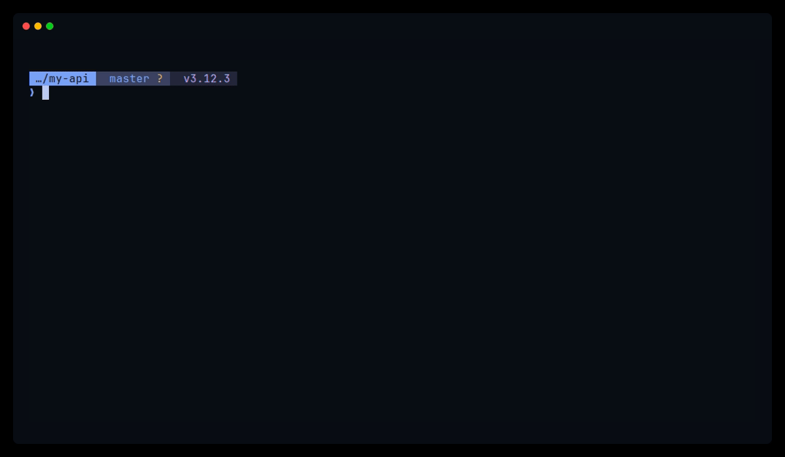

<p align="center">
  
</p>

<h1 align="center">FastFN</h1>

<p align="center">
  Start with one file, a friendly CLI, and a route tree that can grow into a real API or SPA without a rewrite later.
</p>

<p align="center">
  FastFN keeps the terminal as the main control surface: scaffold routes, run locally, inspect docs, and ship a small API or SPA + API stack without a lot of glue.
</p>

<p align="center">
  <a href="https://github.com/misaelzapata/fastfn"></a>
  <a href="./LICENSE"></a>
  <a href="https://fastfn.dev/en/"></a>
  <a href="https://fastfn.dev/en/reference/cli/"></a>
  <a href="https://fastfn.dev/en/reference/http-api/"></a>
  <a href="https://fastfn.dev/en/"></a>
  <a href="https://fastfn.dev/en/explanation/architecture/"></a>
</p>

<p align="center">
  <a href="https://fastfn.dev/en/tutorial/first-steps/"><strong>Quick Start</strong></a>
  &bull;
  <a href="https://fastfn.dev/en/tutorial/spa-and-api-together/"><strong>SPA + API</strong></a>
  &bull;
  <a href="https://fastfn.dev/en/how-to/run-as-a-linux-service/"><strong>Linux Service</strong></a>
  &bull;
  <a href="./examples"><strong>Examples</strong></a>
</p>

<p align="center">
  
</p>

<p align="center">
  <a href="./assets/demos/demo-init-narrated.mp4"><strong>Watch MP4</strong></a>
  &bull;
  <a href="https://fastfn.dev/en/tutorial/first-steps/"><strong>Read Quick Start</strong></a>
  &bull;
  <a href="https://fastfn.dev/en/tutorial/spa-and-api-together/"><strong>Serve SPA + API</strong></a>
</p>

> [!WARNING]
> FastFN is **alpha-quality** software. The API surface is evolving and breaking changes may occur between minor versions. Do not use in production without understanding the risks.

## Why People Pick FastFN

FastFN is for teams that want a simple start, a clear mental model, and a CLI they can stay in while the project grows.

If you like the clarity of FastAPI or the file-routing feel of frameworks like Next.js, FastFN aims for that same low-friction start while letting one API tree mix Python, Node.js, PHP, Lua, Rust, and Go.

- File routes feel local: `get.hello.py` becomes `GET /hello`
- One API tree can mix Python, Node.js, PHP, Lua, Rust, and Go
- OpenAPI and Swagger stay generated from the real route graph
- Public assets can be mounted Cloudflare-style from `public/` or `dist/`
- The CLI scaffolds, runs, documents, and validates the project in one loop

| What You Want | With FastFN |
| --- | --- |
| Start fast | One file, one command |
| Scale language choice | Mix runtimes in one API |
| Keep docs current | OpenAPI generated from real routes |
| Keep ops predictable | Gateway + contracts + tests in repo |

## Start in 60 seconds

This is the shortest path from zero to a running route with docs.

### 1) Install

Homebrew:

```bash
brew tap misaelzapata/homebrew-fastfn
brew install fastfn
```

From source:

```bash
cd cli && go build -o ../bin/fastfn
./bin/fastfn --help
```

### 2) Write one function

`functions/get.hello.py`

```python
def main(req):
    name = (req.get("query") or {}).get("name", "World")
    return {"message": f"Hello, {name}!"}
```

### 3) Run

```bash
fastfn dev functions
```

Try it:

```bash
curl -sS "http://127.0.0.1:8080/hello?name=Developer"
```

Docs:

- Swagger UI: `http://127.0.0.1:8080/docs`
- OpenAPI JSON: `http://127.0.0.1:8080/_fn/openapi.json`

That is the core loop: create a file, run `fastfn dev`, and call the route.

When a handler needs external packages, the fastest and most predictable path is still an explicit `requirements.txt` or `package.json`.
FastFN can also infer dependencies for Python and Node, and it now supports optional backends like `pipreqs`, `detective`, and `require-analyzer`, but that path is slower and is best treated as a bootstrap tool for quick demos or first drafts.

## A CLI You Can Stay In

FastFN is meant to feel simple from the terminal: scaffold a route, run it, inspect docs, and validate the project without switching mental models.

Common commands you will actually use:

```bash
fastfn init hello -t python
fastfn dev .
fastfn docs
fastfn doctor domains --domain api.example.com
fastfn run --native .
fastfn --help
```

That gives you the main loop:

- scaffold with `init`
- run locally with `dev`
- open live docs with `docs`
- check domains or config with `doctor`
- switch to native mode with `run --native`

For the simplest SPA + API setup, keep your frontend build in `dist/` or `public/`, keep your API under `api/`, and let FastFN serve both under one base URL with almost no glue.
The [SPA + API tutorial](https://fastfn.dev/en/tutorial/spa-and-api-together/) walks through that setup directly.

## Repository Layout

- `cli/`: Go CLI source and local test runners.
- `cli/tools/`: local helper scripts.
- `openresty/`: gateway/runtime Lua and console assets.
- `examples/`: runnable examples and demos.
- `tests/unit/`: runtime and SDK unit checks.
- `tests/integration/`: API/OpenAPI/native/hot-reload checks.
- `tests/e2e/`: browser/UI tests.
- `tests/stress/`: benchmark scenarios.
- `tests/results/`: generated artifacts from test runs.
- `docs/`: MkDocs source (`docs/en`, `docs/es`) and theme overrides.

## Documentation

- Start: [Docs Home](https://fastfn.dev/en/)
- First steps: [Quick Start](https://fastfn.dev/en/tutorial/first-steps/)
- SPA + API: [Serve a SPA and API Together](https://fastfn.dev/en/tutorial/spa-and-api-together/)
- Linux service: [Run FastFN as a Linux Service](https://fastfn.dev/en/how-to/run-as-a-linux-service/)
- Routing: [`docs/en/tutorial/routing.md`](./docs/en/tutorial/routing.md)
- CLI reference: [`docs/en/reference/cli.md`](./docs/en/reference/cli.md)
- HTTP/OpenAPI: [`docs/en/reference/http-api.md`](./docs/en/reference/http-api.md)
- Function spec: [`docs/en/reference/function-spec.md`](./docs/en/reference/function-spec.md)
- Architecture: [`docs/en/explanation/architecture.md`](./docs/en/explanation/architecture.md)
- Public assets: [`docs/en/articles/cloudflare-style-public-assets.md`](./docs/en/articles/cloudflare-style-public-assets.md)

## Configuration (`fastfn.json`)

FastFN reads `fastfn.json` in the current directory by default.

```json
{
  "functions-dir": "functions",
  "public-base-url": "https://api.example.com",
  "openapi-include-internal": false,
  "apps": {
    "admin": {
      "image": "./images/admin",
      "port": 3000,
      "routes": ["/admin/*"]
    }
  },
  "services": {
    "mysql": {
      "image": "./images/mysql",
      "port": 3306,
      "volume": "mysql-data"
    }
  }
}
```

Key behavior:

- `openapi-include-internal` defaults to `false`.
- Env override for internal visibility: `FN_OPENAPI_INCLUDE_INTERNAL`.
- `public-base-url` controls `servers[0].url` in generated OpenAPI.
- `domains` helps CLI doctor checks; host enforcement at runtime lives in per-function `invoke.allow_hosts`.
- `apps` registers simple public HTTP routes backed by Firecracker image bundles.
- `services` registers private Firecracker image bundles and injects connection env vars into functions.
- In this branch, `apps` and `services` are wired for `fastfn dev --native` and `fastfn run --native` on Linux/KVM hosts.

Bundle note:

- `image` points to a local Firecracker bundle directory, not a registry image reference.
- Each bundle should contain `vmlinux`, `rootfs.ext4`, and can optionally include `fastfn-image.json`.
- `dockerfile`-based conversion is not implemented in this branch yet.

Reference:

- [`docs/en/reference/fastfn-config.md`](./docs/en/reference/fastfn-config.md)
- [`docs/en/reference/function-spec.md`](./docs/en/reference/function-spec.md)

## License

MIT. See [`LICENSE`](./LICENSE).
