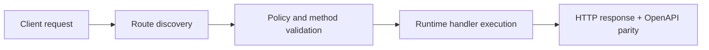

# FastFN Doctor for Domains and CI


> Verified status as of **March 10, 2026**.
> Runtime note: FastFN auto-installs function-local dependencies from `requirements.txt` / `package.json`; host runtimes are required in `fastfn dev --native`, while `fastfn dev` depends on a running Docker daemon.
`fastfn doctor` gives a single entry point to validate local prerequisites and domain readiness.

## Why this matters

Domain issues are usually discovered too late:
- DNS points to the wrong target
- TLS is expired or close to expiring
- HTTP does not redirect to HTTPS
- ACME challenge path is blocked

`fastfn doctor domains` catches these before deployment.

## Quick start

```bash
fastfn doctor
fastfn doctor --json
```

Domain check:

```bash
fastfn doctor domains --domain api.example.com
fastfn doctor domains --domain api.example.com --expected-target lb.example.net
```

CI-friendly output:

```bash
fastfn doctor domains --domain api.example.com --json
```

## Configure domains in `fastfn.json`

```json
{
  "domains": [
    "api.example.com",
    {
      "domain": "www.example.com",
      "expected-target": "lb.example.net",
      "enforce-https": true
    }
  ]
}
```

Then run:

```bash
fastfn doctor domains
```

## Check contract (OK/WARN/FAIL)

- `domain.format`: hostname syntax validation.
- `dns.resolve`: A/AAAA/CNAME resolution.
- `dns.target`: expected DNS target match (when configured).
- `tls.handshake`: certificate validity for host.
- `tls.expiry`: expiry window (warns when near expiration).
- `https.reachability`: basic HTTPS response.
- `http.redirect`: HTTP -> HTTPS policy.
- `acme.challenge`: reachability of `/.well-known/acme-challenge/...`.

## Safe auto-fix

`fastfn doctor --fix` applies only local safe changes.

Current safe fix:
- create a minimal `fastfn.json` when missing.

## Flow Diagram



## Problem

What operational or developer pain this topic solves.

## Mental Model

How to reason about this feature in production-like environments.

## Design Decisions

- Why this behavior exists
- Tradeoffs accepted
- When to choose alternatives

## See also

- [Function Specification](../reference/function-spec.md)
- [HTTP API Reference](../reference/http-api.md)
- [Run and Test Checklist](../how-to/run-and-test.md)
