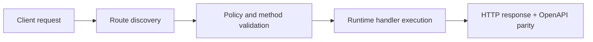

# IP Geolocation with MaxMind and ipapi-style Services


> Verified status as of **March 10, 2026**.
> Runtime note: FastFN auto-installs function-local dependencies from `requirements.txt` / `package.json`; host runtimes are required in `fastfn dev --native`, while `fastfn dev` depends on a running Docker daemon.
This article shows a practical `ip -> country` setup with two FastFN examples:

- `/ip-intel/maxmind`: local lookup with MaxMind-style MMDB (`GeoLite2-Country.mmdb`).
- `/ip-intel/remote`: remote lookup using an ipapi-style HTTP service.

## Run the examples

```bash
bin/fastfn dev examples/functions
```

## 1) MaxMind local lookup

Quick deterministic test (no DB file required):

```bash
curl -s "http://127.0.0.1:8080/ip-intel/maxmind?ip=8.8.8.8&mock=1"
```

Real MMDB lookup:

```bash
# Install Python dependency once in the function folder:
#   echo "maxminddb>=2.6.2" > examples/functions/ip-intel/requirements.txt
# Then restart fastfn dev so runtime installs it.
MAXMIND_DB_PATH=/absolute/path/to/GeoLite2-Country.mmdb \
curl -s "http://127.0.0.1:8080/ip-intel/maxmind?ip=8.8.8.8"
```

Response shape:

```json
{
  "ok": true,
  "provider": "maxmind",
  "ip": "8.8.8.8",
  "country_code": "US",
  "country_name": "United States"
}
```

## 2) ipapi-style remote lookup

Deterministic test mode:

```bash
curl -s "http://127.0.0.1:8080/ip-intel/remote?ip=8.8.8.8&mock=1"
```

Real remote lookup:

```bash
IPAPI_BASE_URL=https://ipapi.co \
curl -s "http://127.0.0.1:8080/ip-intel/remote?ip=8.8.8.8"
```

The handler expects `/{ip}/json/` style endpoints and normalizes common fields:
`country_code`, `country_name`, `city`, `region`.

## Tests included

Unit tests:

```bash
python3 tests/unit/test-python-handlers.py
node tests/unit/test-node-handler.js
```

Integration checks (includes both geolocation routes):

```bash
bash tests/integration/test-api.sh
```

## Flow Diagram



## Problem

What operational or developer pain this topic solves.

## Mental Model

How to reason about this feature in production-like environments.

## Design Decisions

- Why this behavior exists
- Tradeoffs accepted
- When to choose alternatives

## See also

- [Function Specification](../reference/function-spec.md)
- [HTTP API Reference](../reference/http-api.md)
- [Run and Test Checklist](../how-to/run-and-test.md)
