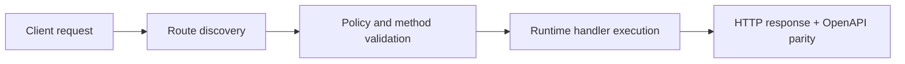

# Local Serverless Without a Routes File: Hot Reload, Custom Routes, and Live OpenAPI


> Verified status as of **March 10, 2026**.
> Runtime note: FastFN auto-installs function-local dependencies from `requirements.txt` / `package.json`; host runtimes are required in `fastfn dev --native`, while `fastfn dev` depends on a running Docker daemon.
## Why this matters
A lot of local serverless setups fail in one of two ways:
- they require a central routing file nobody wants to maintain,
- or docs and runtime drift apart.

`fastfn` avoids both by discovering functions from the filesystem and generating OpenAPI from each function's config.

## Quick docs map
- First boot and tests: [Run & Test](../how-to/run-and-test.md)
- Manage files from console/API: [Manage Functions](../how-to/manage-functions.md)
- Function shape and options: [Function Spec](../reference/function-spec.md)
- Available endpoints: [HTTP API](../reference/http-api.md)
- Runtime payload contract: [Runtime Contract](../reference/runtime-contract.md)
- Why invocation works this way: [Invocation Flow](../explanation/invocation-flow.md)

## Core idea
You define a function by files under:
- `functions/<runtime>/<name>/`

Optionally versioned:
- `functions/<runtime>/<name>/<version>/`

No global `routes.json` is required.

The gateway discovers functions automatically and applies policy from `fn.config.json`.

## Step 1: Create a tiny function
Create `functions/my-profile/app.py`:

```python
import json

def handler(event):
    query = (event or {}).get("query") or {}
    name = query.get("name", "world")
    return {
        "status": 200,
        "headers": {"Content-Type": "application/json"},
        "body": json.dumps({"hello": name})
    }
```

Create `functions/my-profile/fn.config.json`:

```json
{
  "timeout_ms": 1200,
  "max_concurrency": 10,
  "invoke": {
    "methods": ["GET"],
    "summary": "Simple profile demo",
    "query": {"name": "World"}
  }
}
```

## Step 2: Reload catalog immediately

```bash
curl -sS -X POST http://127.0.0.1:8080/_fn/reload
```

You now avoid restart loops while iterating.

## Step 3: Invoke the function

```bash
curl -sS 'http://127.0.0.1:8080/my-profile?name=Misael'
```

## Step 4: Verify OpenAPI is live

```bash
curl -sS http://127.0.0.1:8080/openapi.json
```

Confirm:
- `/my-profile` exists,
- method list matches `invoke.methods`.

If you change methods to `POST` and reload, OpenAPI updates.

## Step 5: Add a real custom endpoint
Edit `fn.config.json`:

```json
{
  "invoke": {
    "methods": ["GET"],
    "routes": ["/api/profile", "/public/whoami"],
    "summary": "Profile via custom routes"
  }
}
```

Reload and test:

```bash
curl -sS 'http://127.0.0.1:8080/api/profile?name=Misael'
curl -sS 'http://127.0.0.1:8080/public/whoami?name=Misael'
```

## Step 6: Add versioning with zero confusion
Create a second version:
- `functions/my-profile/v2/app.py`
- `functions/my-profile/v2/fn.config.json`

Invoke both:

```bash
curl -sS 'http://127.0.0.1:8080/my-profile'
curl -sS 'http://127.0.0.1:8080/my-profile@v2'
```

## Step 7: Use custom handler names (Lambda-style)
If you do not want the function symbol to be named `handler`, use `invoke.handler`.

`fn.config.json`:

```json
{
  "invoke": {
    "handler": "main",
    "methods": ["POST"]
  }
}
```

Then export/define `main` in your runtime file.

## Common pitfalls and fixes

| Problem | Cause | Fix |
|---|---|---|
| function not found | wrong folder naming | match `runtime/name[/version]` layout exactly |
| OpenAPI doesn't change | catalog not reloaded | call `POST /_fn/reload` |
| method mismatch | `invoke.methods` changed but test still old | verify method in both curl and OpenAPI |
| route conflict | same custom route in two functions | rename one route; conflicts return `409` |
| ambiguous function | same name in multiple runtimes | use explicit runtime path in console APIs or avoid duplicate names |

## Why teams like this model
- policy close to code,
- no giant central config,
- doc/runtime parity through OpenAPI generation,
- fast local inner loop.

## Related docs
- [Function Spec](../reference/function-spec.md)
- [HTTP API](../reference/http-api.md)
- [Manage Functions](../how-to/manage-functions.md)
- [Console and Admin Access](../how-to/console-admin-access.md)
- [Architecture](../explanation/architecture.md)

## Flow Diagram



## Problem

What operational or developer pain this topic solves.

## Mental Model

How to reason about this feature in production-like environments.

## Design Decisions

- Why this behavior exists
- Tradeoffs accepted
- When to choose alternatives

## See also

- [Function Specification](../reference/function-spec.md)
- [HTTP API Reference](../reference/http-api.md)
- [Run and Test Checklist](../how-to/run-and-test.md)
