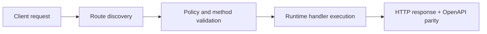

# Practical Auth for Functions: API Keys, Signatures, Console Guard, and Safe Defaults


> Verified status as of **March 10, 2026**.
> Runtime note: FastFN auto-installs function-local dependencies from `requirements.txt` / `package.json`; host runtimes are required in `fastfn dev --native`, while `fastfn dev` depends on a running Docker daemon.
## Why this article matters
Security often gets added late, and then teams bolt on too much complexity.

This guide gives a practical baseline you can deploy now:
- function-level auth,
- strict method and body limits,
- console safety,
- webhook signature verification pattern.

It is written for builders who want production-safe defaults without enterprise overhead.

## Quick docs map
- Complete endpoint list: [HTTP API](../reference/http-api.md)
- Function config keys: [Function Spec](../reference/function-spec.md)
- Console access model: [Console and Admin Access](../how-to/console-admin-access.md)
- Operational hardening: [Operational Recipes](../how-to/operational-recipes.md)
- Security internals: [Security Model](../explanation/security-model.md)

## Security layers in fastfn
1. Gateway policy from `fn.config.json`.
2. Function-level auth logic inside your handler.
3. Console/UI access gates.

You usually need all three.

## Layer 1: Lock the gateway policy first
Minimal secure `fn.config.json` example:

```json
{
  "timeout_ms": 1500,
  "max_concurrency": 5,
  "max_body_bytes": 131072,
  "invoke": {
    "methods": ["POST"],
    "summary": "Signed webhook receiver"
  }
}
```

Effects:
- non-POST calls fail with `405`,
- huge payloads fail with `413`,
- runaway parallel requests fail with `429`.

## Layer 2: Add function-level API key auth
Node example:

```js
exports.handler = async (event) => {
  const headers = event.headers || {};
  const apiKey = headers['x-api-key'] || headers['X-API-Key'];
  const expected = (event.env || {}).MY_API_KEY;

  if (!expected || apiKey !== expected) {
    return {
      status: 401,
      headers: { 'Content-Type': 'application/json' },
      body: JSON.stringify({ error: 'unauthorized' })
    };
  }

  return {
    status: 200,
    headers: { 'Content-Type': 'application/json' },
    body: JSON.stringify({ ok: true })
  };
};
```

Store secret in `fn.env.json`:

```json
{
  "MY_API_KEY": { "value": "set-me", "is_secret": true }
}
```

## Layer 3: Signature auth for external webhooks
For Stripe/GitHub-like integrations, use signature verification on raw body.

Pattern:
1. read raw body from `event.body`,
2. compute HMAC with shared secret,
3. compare to signature header,
4. reject mismatch with `401`.

This is stronger than static API keys for callbacks.

## Layer 4: Protect console and admin APIs
Recommended platform env:

```bash
FN_UI_ENABLED=1
FN_CONSOLE_LOCAL_ONLY=1
FN_CONSOLE_WRITE_ENABLED=0
FN_ADMIN_TOKEN=<strong-random-token>
```

Meaning:
- UI accessible,
- local-only by default,
- write actions disabled unless admin token is present.

## Verification checklist (copy/paste)
1. Missing API key returns `401`.
2. Wrong method returns `405`.
3. Oversized payload returns `413`.
4. Invalid signature returns `401`.
5. Unauthenticated console write returns `403`.

## Example curl checks
Unauthorized:

```bash
curl -i -sS -X POST http://127.0.0.1:8080/secure-webhook
```

Wrong method:

```bash
curl -i -sS http://127.0.0.1:8080/secure-webhook
```

Expected responses should include `401` and `405` respectively.

## Common mistakes
- Putting secrets in source code instead of `fn.env.json`.
- Exposing console writes from remote networks.
- Leaving sensitive endpoints open to `GET`.
- Ignoring `max_body_bytes` on webhook handlers.

## Practical baseline profile
Use this as your default for external-facing functions:
- methods restricted to minimum required,
- body limit under 256 KB unless necessary,
- low concurrency for expensive external APIs,
- local-only console with token for privileged actions.

## Related docs
- [HTTP API](../reference/http-api.md)
- [Function Spec](../reference/function-spec.md)
- [Console and Admin Access](../how-to/console-admin-access.md)
- [Operational Recipes](../how-to/operational-recipes.md)
- [Security Model](../explanation/security-model.md)

## Flow Diagram



## Problem

What operational or developer pain this topic solves.

## Mental Model

How to reason about this feature in production-like environments.

## Design Decisions

- Why this behavior exists
- Tradeoffs accepted
- When to choose alternatives

## See also

- [Function Specification](../reference/function-spec.md)
- [HTTP API Reference](../reference/http-api.md)
- [Run and Test Checklist](../how-to/run-and-test.md)
