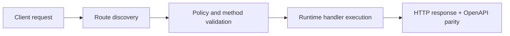

# Build a Telegram AI Bot with Memory That Survives Cron Runs


> Verified status as of **March 10, 2026**.
> Runtime note: FastFN auto-installs function-local dependencies from `requirements.txt` / `package.json`; host runtimes are required in `fastfn dev --native`, while `fastfn dev` depends on a running Docker daemon.
## Why this article exists
Many Telegram bot demos work once and then fail in real use.

This guide focuses on the practical version:
- loop polling that keeps running,
- memory per chat,
- offset persistence so updates are not reprocessed after restart,
- scheduler-friendly setup with predictable behavior.

If you are new, this is the shortest path to a bot that feels "alive" instead of fragile.

## Quick docs map
- First run platform: [Run & Test](../how-to/run-and-test.md)
- Full Telegram setup: [Telegram E2E](../how-to/telegram-e2e.md)
- Function file format: [Function Spec](../reference/function-spec.md)
- Internal endpoints used here (`/_fn/reload`, `/_fn/schedules`): [HTTP API](../reference/http-api.md)
- Runtime behavior and payload contract: [Runtime Contract](../reference/runtime-contract.md)
- Full request lifecycle: [Invocation Flow](../explanation/invocation-flow.md)

## What you will build
A `telegram-ai-reply` function that:
- polls Telegram on schedule,
- reads new updates,
- calls OpenAI,
- replies back to the same chat,
- stores short memory for context continuity.

## Architecture in one picture

```text
Telegram user
  -> Telegram Bot API (getUpdates)
  -> FastFN scheduler -> /telegram-ai-reply
  -> OpenAI
  -> Telegram Bot API (sendMessage)
  -> Telegram user
```

Local state files used by the function:
- `.memory.json` for per-chat memory
- `.loop_state.json` for last processed update offset

## Prerequisites
- Docker Desktop running
- Telegram bot token from `@BotFather`
- OpenAI API key

Optional but recommended:
- console enabled only locally (`FN_UI_ENABLED=1`, `FN_CONSOLE_LOCAL_ONLY=1`)

## Step 1: Start FastFN

```bash
docker compose up -d --build
curl -sS http://127.0.0.1:8080/_fn/health
```

Expected:
- `node` and `python` runtimes reported as up.

## Step 2: Configure function secrets and runtime options
Edit `<FN_FUNCTIONS_ROOT>/node/telegram-ai-reply/fn.env.json`:

```json
{
  "TELEGRAM_BOT_TOKEN": { "value": "<set-me>", "is_secret": true },
  "OPENAI_API_KEY": { "value": "<set-me>", "is_secret": true },
  "OPENAI_MODEL": { "value": "gpt-4o-mini", "is_secret": false },
  "TELEGRAM_LOOP_ENABLED": { "value": "true", "is_secret": false }
}
```

Notes:
- Keep real secrets with `is_secret: true`.
- Function env values are exposed at runtime as `event.env`.

## Step 3: Enable scheduler loop in function config
Edit `<FN_FUNCTIONS_ROOT>/node/telegram-ai-reply/fn.config.json`:

```json
{
  "timeout_ms": 200000,
  "max_concurrency": 2,
  "schedule": {
    "enabled": true,
    "every_seconds": 75,
    "method": "GET",
    "query": {
      "loop": "true",
      "dry_run": "false",
      "wait_secs": "45",
      "force_clear_webhook": "true"
    },
    "context": { "type": "cron" }
  }
}
```

Why this interval split:
- `every_seconds` should be larger than `wait_secs` to reduce overlap.
- This lowers duplicate work and noisy statuses.

## Step 4: Hot reload instead of restart

```bash
curl -sS -X POST http://127.0.0.1:8080/_fn/reload
```

You usually do not need a container restart for function code/config/env edits.

## Step 5: Verify scheduler status

```bash
curl -sS http://127.0.0.1:8080/_fn/schedules
```

Check the `telegram-ai-reply` entry:
- `schedule.enabled=true`
- `state.last_status=200` after at least one cycle

## Step 6: Dry run and live run checks
Dry run:

```bash
curl -sS -X POST \
  'http://127.0.0.1:8080/telegram-ai-reply?mode=loop&dry_run=true&wait_secs=10'
```

Live mode:
- send any message to your bot in Telegram,
- wait one scheduler cycle,
- verify bot reply on your phone.

Manual one-shot reply test:

```bash
curl -sS -X POST \
  'http://127.0.0.1:8080/telegram-ai-reply?mode=reply&dry_run=false&chat_id=<CHAT_ID>&text=Hello'
```

## Memory and offset behavior
Memory settings (query params):
- `memory=true|false`
- `memory_max_turns` (default 8)
- `memory_ttl_secs` (default 3600)

Offset persistence:
- `<FN_FUNCTIONS_ROOT>/node/telegram-ai-reply/.loop_state.json`

Memory file:
- `<FN_FUNCTIONS_ROOT>/node/telegram-ai-reply/.memory.json`

This combination is what makes cron mode stable after restarts.

## Troubleshooting quick table

| Symptom | Meaning | Fix |
|---|---|---|
| `last_status=409` | another poller/webhook active | keep `force_clear_webhook=true` and disable external poller |
| `last_status=502` | outbound API failure | verify tokens/keys, network, API quotas |
| `last_status=504` | no update within wait window | acceptable in polling; tune wait/interval |
| bot responds once only | loop or schedule disabled | enable `TELEGRAM_LOOP_ENABLED` and `schedule.enabled` |
| old messages repeat | offset not persisted | verify `.loop_state.json` write permissions |

## Production-minded checklist
1. `/_fn/health` shows runtimes up.
2. `/_fn/schedules` shows active loop with healthy status.
3. Only one poller source is active.
4. Secrets are in `fn.env.json` with `is_secret=true`.
5. Memory and offset files are writable.

## Related docs
- [Telegram E2E](../how-to/telegram-e2e.md)
- [Telegram Digest (Cron)](../how-to/telegram-digest.md)
- [HTTP API](../reference/http-api.md)
- [Function Spec](../reference/function-spec.md)
- [Architecture](../explanation/architecture.md)

## Flow Diagram



## Problem

What operational or developer pain this topic solves.

## Mental Model

How to reason about this feature in production-like environments.

## Design Decisions

- Why this behavior exists
- Tradeoffs accepted
- When to choose alternatives

## See also

- [Function Specification](../reference/function-spec.md)
- [HTTP API Reference](../reference/http-api.md)
- [Run and Test Checklist](../how-to/run-and-test.md)
