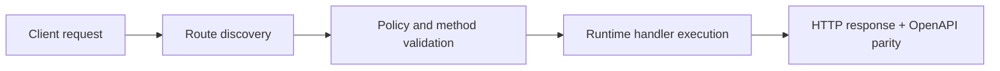

# How `telegram-ai-reply` Works (Step-by-Step)


> Verified status as of **March 10, 2026**.
> Runtime note: FastFN auto-installs function-local dependencies from `requirements.txt` / `package.json`; host runtimes are required in `fastfn dev --native`, while `fastfn dev` depends on a running Docker daemon.
This article explains how the **example function** `telegram-ai-reply` works internally:

- it accepts a Telegram update (webhook) or a simple query-mode request,
- generates a reply with OpenAI,
- and sends the reply back via the Telegram Bot API.

It is **safe by default**: `dry_run` defaults to `true`.

Code: `examples/functions/node/telegram-ai-reply/app.js`

## 1) Run it locally

Run the full example catalog:

```bash
bin/fastfn dev examples/functions
```

Or run just this function folder:

```bash
bin/fastfn dev examples/functions/node/telegram-ai-reply
```

The public route is:

- `POST /telegram-ai-reply`
- `GET /telegram-ai-reply` (query-mode)

## 2) Safe smoke test (dry run)

Webhook-style request (POST body contains a Telegram update):

```bash
curl -sS 'http://127.0.0.1:8080/telegram-ai-reply?dry_run=true' \
  -X POST \
  -H 'Content-Type: application/json' \
  -d '{"message":{"chat":{"id":123},"text":"Hola"}}'
```

Expected response shape:

```json
{"ok":true,"dry_run":true,"chat_id":123,"received_text":"Hola","note":"..."}
```

Query-mode request (useful for local testing without configuring a webhook):

```bash
curl -sS 'http://127.0.0.1:8080/telegram-ai-reply?mode=reply&dry_run=true&chat_id=123&text=Hola'
```

## 3) Request parsing: webhook vs query-mode

The handler begins by reading:

- `event.query` (query string)
- `event.body` (string or object)
- `event.env` (per-function env)
- `event.context` (request id, timeouts, scheduler trigger, etc)

Then it chooses an input source:

1. **Webhook update** (`event.body` is valid JSON): parse it and extract:
   - `chat_id`
   - `text` (message text or caption)
   - `message_id` (for threaded replies)
2. **Query-mode** (no JSON body): use `chat_id` + `text` from the query string

If `chat_id` is missing, it returns:

```json
{"ok":true,"note":"no chat_id provided; nothing to do"}
```

If the message has no text, it returns:

```json
{"ok":true,"chat_id":123,"note":"no text in update; nothing to do"}
```

## 4) `dry_run` gate (why you don’t accidentally spam Telegram)

Before doing outbound calls, the function checks `dry_run`:

- default: `dry_run=true`
- real sends: `dry_run=false`

In dry run, it returns `200` and never calls Telegram/OpenAI.

## 5) Reply mode: OpenAI -> Telegram sendMessage

When `dry_run=false`, reply mode does:

1. Optionally send a “thinking” indicator to Telegram (typing or a text message).
2. Build the OpenAI prompt:
   - system prompt (`OPENAI_SYSTEM_PROMPT`)
   - optional per-chat memory window
   - optional tool results context (see below)
3. Call OpenAI Chat Completions (`/v1/chat/completions`).
4. Send the reply back via Telegram `sendMessage`.
5. Persist memory (only after a successful send).

It returns a JSON summary like:

```json
{"ok":true,"dry_run":false,"chat_id":123,"reply_preview":"...","telegram":{"message_id":321}}
```

## 6) Loop mode (self-contained polling + reply)

Loop mode exists to demonstrate a full E2E flow **inside one endpoint**:

- send an initial prompt (optional),
- poll Telegram `getUpdates` for replies,
- call OpenAI,
- reply back,
- persist offset state to avoid reprocessing the same updates.

Enable loop mode (in env):

- `TELEGRAM_LOOP_ENABLED=true`

Call it (dry run):

```bash
curl -sS 'http://127.0.0.1:8080/telegram-ai-reply?mode=loop&dry_run=true'
```

Key internal mechanisms:

- A small lock file (`.loop.lock`) prevents concurrent loops.
- A state file (`.loop_state.json`) stores `last_update_id` so scheduler runs don’t repeat work.
- `force_clear_webhook=true` can call Telegram `deleteWebhook` to avoid `409 Conflict` with `getUpdates`.

Related: [Telegram Loop](../articles/telegram-loop.md)

## 7) “Thinking” indicator

This is optional and controlled by:

- `TELEGRAM_SHOW_THINKING=true`
- `TELEGRAM_THINKING_MODE=typing|text` (default: `typing`)
- `TELEGRAM_THINKING_TEXT=Escribiendo...` (used when `mode=text`)
- `TELEGRAM_THINKING_MIN_MS=600` (sleep a minimum amount so typing looks real)

If sending the typing action fails transiently, the function retries once.

## 8) Tools: controlled outbound fetches (allowlists)

If enabled, the function can execute limited “tools” before calling OpenAI and then attach a `[Tool results]` JSON block to the user message.

Enable tools:

- `TELEGRAM_TOOLS_ENABLED=true`

Two ways to select tools:

1. Manual directives inside the user text:
   - `[[http:https://api.ipify.org?format=json]]`
   - `[[fn:request-inspector?key=e2e|GET]]`
2. Auto-tools (simple intent detection):
   - `TELEGRAM_AUTO_TOOLS=true`

Safety controls:

- Allowed function tools:
  - `TELEGRAM_TOOL_ALLOW_FN=request-inspector,telegram-ai-digest,cron-tick`
- Allowed HTTP hostnames:
  - `TELEGRAM_TOOL_ALLOW_HTTP_HOSTS=api.ipify.org,wttr.in,ipapi.co`
- Tool timeout:
  - `TELEGRAM_TOOL_TIMEOUT_MS=20000`

Important: tools are **not** “anything on the internet”. The function enforces allowlists.

If you want to test tool directives **without** Telegram/OpenAI, use the demo endpoint:

- `GET /toolbox-bot` (plan + results as JSON)

See: [Tools (Function-to-Function + Limited HTTP)](../how-to/tools.md)

## 9) Memory: per-chat history window on disk

When memory is enabled (default `memory=true`), the function stores a small per-chat history in:

- `<FN_FUNCTIONS_ROOT>/node/telegram-ai-reply/.memory.json`

Behavior:

- Only persists after a successful Telegram send.
- Limits history to `memory_max_turns` (default: 8 turns).
- Drops entries older than `memory_ttl_secs` (default: 3600s).

## 10) Config reference

### Query parameters

- `dry_run=true|false` (default `true`)
- `mode=reply|loop`
- `chat_id=<id>` (required for query-mode reply; optional for loop multi-chat poller)
- `text=<message>` (query-mode reply)
- `tools=true|false`
- `auto_tools=true|false`
- `tool_timeout_ms=<ms>`
- `tool_allow_fn=...` (CSV)
- `tool_allow_hosts=...` (CSV)
- `memory=true|false`
- `memory_max_turns=<n>`
- `memory_ttl_secs=<n>`
- Loop mode:
  - `prompt=...`
  - `wait_secs=<n>`
  - `poll_ms=<n>`
  - `max_replies=<n>`
  - `force_clear_webhook=true|false`
  - `loop_token=...` (when configured)

### Environment variables

- Telegram:
  - `TELEGRAM_BOT_TOKEN` (secret, required for real sends)
  - `TELEGRAM_API_BASE` (default: `https://api.telegram.org`)
  - `TELEGRAM_HTTP_TIMEOUT_MS` (default: `15000`)
  - `TELEGRAM_LOOP_ENABLED` (default: `false`)
  - `TELEGRAM_LOOP_TOKEN` (optional secret)
- OpenAI:
  - `OPENAI_API_KEY` (secret, required for real replies)
  - `OPENAI_BASE_URL` (default: `https://api.openai.com/v1`)
  - `OPENAI_MODEL` (default: `gpt-4o-mini`)
  - `OPENAI_SYSTEM_PROMPT` (optional)
  - `OPENAI_TOOL_MODEL` (used for small planner calls, optional)

## 11) Security notes (read this if you go beyond local demos)

- Keep `dry_run=true` for local testing until you’re ready.
- Treat `/_fn/*` as a control-plane. In production, restrict it (or disable the console UI).
- If you expose `telegram-ai-reply` publicly as a webhook:
  - add your own verification (for example, check a shared secret header)
  - keep tool allowlists tight
  - keep timeouts reasonable (`fn.config.json` can raise `timeout_ms` for this function)

Related:

- [Telegram E2E](../how-to/telegram-e2e.md)
- [Example Function Catalog](../reference/builtin-functions.md)

## Flow Diagram



## Problem

What operational or developer pain this topic solves.

## Mental Model

How to reason about this feature in production-like environments.

## Design Decisions

- Why this behavior exists
- Tradeoffs accepted
- When to choose alternatives

## See also

- [Function Specification](../reference/function-spec.md)
- [HTTP API Reference](../reference/http-api.md)
- [Run and Test Checklist](../how-to/run-and-test.md)
