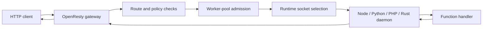

# Architecture

> Verified status as of **March 13, 2026**.
> Runtime note: FastFN resolves dependencies and build steps per function: Python uses `requirements.txt`, Node uses `package.json`, PHP installs from `composer.json` when present, and Rust handlers are built with `cargo`. Host runtimes and tools are required in `fastfn dev --native`, while `fastfn dev` depends on a running Docker daemon.

## Quick View

- Complexity: Advanced
- Typical time: 20-35 minutes
- Use this when: you want to understand where routing, queueing, socket selection, and runtime execution happen
- Outcome: a practical model for debugging health, scaling, and request flow

## Design goals

FastFN keeps the platform simple in three ways:

1. one HTTP edge
2. filesystem-driven discovery
3. per-function control without a large control plane

That is why OpenResty stays at the edge and language runtimes sit behind Unix sockets.

## Mental model

In Docker mode, the same stack runs inside the `openresty` service. In native mode, the CLI starts OpenResty and the runtime daemons directly on the host.

## Discovery and route map

FastFN does not keep a static `routes.json` as the source of truth. It discovers functions from a functions directory and builds the route map at runtime.

Common ways to set the functions directory:

- `fastfn dev functions`
- `fastfn.json` -> `"functions-dir": "functions"`
- `FN_FUNCTIONS_ROOT=/absolute/path/to/functions`

Runtime order is also configurable:

- `FN_RUNTIMES=python,node,php,rust`

If the same public route exists in more than one runtime, the first enabled runtime wins unless you explicitly force a takeover with config.

## Runtime routing

FastFN treats runtimes in two groups:

- `lua` runs in-process inside OpenResty.
- `node`, `python`, `php`, `rust`, and `go` run behind Unix sockets.

When a runtime has one daemon, the gateway uses one socket. When it has multiple daemons, the gateway keeps a socket list and selects a healthy socket with `round_robin`.

Configuration knobs:

- `runtime-daemons` or `FN_RUNTIME_DAEMONS` for daemon counts
- `FN_RUNTIME_SOCKETS` for an explicit socket map
- `FN_SOCKET_BASE_DIR` for generated socket locations

Important rules:

- `FN_RUNTIME_SOCKETS` wins over generated socket counts.
- `lua` ignores daemon counts because it does not run as an external daemon.
- Health is tracked per socket, not only per runtime.
- `/_fn/health` exposes both the aggregate runtime health and the socket list.

## Concurrency knobs: what each one does

FastFN has two different scaling layers and they solve different problems.

| Knob | Scope | Where it applies | What it does |
| --- | --- | --- | --- |
| `runtime-daemons` | global per runtime | startup wiring | adds more daemon processes and sockets for a runtime |
| `worker_pool.*` | per function | gateway admission and queueing | limits active executions and queue length before the runtime call |
| runtime internals | runtime-specific | inside each daemon | child workers, process reuse, build and install behavior |

Practical reading:

- Use `runtime-daemons` when you want more routing targets for a runtime.
- Use `worker_pool` when you want per-function backpressure and queue control.
- Measure both together on real traffic; they are complementary, not interchangeable.

## Choosing binaries

In native mode, FastFN can choose the executable used for each runtime or tool through `runtime-binaries` or `FN_*_BIN` environment variables.

Examples:

- `FN_PYTHON_BIN`
- `FN_NODE_BIN`
- `FN_PHP_BIN`
- `FN_CARGO_BIN`
- `FN_COMPOSER_BIN`
- `FN_OPENRESTY_BIN`

One important detail:

- FastFN chooses one executable per key.
- If you run three Python daemons, all three use the same configured `FN_PYTHON_BIN`.
- Multi-daemon routing is not a mixed-version runtime pool.

## Health, failover, and errors

Startup and request flow are designed to fail clearly:

- Native mode checks that the host port is free before boot.
- Runtime socket paths are checked before startup and stale sockets are removed.
- Health checks run per runtime and per socket.
- If one socket goes down, the gateway can skip it and keep using healthy sockets.
- If every socket for a runtime is down, requests fail with `503 runtime unavailable`.

When `include_debug_headers=true`, function responses can include:

- `X-Fn-Runtime-Routing`
- `X-Fn-Runtime-Socket-Index`

These are useful when you want to confirm that traffic is rotating across sockets.

## Tradeoffs

This model is intentionally simple, but it is not magic:

- More daemons can help CPU-bound or blocked runtimes, but they can also add overhead.
- Queueing at the gateway improves control, not raw speed by itself.
- Unix sockets keep the local stack predictable, but they still add a hop compared with in-process Lua.

That is why FastFN publishes raw benchmark artifacts and recommends measuring your own workload before raising daemon counts across the board.

## Related links

- [Function specification](../reference/function-spec.md)
- [Global config](../reference/fastfn-config.md)
- [HTTP API reference](../reference/http-api.md)
- [Scale runtime daemons](../how-to/scale-runtime-daemons.md)
- [Run and test](../how-to/run-and-test.md)
- [Performance benchmarks](./performance-benchmarks.md)
