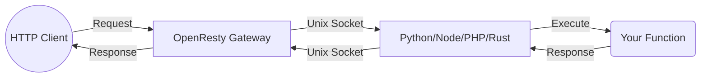

# Architecture

> Verified status as of **March 10, 2026**.
> Runtime note: FastFN auto-installs function-local dependencies from `requirements.txt` / `package.json`; host runtimes are required in `fastfn dev --native`, while `fastfn dev` depends on a running Docker daemon.
## Design goals

The platform optimizes for three things at once:

1. fast local development
2. per-function operational control
3. low operational complexity

That is why it keeps OpenResty as the single HTTP edge and uses language runtimes over Unix sockets.

## Mental model

FastFN optimizes for fast local development and low operational complexity by keeping OpenResty as the single HTTP edge.

In Docker, everything runs in one `openresty` service, including runtime processes.

## Filesystem discovery (configurable)

There is no static `routes.json`. Functions are discovered from a filesystem root (your "functions directory").

Recommended convention: create a `functions/` directory at the repo root and point FastFN to it.

Common ways to set the functions directory:

- `fastfn dev functions`
- `fastfn.json` -> `"functions-dir": "functions"`
- `FN_FUNCTIONS_ROOT=/absolute/path/to/functions`

Runtime list is also configurable:

- `FN_RUNTIMES` (CSV, e.g. `python,node,php,rust`)

Socket mapping is configurable:

- `FN_RUNTIME_SOCKETS` (JSON map runtime -> socket URI)
- `FN_SOCKET_BASE_DIR` (base dir when map is not provided)

Route collision precedence:

- If the same function name exists in multiple runtimes, `/<name>` resolves to the first runtime in `FN_RUNTIMES`.
- If `FN_RUNTIMES` is not set, it uses alphabetical order of runtime folders.

## Per-function policy

`fn.config.json` can define:

- `invoke.methods`
- `timeout_ms`
- `max_concurrency`
- `max_body_bytes`

This avoids rigid global behavior and keeps control near each function owner.

## Uniform runtime contract

All runtimes share one protocol:

- request: `{ fn, version, event }`
- response: `{ status, headers, body }`

That keeps the gateway language-agnostic.

## Security model

Built-in controls include:

- path traversal protection
- symlink escape prevention for code/config writes
- secret masking (`fn.env.json` with `is_secret=true`) in the console
- console permissions via flags (`ui/api/write/local_only`)
- strict per-function filesystem sandbox enabled by default (`FN_STRICT_FS=1`)

## Known tradeoffs

- higher latency than pure embedded Lua for some workloads
- filesystem discovery requires folder structure discipline
- public auth is function-level by default (not centralized)

The tradeoff is intentional: strong local velocity plus practical control.

## Throughput model and scaling reality

FastFN throughput is the product of both layers:

- OpenResty/Nginx (network edge, connection handling, request parsing)
- runtime execution capacity (Node/Python/PHP/Lua/Rust/Go workers and handler cost)

Adding more workers can increase throughput, but only until the next bottleneck:

- CPU saturation
- runtime dependency overhead (cold/warm behavior, package loading)
- per-function limits (`max_concurrency`, `worker_pool.max_workers`, `worker_pool.max_queue`)
- downstream I/O latency (DB, external APIs)

In other words: worker count helps when runtime capacity is the bottleneck, but does not bypass hard limits at the gateway, network, or external dependencies.

## Future work and technical debt

Current architecture is production-capable, but these are active optimization fronts:

- adaptive worker-pool autosizing per function based on observed latency/error rates
- better backpressure defaults (queue timeout and overflow strategy by traffic profile)
- lower IPC overhead in hot paths (framing/serialization improvements)
- stronger runtime parity for advanced pool behavior across all runtimes
- clearer, first-class observability for queue wait time vs execution time
- benchmark matrix standardization (same workload shape across runtimes, reproducible profiles)

These are not blockers for normal usage; they are the next layer for higher percentile performance under burst traffic.

## Problem

What operational or developer pain this topic solves.

## Mental Model

How to reason about this feature in production-like environments.

## Design Decisions

- Why this behavior exists
- Tradeoffs accepted
- When to choose alternatives

## See also

- [Function Specification](../reference/function-spec.md)
- [HTTP API Reference](../reference/http-api.md)
- [Run and Test Checklist](../how-to/run-and-test.md)
