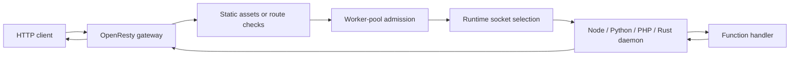
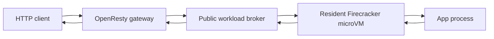

# Architecture

> Verified status as of **April 1, 2026**.
> Runtime note: FastFN resolves dependencies and build steps per function: Python uses `requirements.txt`, Node uses `package.json`, PHP installs from `composer.json` when present, and Rust handlers are built with `cargo`. Host runtimes and tools are required in `fastfn dev --native`, while `fastfn dev` depends on a running Docker daemon.

## Quick View

- Complexity: Advanced
- Typical time: 20-35 minutes
- Use this when: you want to understand where routing, queueing, socket selection, and runtime execution happen
- Outcome: a practical model for debugging health, scaling, and request flow

## Design goals

FastFN keeps the platform simple in three ways:

1. one HTTP edge
2. filesystem-driven discovery
3. per-function control without a large control plane

If you only remember one thing, keep this in mind:

- your files define the app
- OpenResty decides what is public
- runtimes only run the handlers that discovery selects

That is why OpenResty stays at the edge and language runtimes sit behind Unix sockets.

## Mental model

In Docker mode, the same stack runs inside the `openresty` service. In native mode, the CLI starts OpenResty and the runtime daemons directly on the host.

For a more operational view, see:

- [Run and test](../how-to/run-and-test.md)
- [Debugging and troubleshooting](../how-to/debugging-and-troubleshooting.md)
- [Environment variables](../reference/environment-variables.md)

If the root `fn.config.json` defines `assets`, the gateway can answer `GET`/`HEAD` directly from a static folder before the request ever reaches a runtime. With `run_worker_first=true`, that order flips: FastFN checks mapped routes first, then falls back to static assets only when no function route matches.

That assets mount is intentionally narrow: only the configured directory is public, while sibling function folders stay private. Dotfiles, traversal attempts, and reserved prefixes such as `/_fn/*` and `/console/*` are rejected before file resolution.

Image workloads add a second path in native mode:

Private traffic between image workloads stays off the public edge:

## Discovery and route map

FastFN does not keep a static `routes.json` as the source of truth. It discovers functions from a functions directory and builds the route map at runtime.

Common ways to set the functions directory:

- `fastfn dev functions`
- `fastfn.json` -> `"functions-dir": "functions"`
- `FN_FUNCTIONS_ROOT=/absolute/path/to/functions`

`fastfn.json` only points FastFN at the root. Once that root is known, nested folders can carry their own `fn.config.json` files. That means a folder such as `functions/payments/` can declare a local `service`, `app`, `services`, or `apps` block without editing the global `fastfn.json`.

For Firecracker workloads, that folder-local ownership is about declaration and scope. Persistent storage is still managed as FastFN-owned volume images under `.fastfn/firecracker-volumes/`; host-folder bind mounts are not supported in this branch yet.

Runtime order is also configurable:

- `FN_RUNTIMES=python,node,php,rust`

If the same public route exists in more than one runtime, the first enabled runtime wins unless you explicitly force a takeover with config.

When root `assets` are enabled, the static directory is intentionally excluded from zero-config discovery. That keeps files under `public/` or `dist/` from accidentally becoming runtime routes.

In `fastfn dev`, non-leaf project roots are mounted as a whole. That keeps Docker/native hot reload honest: new directories, new asset files, and new explicit function folders become visible without restart, and explicit folders keep their function identity instead of degrading into `handler.*` aliases.

## Image workloads, brokers, and private networking

Public image-backed apps and services do not expose their ephemeral VM ports directly to the rest of the stack.

- Each public endpoint gets a stable host-side broker.
- `/_fn/health` reports both the legacy public `host`/`port` view and the richer `broker_host`/`broker_port` plus `public_endpoints`.
- Once prewarmed, hot requests keep using the same resident microVM instead of rebuilding, repulling, or restarting Firecracker.

Private image-workload networking uses stable internal names:

- Every image workload gets an `internal_host` such as `postgres.internal` or `admin.internal`.
- Inside microVMs, FastFN maps those names to deterministic loopback aliases and bridges guest-to-guest traffic over `vsock`.
- Multiple services can keep the same native container port because the separation happens by workload name and VM boundary, not by forcing every service onto a different internal port.

This matters for common Fly.io-style setups:

- two `postgres:16` services can both keep `5432`
- two Flask apps can both keep `5000`
- dependent apps connect through `*.internal` and service-scoped env vars instead of hardcoded host ports

## Access policy for public workloads

FastFN now has two different edge-policy layers:

- function routes still use per-function `invoke.allow_hosts`
- public image workloads use `access.allow_hosts` and `access.allow_cidrs`

Enforcement points:

- HTTP public workloads: OpenResty checks the normalized request host plus the client IP.
- TCP public workloads: the host-side broker checks only `allow_cidrs`.
- Private `*.internal` traffic is not gated by the public firewall; it stays inside the workload-to-workload network path.

When FastFN runs behind trusted proxies, client IP resolution follows `FN_TRUSTED_PROXY_CIDRS`. Without that allowlist, the gateway treats `remote_addr` as the caller IP and ignores untrusted forwarding headers.

## Runtime routing

FastFN treats runtimes in two groups:

- `lua` runs in-process inside OpenResty.
- `node`, `python`, `php`, `rust`, and `go` run behind Unix sockets.

For PHP specifically, the daemon does not load every handler into one shared interpreter anymore. It keeps a socket-facing daemon plus isolated child workers per handler path, so one PHP function cannot redeclare or inspect another function's global `handler()` symbol by accident.

When a runtime has one daemon, the gateway uses one socket. When it has multiple daemons, the gateway keeps a socket list and selects a healthy socket with `round_robin`.

Configuration knobs:

- `runtime-daemons` or `FN_RUNTIME_DAEMONS` for daemon counts
- `FN_RUNTIME_SOCKETS` for an explicit socket map
- `FN_SOCKET_BASE_DIR` for generated socket locations

Important rules:

- `FN_RUNTIME_SOCKETS` wins over generated socket counts.
- `lua` ignores daemon counts because it does not run as an external daemon.
- Health is tracked per socket, not only per runtime.
- `/_fn/health` exposes both the aggregate runtime health and the socket list.

## Concurrency knobs: what each one does

FastFN has two different scaling layers and they solve different problems.

| Knob | Scope | Where it applies | What it does |
| --- | --- | --- | --- |
| `runtime-daemons` | global per runtime | startup wiring | adds more daemon processes and sockets for a runtime |
| `worker_pool.*` | per function | gateway admission and queueing | limits active executions and queue length before the runtime call |
| runtime internals | runtime-specific | inside each daemon | child workers, process reuse, build and install behavior |

Practical reading:

- Use `runtime-daemons` when you want more routing targets for a runtime.
- Use `worker_pool` when you want per-function backpressure and queue control.
- Measure both together on real traffic; they are complementary, not interchangeable.

## Choosing binaries

In native mode, FastFN can choose the executable used for each runtime or tool through `runtime-binaries` or `FN_*_BIN` environment variables.

Examples:

- `FN_PYTHON_BIN`
- `FN_NODE_BIN`
- `FN_PHP_BIN`
- `FN_CARGO_BIN`
- `FN_COMPOSER_BIN`
- `FN_OPENRESTY_BIN`

One important detail:

- FastFN chooses one executable per key.
- If you run three Python daemons, all three use the same configured `FN_PYTHON_BIN`.
- Multi-daemon routing is not a mixed-version runtime pool.

## Health, failover, and errors

Startup and request flow are designed to fail clearly:

- Native mode checks that the host port is free before boot.
- Runtime socket paths are checked before startup and stale sockets are removed.
- Health checks run per runtime and per socket.
- If one socket goes down, the gateway can skip it and keep using healthy sockets.
- If every socket for a runtime is down, requests fail with `503 runtime unavailable`.

When `include_debug_headers=true`, function responses can include:

- `X-Fn-Runtime-Routing`
- `X-Fn-Runtime-Socket-Index`

These are useful when you want to confirm that traffic is rotating across sockets.

## Tradeoffs

This model is intentionally simple, but it is not magic:

- More daemons can help CPU-bound or blocked runtimes, but they can also add overhead.
- Queueing at the gateway improves control, not raw speed by itself.
- Unix sockets keep the local stack predictable, but they still add a hop compared with in-process Lua.

That is why FastFN publishes raw benchmark artifacts and recommends measuring your own workload before raising daemon counts across the board.

The current Firecracker image-workload matrix reinforces the same lesson:

- cold build/pull and prewarm can take seconds
- hot resident traffic drops into single-digit milliseconds after prewarm
- the hot path stays fast because it reuses the same broker and the same Firecracker process
- services with slower bootstrap sequences now wait for a short stable-ready window before FastFN exposes them to dependent apps

## Related links

- [Function specification](../reference/function-spec.md)
- [Global config](../reference/fastfn-config.md)
- [Complete config reference](../reference/fn-config-complete.md)
- [HTTP API reference](../reference/http-api.md)
- [Scale runtime daemons](../how-to/scale-runtime-daemons.md)
- [Run and test](../how-to/run-and-test.md)
- [Debugging and troubleshooting](../how-to/debugging-and-troubleshooting.md)
- [Performance benchmarks](./performance-benchmarks.md)
