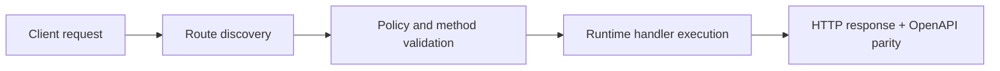

# Authentication and Access Control


> Verified status as of **March 10, 2026**.
> Runtime note: FastFN auto-installs function-local dependencies from `requirements.txt` / `package.json`; host runtimes are required in `fastfn dev --native`, while `fastfn dev` depends on a running Docker daemon.
## Quick View

- Complexity: Intermediate
- Typical time: 10-15 minutes
- Use this when: you need to separate platform admin access from function-level auth
- Outcome: admin surface and business auth rules are clearly scoped


This guide separates two concerns that are usually mixed:

1. Platform administration access (`/console`, `/_fn/*`)
2. Business authentication inside each function route (`/<route>`)

## 1) Platform admin surface

Main flags:

- `FN_UI_ENABLED` (default `0`)
- `FN_CONSOLE_API_ENABLED` (default `1`)
- `FN_CONSOLE_WRITE_ENABLED` (default `0`)
- `FN_CONSOLE_LOCAL_ONLY` (default `1`)
- `FN_ADMIN_TOKEN` (optional)

Recommended baseline:

- keep `FN_CONSOLE_LOCAL_ONLY=1`
- keep `FN_CONSOLE_WRITE_ENABLED=0` unless needed
- use `FN_ADMIN_TOKEN` for remote/admin automation

Example:

```bash
curl -sS 'http://127.0.0.1:8080/_fn/ui-state' \
  -H 'x-fn-admin-token: my-secret-token'
```

## 2) Function-level auth patterns

Gateway forwards headers/query/body/cookies into `event`, and per-function env into `event.env`.

Useful fields:

- `event.headers.authorization`
- `event.headers.cookie`
- `event.headers.x-api-key`
- `event.query`
- `event.body`
- `event.env`

## Pattern A: API key (Python, Node, PHP, Lua)

### Python

```python
import json

def handler(event):
    headers = event.get("headers") or {}
    env = event.get("env") or {}

    provided = headers.get("x-api-key")
    expected = env.get("API_KEY")

    if not expected or provided != expected:
        return {
            "status": 401,
            "headers": {"Content-Type": "application/json"},
            "body": json.dumps({"error": "unauthorized"}),
        }

    return {
        "status": 200,
        "headers": {"Content-Type": "application/json"},
        "body": json.dumps({"ok": True}),
    }
```

### Node

```js
exports.handler = async (event) => {
  const headers = event.headers || {};
  const env = event.env || {};

  const provided = headers['x-api-key'];
  const expected = env.API_KEY;

  if (!expected || provided !== expected) {
    return {
      status: 401,
      headers: { 'Content-Type': 'application/json' },
      body: JSON.stringify({ error: 'unauthorized' }),
    };
  }

  return {
    status: 200,
    headers: { 'Content-Type': 'application/json' },
    body: JSON.stringify({ ok: true }),
  };
};
```

### PHP

```php
<?php
function handler($event) {
    $headers = $event['headers'] ?? [];
    $env = $event['env'] ?? [];

    $provided = $headers['x-api-key'] ?? null;
    $expected = $env['API_KEY'] ?? null;

    if (!$expected || $provided !== $expected) {
        return [
            'status' => 401,
            'headers' => ['Content-Type' => 'application/json'],
            'body' => json_encode(['error' => 'unauthorized']),
        ];
    }

    return [
        'status' => 200,
        'headers' => ['Content-Type' => 'application/json'],
        'body' => json_encode(['ok' => true]),
    ];
}
```

### Lua

```lua
local cjson = require("cjson.safe")

function handler(event)
  local headers = event.headers or {}
  local env = event.env or {}
  local provided = headers["x-api-key"]
  local expected = env.API_KEY

  if not expected or provided ~= expected then
    return {
      status = 401,
      headers = { ["Content-Type"] = "application/json" },
      body = cjson.encode({ error = "unauthorized" }),
    }
  end

  return {
    status = 200,
    headers = { ["Content-Type"] = "application/json" },
    body = cjson.encode({ ok = true }),
  }
end
```

Store secret in function env:

```bash
curl -sS 'http://127.0.0.1:8080/_fn/function-env?runtime=python&name=hello' \
  -X PUT -H 'Content-Type: application/json' \
  --data '{"API_KEY":{"value":"hello-secret","is_secret":true}}'
```

## Pattern B: Session cookie (Python, Node, PHP, Lua)

### Python

```python
import json

def handler(event):
    headers = event.get("headers") or {}
    cookie = headers.get("cookie") or headers.get("Cookie") or ""

    if "session_id=" not in cookie:
        return {
            "status": 401,
            "headers": {"Content-Type": "application/json"},
            "body": json.dumps({"error": "missing session"}),
        }

    return {
        "status": 200,
        "headers": {"Content-Type": "application/json"},
        "body": json.dumps({"ok": True}),
    }
```

### Node

```js
exports.handler = async (event) => {
  const headers = event.headers || {};
  const cookie = headers.cookie || headers.Cookie || '';

  if (!cookie.includes('session_id=')) {
    return {
      status: 401,
      headers: { 'Content-Type': 'application/json' },
      body: JSON.stringify({ error: 'missing session' }),
    };
  }

  return {
    status: 200,
    headers: { 'Content-Type': 'application/json' },
    body: JSON.stringify({ ok: true }),
  };
};
```

### PHP

```php
<?php
function handler($event) {
    $headers = $event['headers'] ?? [];
    $cookie = $headers['cookie'] ?? ($headers['Cookie'] ?? '');

    if (strpos($cookie, 'session_id=') === false) {
        return [
            'status' => 401,
            'headers' => ['Content-Type' => 'application/json'],
            'body' => json_encode(['error' => 'missing session']),
        ];
    }

    return [
        'status' => 200,
        'headers' => ['Content-Type' => 'application/json'],
        'body' => json_encode(['ok' => true]),
    ];
}
```

### Lua

```lua
local cjson = require("cjson.safe")

function handler(event)
  local headers = event.headers or {}
  local cookie = headers.cookie or headers.Cookie or ""

  if not string.find(cookie, "session_id=", 1, true) then
    return {
      status = 401,
      headers = { ["Content-Type"] = "application/json" },
      body = cjson.encode({ error = "missing session" }),
    }
  end

  return {
    status = 200,
    headers = { ["Content-Type"] = "application/json" },
    body = cjson.encode({ ok = true }),
  }
end
```

## Secret visibility and masking

Use `fn.env.json` with `is_secret`:

```json
{
  "API_KEY": {"value": "hello-secret", "is_secret": true}
}
```

## Common mistakes

- mixing admin security with function business auth
- exposing `/_fn/*` publicly without controls
- hardcoding secrets in source instead of `event.env`

## Flow Diagram



## Objective

Clear scope, expected outcome, and who should use this page.

## Prerequisites

- FastFN CLI available
- Runtime dependencies by mode verified (Docker for `fastfn dev`, OpenResty+runtimes for `fastfn dev --native`)

## Validation Checklist

- Command examples execute with expected status codes
- Routes appear in OpenAPI where applicable
- References at the end are reachable

## Troubleshooting

- If runtime is down, verify host dependencies and health endpoint
- If routes are missing, re-run discovery and check folder layout

## See also

- [Function Specification](../reference/function-spec.md)
- [HTTP API Reference](../reference/http-api.md)
- [Run and Test Checklist](run-and-test.md)
