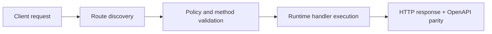

# Contributing


> Verified status as of **March 10, 2026**.
> Runtime note: FastFN auto-installs function-local dependencies from `requirements.txt` / `package.json`; host runtimes are required in `fastfn dev --native`, while `fastfn dev` depends on a running Docker daemon.
## Quick View

- Complexity: Basic
- Typical time: 5-10 minutes
- Use this when: you are preparing a change or pull request
- Outcome: you follow the expected repo workflow and checks


Read first:

- `README.md`
- `docs/en/explanation/architecture.md`
- `docs/internal/TASK_QUEUE.md`

Workflow:

1. Create a branch.
2. Keep changes small and focused.
3. Update docs for any public behavior/API change.
4. Run full suite before PR:

```bash
sh ./scripts/ci/test-pipeline.sh
mkdocs build --strict
```

PR checklist:

- unit tests pass
- integration tests pass
- README/docs updated
- no hardcoded secrets in examples
- method policy (`invoke.methods`) reflected in gateway and OpenAPI

## Flow Diagram



## Objective

Clear scope, expected outcome, and who should use this page.

## Prerequisites

- FastFN CLI available
- Runtime dependencies by mode verified (Docker for `fastfn dev`, OpenResty+runtimes for `fastfn dev --native`)

## Validation Checklist

- Command examples execute with expected status codes
- Routes appear in OpenAPI where applicable
- References at the end are reachable

## Troubleshooting

- If runtime is down, verify host dependencies and health endpoint
- If routes are missing, re-run discovery and check folder layout

## See also

- [Function Specification](../reference/function-spec.md)
- [HTTP API Reference](../reference/http-api.md)
- [Run and Test Checklist](run-and-test.md)

## Contribution workflow and review checklist

1. create focused branch
2. implement minimal coherent change
3. run relevant tests and docs strict build
4. open PR with validation evidence
5. address review comments and keep CI green

Review checklist:

- contract changes include tests
- EN/ES docs parity kept for user-facing docs changes
- no internal runbook leakage into public docs

## Release notes policy

- every user-visible change must be captured in release notes/changelog
- entries should include date, scope, and upgrade impact
- docs-only updates still require a concise release note line when they change behavior expectations
