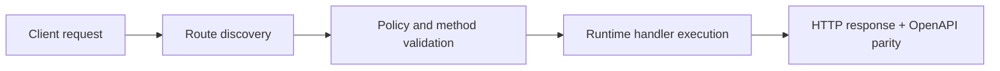

# Deploying to Production


> Verified status as of **March 10, 2026**.
> Runtime note: FastFN auto-installs function-local dependencies from `requirements.txt` / `package.json`; host runtimes are required in `fastfn dev --native`, while `fastfn dev` depends on a running Docker daemon.
## Quick View

- Complexity: Intermediate
- Typical time: 20-30 minutes
- Use this when: you are moving from local dev to production runtime
- Outcome: production run mode and edge hardening are correctly configured


FastFN is designed to run in production using the same engine as development, with hot reload enabled by default and safer TLS defaults.

If you want a smaller deployment walkthrough focused on `systemd` and TLS, see [Run FastFN as a Linux Service](./run-as-a-linux-service.md).

## Current Status

- Native production mode (`fastfn run --native`): available
- Docker-first production mode: available for development workflows, while native mode remains the production default in this guide.

## Production Modes

### 1. Self-Hosted (Bare Metal / VM)

The simplest way is to run the binary in `run` mode. Hot reload and file watchers are enabled by default so code changes take effect immediately without restarting.

**Command:**
```bash
fastfn run --native /path/to/your/functions
```

To disable hot reload (for example in a locked-down deployment):

```bash
FN_HOT_RELOAD=0 fastfn run --native /path/to/your/functions
```

Or in `fastfn.json`:

```json
{ "hot-reload": false }
```

**Requirements:**
- FastFN binary on the host.
- OpenResty available in `PATH` (required by `--native`).
- Language runtimes installed on the host for any runtimes you plan to use (Python/Node/PHP).

If OpenResty is missing but Docker is installed, production `run --native` still fails (as expected).  
For development, you can use `fastfn dev` (Docker mode) while installing OpenResty for native prod flows.

### 2. Docker Container

FastFN production guidance in this document is `--native` first. Docker-based production wiring exists for selected workflows, but it is not the default path documented here.

## Health Checks

FastFN exposes a health check endpoint for load balancers (K8s, AWS ALB):

- `GET /_fn/health`
- Returns `200 OK`

## Environment Variables

Ensure you pass production secrets via env vars, not `fn.env.json`.

```bash
docker run -e DB_PASSWORD=secret ...
```

FastFN merges `fn.env.json` with actual environment variables, prioritizing the environment.

## Reverse Proxy With Existing Nginx

Assume you already have a website on Nginx and you want to forward only API paths to FastFN.

FastFN listens on an internal port (for example `127.0.0.1:8080`) and Nginx proxies requests to it.

### Minimal example

This keeps your existing site as-is and forwards `/api/` to FastFN:

```nginx
upstream fastfn_upstream {
  server 127.0.0.1:8080;
  keepalive 32;
}

server {
  listen 443 ssl;
  server_name example.com;

  # Your existing site:
  root /var/www/site;
  index index.html;

  # Forward API to FastFN:
  location ^~ /api/ {
    proxy_pass http://fastfn_upstream;
    proxy_set_header Host $host;
    proxy_set_header X-Forwarded-Host $host;
    proxy_set_header X-Forwarded-Proto $scheme;
    proxy_set_header X-Forwarded-For $proxy_add_x_forwarded_for;
  }
}
```

### Lock down admin endpoints

Do not expose `/_fn/*` or `/console/*` publicly unless you also restrict them.

A simple option is IP allowlisting:

```nginx
location ^~ /_fn/ {
  allow 127.0.0.1;
  deny all;
  proxy_pass http://fastfn_upstream;
}

location ^~ /console/ {
  allow 127.0.0.1;
  deny all;
  proxy_pass http://fastfn_upstream;
}
```

### OpenAPI base URL behind Nginx

FastFN detects the public server URL from `X-Forwarded-Proto` and `X-Forwarded-Host`.

If you cannot (or do not want to) forward those headers, set:

- `FN_PUBLIC_BASE_URL=https://example.com`

## Flow Diagram



## Objective

Clear scope, expected outcome, and who should use this page.

## Prerequisites

- FastFN CLI available
- Runtime dependencies by mode verified (Docker for `fastfn dev`, OpenResty+runtimes for `fastfn dev --native`)

## Validation Checklist

- Command examples execute with expected status codes
- Routes appear in OpenAPI where applicable
- References at the end are reachable

## Troubleshooting

- If runtime is down, verify host dependencies and health endpoint
- If routes are missing, re-run discovery and check folder layout

## See also

- [Function Specification](../reference/function-spec.md)
- [HTTP API Reference](../reference/http-api.md)
- [Run and Test Checklist](run-and-test.md)

## Runtime mode matrix and production preflight

| Mode | Requirement | Recommended use |
|---|---|---|
| Docker mode (`fastfn dev`) | Docker daemon | local parity and onboarding |
| Native mode (`fastfn dev --native`) | OpenResty + host runtimes | advanced local ops and debugging |

Preflight before deploy:

1. dependency check passes (`fastfn doctor`)
2. health endpoint returns up
3. OpenAPI and critical routes validated
4. security defaults reviewed (`/_fn/*` exposure, admin token)
