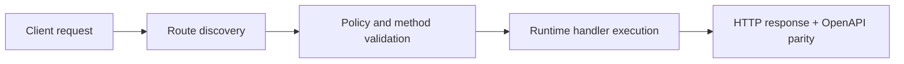

# Install and Release (Homebrew)


> Verified status as of **March 10, 2026**.
> Runtime note: FastFN auto-installs function-local dependencies from `requirements.txt` / `package.json`; host runtimes are required in `fastfn dev --native`, while `fastfn dev` depends on a running Docker daemon.
## Quick View

- Complexity: Basic
- Typical time: 5-10 minutes
- Use this when: you need install and upgrade paths via Homebrew
- Outcome: CLI install path and runtime prerequisites are clear


This page covers:

- Homebrew channel usage and fallback install paths.
- Publishing a new release and updating the Homebrew tap (maintainers).

> Verified status as of **March 10, 2026**: if tap/formula is not available in your environment, use source install (below).

## Install (users, once tap is available)

```bash
brew tap misaelzapata/homebrew-fastfn
brew install fastfn
fastfn --version
```

## Runtime requirements (by mode)

`brew install fastfn` installs the CLI. Runtime requirements depend on mode:

- `native` (`fastfn dev --native`, `fastfn run --native`): requires `openresty`.
- `docker` (`fastfn dev` by default): requires Docker CLI + a running daemon.

Behavior when dependencies are incomplete:

- Docker installed, OpenResty missing:
  - `fastfn dev --native` and `fastfn run --native` fail with an explicit OpenResty error.
  - `fastfn dev` (without `--native`) still works if Docker daemon is running.
- OpenResty installed, Docker missing:
  - native mode works.
  - docker mode fails until Docker is installed/running.

This follows the same dependency UX standard used by major local-runtime CLIs:

- explicit prerequisite per execution mode (Cloudflare Wrangler docs)
- clear Docker requirement for local stack mode (Supabase docs)
- actionable failure message when local container runtime is missing/down (AWS SAM / LocalStack docs)

Recommended bootstrap (macOS + Homebrew):

```bash
brew tap misaelzapata/homebrew-fastfn
brew install fastfn openresty
brew install --cask docker
fastfn doctor
```

Upgrade:

```bash
brew upgrade fastfn
```

Uninstall:

```bash
brew uninstall fastfn
```

## Install from source (contributors)

Requirements: Go and Docker.

```bash
git clone https://github.com/misaelzapata/fastfn
cd fastfn
bash cli/build.sh
./bin/fastfn --help
```

## Publish a release (maintainers)

FastFN uses GoReleaser and GitHub Actions:

- CI runs on pushes to `main`.
- Releases run on tag pushes matching `v*` (for example `v0.1.0`).

### 1) Configure secrets (once)

If you want GoReleaser to update the Homebrew tap automatically, set:

- `HOMEBREW_TAP_GITHUB_TOKEN`: a GitHub token that can push to `misaelzapata/homebrew-fastfn`.

If the secret is not present, the release will still publish GitHub release assets, but it will **skip** updating Homebrew.

### 2) Tag and push

From the repo root:

```bash
git tag -a v0.1.0 -m "v0.1.0"
git push origin v0.1.0
```

### 3) Verify

After the workflow finishes:

- GitHub Releases contains the new version and binary archives.
- `misaelzapata/homebrew-fastfn` has an updated `Formula/fastfn.rb`.

## Flow Diagram



## Objective

Clear scope, expected outcome, and who should use this page.

## Prerequisites

- FastFN CLI available
- Runtime dependencies by mode verified (Docker for `fastfn dev`, OpenResty+runtimes for `fastfn dev --native`)

## Validation Checklist

- Command examples execute with expected status codes
- Routes appear in OpenAPI where applicable
- References at the end are reachable

## Troubleshooting

- If runtime is down, verify host dependencies and health endpoint
- If routes are missing, re-run discovery and check folder layout

## See also

- [Function Specification](../reference/function-spec.md)
- [HTTP API Reference](../reference/http-api.md)
- [Run and Test Checklist](run-and-test.md)
