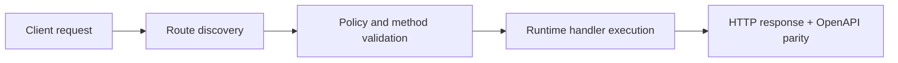

# Manage Functions (Console API)


> Verified status as of **March 10, 2026**.
> Runtime note: FastFN auto-installs function-local dependencies from `requirements.txt` / `package.json`; host runtimes are required in `fastfn dev --native`, while `fastfn dev` depends on a running Docker daemon.
## Quick View

- Complexity: Intermediate
- Typical time: 15-25 minutes
- Use this when: you need CRUD and config updates through Console API
- Outcome: functions can be created, updated, invoked, and removed safely


Practical CRUD lifecycle using `/_fn/*` endpoints.

## Important: function paths are configurable

Function files are stored under `FN_FUNCTIONS_ROOT` (not hardcoded).

In practice, this is the directory you pass to `fastfn dev`.

Recommended setup:

1. Put your code under `functions/`.
2. Run `fastfn dev functions` (or set `"functions-dir": "functions"` in `fastfn.json`).

If you need to set it explicitly:

```bash
export FN_FUNCTIONS_ROOT="$PWD/functions"
```

## Prerequisites

- platform running on `http://127.0.0.1:8080`
- Console API enabled (`FN_CONSOLE_API_ENABLED=1`)
- write mode enabled (`FN_CONSOLE_WRITE_ENABLED=1`) or admin token

## 1) Inspect catalog

```bash
curl -sS 'http://127.0.0.1:8080/_fn/catalog'
```

Use this first to confirm runtime names and discover current `functions_root`.

## 2) Create a function

```bash
curl -sS 'http://127.0.0.1:8080/_fn/function?runtime=python&name=demo-new' \
  -X POST \
  -H 'Content-Type: application/json' \
  --data '{"methods":["GET"],"summary":"Demo function"}'
```

## 3) Read details

```bash
curl -sS 'http://127.0.0.1:8080/_fn/function?runtime=python&name=demo-new&include_code=1'
```

## 3a) Inspect dependency resolution state

```bash
curl -sS 'http://127.0.0.1:8080/_fn/function?runtime=python&name=demo-new' \
| python3 - <<'PY'
import json, sys
obj = json.load(sys.stdin)
print(json.dumps((obj.get("metadata") or {}).get("dependency_resolution"), indent=2))
PY
```

Fields to check:

- `mode`: `manifest` or `inferred`
- `manifest_generated`: whether FastFN created the manifest automatically
- `infer_backend`: which inference backend ran (`native`, `pipreqs`, `detective`, `require-analyzer`)
- `inference_duration_ms`: how long inference took before install
- `inferred_imports` / `resolved_packages` / `unresolved_imports`
- `last_install_status` and `last_error`
- `lockfile_path` (when available)

Practical guidance:

- explicit `requirements.txt` / `package.json` is still the fastest path
- inference is optional and better treated as a bootstrap helper
- external backends such as `pipreqs`, `detective`, and `require-analyzer` can take longer because FastFN has to invoke extra tooling

## 4) Update policy (methods/limits)

```bash
curl -sS 'http://127.0.0.1:8080/_fn/function-config?runtime=python&name=demo-new' \
  -X PUT \
  -H 'Content-Type: application/json' \
--data '{"timeout_ms":1200,"max_concurrency":5,"max_body_bytes":262144,"invoke":{"methods":["GET","POST"]}}'
```

## 4a) Reuse shared dependency packs (optional)

If multiple functions need the same reusable dependencies, you can define a shared pack under:

```text
<FN_FUNCTIONS_ROOT>/.fastfn/packs/<runtime>/<pack>/
```

If your functions root points to a runtime-specific folder such as `<root>/python` or `<root>/node`, FastFN also checks the parent root for the same `.fastfn/packs/<runtime>/...` structure.

Pack names are user-defined identifiers. A function can keep its own local `requirements.txt` or `package.json` and also attach one or more packs through `shared_deps`.

For example, a Python function might keep app-specific pins locally and add a shared HTTP client pack for reuse across many handlers.

Then attach the pack names to a function via `shared_deps`:

```bash
curl -sS 'http://127.0.0.1:8080/_fn/function-config?runtime=python&name=demo-new' \
  -X PUT \
  -H 'Content-Type: application/json' \
  --data '{"shared_deps":["common_http"]}'
```

## 4b) Add a schedule (interval cron)

```bash
curl -sS 'http://127.0.0.1:8080/_fn/function-config?runtime=python&name=demo-new' \
  -X PUT \
  -H 'Content-Type: application/json' \
  --data '{"schedule":{"enabled":true,"every_seconds":60,"method":"GET","query":{"action":"inc"},"headers":{},"body":"","context":{}}}'
```

Inspect scheduler state:

```bash
curl -sS 'http://127.0.0.1:8080/_fn/schedules'
```

## 5) Update env

```bash
curl -sS 'http://127.0.0.1:8080/_fn/function-env?runtime=python&name=demo-new' \
  -X PUT \
  -H 'Content-Type: application/json' \
  --data '{"GREETING_PREFIX":"hello"}'
```

## 6) Update code

```bash
curl -sS 'http://127.0.0.1:8080/_fn/function-code?runtime=python&name=demo-new' \
  -X PUT \
  -H 'Content-Type: application/json' \
  --data '{"code":"import json\n\ndef handler(event):\n    q = event.get(\"query\") or {}\n    return {\"status\":200,\"headers\":{\"Content-Type\":\"application/json\"},\"body\":json.dumps({\"ok\":True,\"query\":q})}\n"}'
```

## 7) Invoke through internal helper

```bash
curl -sS 'http://127.0.0.1:8080/_fn/invoke' \
  -X POST \
  -H 'Content-Type: application/json' \
  --data '{"runtime":"python","name":"demo-new","method":"GET","query":{"name":"Ops"}}'
```

This routes through the same gateway routing/policy layer as public traffic, so it enforces the same methods and limits.

## 7b) Enqueue async job (run later)

```bash
curl -sS 'http://127.0.0.1:8080/_fn/jobs' \
  -X POST \
  -H 'Content-Type: application/json' \
  --data '{"name":"demo-new","method":"GET","query":{"name":"Async"}}'
```

Then poll:

```bash
curl -sS 'http://127.0.0.1:8080/_fn/jobs/<id>'
curl -sS 'http://127.0.0.1:8080/_fn/jobs/<id>/result'
```

## 8) Delete function

```bash
curl -sS 'http://127.0.0.1:8080/_fn/function?runtime=python&name=demo-new' -X DELETE
```

## Common errors

- `404`: unknown function/version
- `405`: method not allowed by policy
- `409`: ambiguous function name across runtimes (or route mapping conflict)
- `403`: write disabled/local-only restriction

## Flow Diagram



## Objective

Clear scope, expected outcome, and who should use this page.

## Validation Checklist

- Command examples execute with expected status codes
- Routes appear in OpenAPI where applicable
- References at the end are reachable

## Troubleshooting

- If runtime is down, verify host dependencies and health endpoint
- If routes are missing, re-run discovery and check folder layout
- If dependency inference fails, inspect `metadata.dependency_resolution` and `<function_dir>/.fastfn-deps-state.json`
- If `infer_backend` is an external tool, verify that tool exists in the runtime environment before debugging the handler itself
- For strict inference failures, add explicit pins in `requirements.txt` / `package.json` or adjust `FN_AUTO_INFER_STRICT`

## See also

- [Function Specification](../reference/function-spec.md)
- [HTTP API Reference](../reference/http-api.md)
- [Run and Test Checklist](run-and-test.md)
- [Built-in Functions Catalog](../reference/builtin-functions.md)
- [Python Packaging User Guide](https://packaging.python.org/)
- [npm package.json docs](https://docs.npmjs.com/cli/v10/configuring-npm/package-json)
