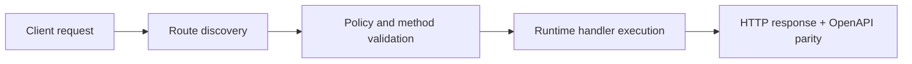

# Run and Test


> Verified status as of **March 10, 2026**.
> Runtime note: FastFN auto-installs function-local dependencies from `requirements.txt` / `package.json`; host runtimes are required in `fastfn dev --native`, while `fastfn dev` depends on a running Docker daemon.
## Quick View

- Complexity: Intermediate
- Typical time: 20-40 minutes
- Use this when: you need full platform validation locally or in CI
- Outcome: health, routing, OpenAPI and test gates are verified


This guide is the practical validation flow for teams treating FastFN as a serious FaaS platform.

It is organized as a staged checklist so you can run it locally and in CI with the same criteria.

## Validation scope

This flow validates:

- runtime boot and health
- route discovery and request handling
- OpenAPI parity with discovered routes
- route conflict behavior
- regression test suites (unit + integration)

If you need architecture background first:

- [Architecture](../explanation/architecture.md)
- [Invocation flow](../explanation/invocation-flow.md)
- [Function spec](../reference/function-spec.md)
- [FastAPI / Next.js migration playbook](./fastapi-nextjs-playbook.md)

## Prerequisites

Required:

- `./bin/fastfn` available
- `curl`, `jq`

Mode-specific:

- Docker mode (`fastfn dev`): Docker CLI + daemon running
- Native mode (`fastfn dev --native`): OpenResty in PATH, plus runtime binaries you plan to use

## Stage 1: build and start

Build:

```bash
make build-cli
```

Start stack (docker default):

```bash
./bin/fastfn dev examples/functions/next-style
```

Start stack (native):

```bash
./bin/fastfn dev --native examples/functions/next-style
```

Acceptance criteria:

- process starts without fatal errors
- `/_fn/health` reaches HTTP `200`

## Stage 2: health and core endpoint checks

Health:

```bash
curl -sS 'http://127.0.0.1:8080/_fn/health' | jq
```

Public endpoint smoke:

```bash
curl -i 'http://127.0.0.1:8080/hello?name=World'
curl -i 'http://127.0.0.1:8080/html?name=Designer'
```

Acceptance criteria:

- health payload reports enabled runtimes as up
- endpoint calls return HTTP `200`

## Stage 3: OpenAPI and routing parity checks

OpenAPI paths:

```bash
curl -sS 'http://127.0.0.1:8080/_fn/openapi.json' | jq '.paths | keys'
```

Catalog routes and conflict view:

```bash
curl -sS 'http://127.0.0.1:8080/_fn/catalog' | jq '{mapped_routes, mapped_route_conflicts}'
```

Acceptance criteria:

- all expected public routes appear in OpenAPI
- `mapped_route_conflicts` is empty in normal operation

Related behavior:

- [Zero-config routing](./zero-config-routing.md)
- [HTTP API reference](../reference/http-api.md)

## Stage 4: explicit conflict behavior check

FastFN should not silently override mapped URLs by default.

Verify conflict handling policy:

1. create two functions claiming the same route
2. call catalog and confirm conflict exposure
3. ensure collision returns deterministic error behavior

Policy references:

- [Function route precedence and `invoke.force-url`](../reference/function-spec.md)
- [Global override (`FN_FORCE_URL`)](../reference/fastfn-config.md)

## Stage 5: run full regression suites

Core CI-like pipeline:

```bash
bash scripts/ci/test-pipeline.sh
```

Focused suites:

```bash
bash tests/integration/test-openapi-system.sh
bash tests/integration/test-openapi-native.sh
bash tests/integration/test-api.sh
bash tests/integration/test-home-routing.sh
bash tests/integration/test-auto-install-inference.sh
bash tests/integration/test-platform-equivalents.sh
```

Acceptance criteria:

- no skipped mandatory checks in CI
- OpenAPI parity tests pass in both docker and native where required

## Stage 6: publish-quality tracking checklist

Use this checklist before merge/release:

- [ ] `/_fn/health` returns 200 and runtimes up
- [ ] representative public routes return expected status/body
- [ ] `/_fn/openapi.json` includes mapped public routes
- [ ] `mapped_route_conflicts` is empty (or intentionally documented)
- [ ] `test-openapi-system.sh` passes
- [ ] `test-openapi-native.sh` passes (or explicitly justified for local non-native environments)
- [ ] `test-home-routing.sh` passes (root `/` override + folder home alias via `fn.config.json`)
- [ ] `test-auto-install-inference.sh` passes (strict inference + metadata visibility)
- [ ] `test-platform-equivalents.sh` passes (advanced auth/webhook/jobs/order examples)
- [ ] docs links added/updated for changed behavior

For production hardening next:

- [Deploy to production](./deploy-to-production.md)
- [Security confidence checklist](./security-confidence.md)

## Flow Diagram



## Objective

Clear scope, expected outcome, and who should use this page.

## Validation Checklist

- Command examples execute with expected status codes
- Routes appear in OpenAPI where applicable
- References at the end are reachable

## Troubleshooting

- If runtime is down, verify host dependencies and health endpoint
- If routes are missing, re-run discovery and check folder layout

## See also

- [Function Specification](../reference/function-spec.md)
- [HTTP API Reference](../reference/http-api.md)
- [Architecture Overview](../explanation/architecture.md)

## Unit and integration quick recipes

```bash
cd cli && go test ./...
sh ./scripts/ci/test-pipeline.sh
```

Use unit tests for function logic and integration scripts for routing/runtime parity.

## Testing seams and mocking strategy

Prefer seams at:

- external HTTP clients
- database adapters
- clock/time providers
- process/signal boundaries in native mode

## Debug checklist

1. confirm route discovery output
2. confirm `/_fn/health` status
3. test endpoint with verbose curl (`-i -v`)
4. inspect runtime logs by language
5. isolate minimal repro function
