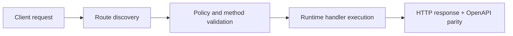

# Telegram AI Digest (cron)


> Verified status as of **March 10, 2026**.
> Runtime note: FastFN auto-installs function-local dependencies from `requirements.txt` / `package.json`; host runtimes are required in `fastfn dev --native`, while `fastfn dev` depends on a running Docker daemon.
## Quick View

- Complexity: Intermediate
- Typical time: 15-30 minutes
- Use this when: you want scheduled Telegram digests with optional AI summary
- Outcome: digest flow runs with correct secrets and schedule


This function sends a periodic digest to your Telegram chat using free sources (no API keys required for weather/news) and optional AI summarization.

## Function

- Function: `telegram-ai-digest`
- Route: `/telegram-ai-digest`
- Methods: `GET`, `POST`
- Schedule: defined per function in `<FN_FUNCTIONS_ROOT>/telegram-ai-digest/fn.config.json`

## Configure secrets

Edit `<FN_FUNCTIONS_ROOT>/telegram-ai-digest/fn.env.json`:

- `TELEGRAM_BOT_TOKEN`
- `TELEGRAM_CHAT_ID`
- `OPENAI_API_KEY`

`OPENAI_API_KEY` is optional: if missing, the digest is sent without AI rewriting.

## Cron schedule

The cron schedule is defined per function in `fn.config.json`:

```json
"schedule": {
  "enabled": true,
  "every_seconds": 60,
  "method": "GET",
  "query": {"dry_run": "false"},
  "context": {"type": "cron"}
}
```

To disable:

```json
"enabled": false
```

## Manual test

Dry run:

```bash
curl -sS 'http://127.0.0.1:8080/telegram-ai-digest?chat_id=1160337817&dry_run=true'
```

Send to your phone:

```bash
curl -sS 'http://127.0.0.1:8080/telegram-ai-digest?chat_id=1160337817&dry_run=false'
```

Optional query flags:

- `include_ai=true|false` (default `false`)
- `include_weather=true|false` (default `true`)
- `include_news=true|false` (default `true`)
- `max_items=5` (1–10)
- `min_interval_secs=60` (0–86400). Set `0` to send every time.

## What it sends

- Weather: Open‑Meteo (no API key)
- News: Google News RSS (no API key)
- Location: derived from caller IP (ipapi.co)
- Language: inferred from country (es/en)
 - Format: HTML (for clean formatting in Telegram)

## Response example

```json
{
  "ok": true,
  "dry_run": false,
  "chat_id": "1160337817",
  "used_ai": true,
  "telegram": {"message_id": 123},
  "preview": "..."
}
```

## Flow Diagram



## Objective

Clear scope, expected outcome, and who should use this page.

## Prerequisites

- FastFN CLI available
- Runtime dependencies by mode verified (Docker for `fastfn dev`, OpenResty+runtimes for `fastfn dev --native`)

## Validation Checklist

- Command examples execute with expected status codes
- Routes appear in OpenAPI where applicable
- References at the end are reachable

## Troubleshooting

- If runtime is down, verify host dependencies and health endpoint
- If routes are missing, re-run discovery and check folder layout

## See also

- [Function Specification](../reference/function-spec.md)
- [HTTP API Reference](../reference/http-api.md)
- [Run and Test Checklist](run-and-test.md)
