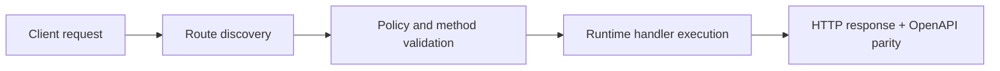

# Telegram AI Digest (cron)


> Verified status as of **March 10, 2026**.
> Runtime note: FastFN auto-installs function-local dependencies from `requirements.txt` / `package.json`; host runtimes are required in `fastfn dev --native`, while `fastfn dev` depends on a running Docker daemon.
## Quick View

- Complexity: Intermediate
- Typical time: 15-30 minutes
- Use this when: you want scheduled Telegram digests with optional AI summary
- Outcome: digest flow runs with correct secrets and schedule


This function fetches recent messages from a Telegram group, summarizes them with OpenAI, and sends the digest back to the chat.

## Function

- Function: `telegram-ai-digest`
- Route: `/telegram-ai-digest`
- Methods: `GET`
- Schedule: defined per function in `<FN_FUNCTIONS_ROOT>/telegram-ai-digest/fn.config.json`

## Configure secrets

Edit `<FN_FUNCTIONS_ROOT>/telegram-ai-digest/fn.env.json`:

- `TELEGRAM_BOT_TOKEN` (required)
- `TELEGRAM_CHAT_ID` (required)
- `OPENAI_API_KEY` (required)

## Cron schedule

The cron schedule is defined per function in `fn.config.json`:

```json
"schedule": {
  "enabled": true,
  "every_seconds": 3600,
  "method": "GET"
}
```

To disable:

```json
"enabled": false
```

## Manual test

```bash
curl -sS 'http://127.0.0.1:8080/telegram-ai-digest'
```

## Response example

```json
{
  "ok": true,
  "message_count": 42,
  "digest": "Daily Digest (2026-03-17T12:00 UTC)\n\n..."
}
```

## Flow Diagram



## Objective

Clear scope, expected outcome, and who should use this page.

## Prerequisites

- FastFN CLI available
- Runtime dependencies by mode verified (Docker for `fastfn dev`, OpenResty+runtimes for `fastfn dev --native`)

## Validation Checklist

- Command examples execute with expected status codes
- Routes appear in OpenAPI where applicable
- References at the end are reachable

## Troubleshooting

- If runtime is down, verify host dependencies and health endpoint
- If routes are missing, re-run discovery and check folder layout

## See also

- [Function Specification](../reference/function-spec.md)
- [HTTP API Reference](../reference/http-api.md)
- [Run and Test Checklist](run-and-test.md)
