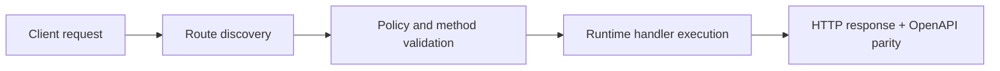

# Telegram E2E (Send a Real Message)


> Verified status as of **March 10, 2026**.
> Runtime note: FastFN auto-installs function-local dependencies from `requirements.txt` / `package.json`; host runtimes are required in `fastfn dev --native`, while `fastfn dev` depends on a running Docker daemon.
## Quick View

- Complexity: Intermediate
- Typical time: 15-25 minutes
- Use this when: you need to validate real Telegram send flow end-to-end
- Outcome: token and chat wiring are verified with a real message


This guide verifies a real end-to-end path:

`fastfn` -> `telegram-send` -> Telegram Bot API -> your Telegram app.

!!! warning "Secrets"
    Do not commit real tokens. Store secrets in `fn.env.json` and keep them out of git history.

## 1) Create a bot token

1. Open Telegram and talk to **@BotFather**
2. Create a new bot and copy the token (`TELEGRAM_BOT_TOKEN`)

## 2) Configure the function secret (fastfn env)

Edit the function env (Console UI):

- Open `http://127.0.0.1:8080/console/explorer/node/telegram-send`
- Set `TELEGRAM_BOT_TOKEN` in the **Env** editor
- Mark it as `is_secret=true` so the Console won’t display it

The file on disk is:

`<FN_FUNCTIONS_ROOT>/telegram-send/fn.env.json`

In this repository (when running `fastfn dev examples/functions`), that path is:

`examples/functions/node/telegram-send/fn.env.json`

!!! tip "Console disabled?"
    The Console UI is disabled by default. If you run with Docker Compose, enable it with:

    - `FN_UI_ENABLED=1`
    - keep `FN_CONSOLE_LOCAL_ONLY=1` (default) so it is not exposed remotely

## 3) Get your `chat_id`

1. Send `/start` to your bot (or any message)
2. Fetch updates:

```bash
export TELEGRAM_BOT_TOKEN='...'
curl -sS "https://api.telegram.org/bot${TELEGRAM_BOT_TOKEN}/getUpdates"
```

Look for:

`result[].message.chat.id`

That is your `CHAT_ID`.

## 4) Send a real message via fastfn

### Option A: one-liner curl

```bash
export CHAT_ID='123456789'
curl -sS "http://127.0.0.1:8080/telegram-send?chat_id=${CHAT_ID}&text=Hello&dry_run=false"
```

Expected: JSON includes `"sent":true`.

!!! tip "Using secrets from docker-compose/.env"
    The `telegram-send` demo prefers `fn.env.json`, but it can also fall back to process env:

    - `TELEGRAM_BOT_TOKEN`
    - `TELEGRAM_API_BASE` (optional)

    This is useful if you keep secrets in a local `.env` used by Docker Compose and don't want to write them into `fn.env.json`.

    If you run `fastfn` with `docker compose`, `docker-compose.yml` already passes these variables into the container.

### Option B: manual script (recommended)

This script calls fastfn and fails if the response indicates `dry_run=true` or `sent!=true`.

```bash
CHAT_ID='123456789' TEXT='hello from fastfn' ./scripts/manual/telegram-e2e.sh
```

### Option C: docker-only script (when host loopback is blocked)

```bash
CHAT_ID='123456789' TEXT='hello from fastfn' ./scripts/manual/telegram-e2e-docker.sh
```

## 5) Optional: AI reply without setting a webhook

You can test the AI bot function by sending a simulated webhook POST:

```bash
curl -sS 'http://127.0.0.1:8080/telegram-ai-reply' \
  -X POST \
  -H 'Content-Type: application/json' \
  -d '{"message":{"chat":{"id":'"${CHAT_ID}"'},"text":"Hola"}}'
```

This will call OpenAI and then send a reply through Telegram (requires `OPENAI_API_KEY` and `TELEGRAM_BOT_TOKEN` in `fn.env.json`).

!!! tip "Timeouts"
    `telegram-ai-reply` performs real outbound network calls (OpenAI + Telegram). Ensure it has a larger timeout in `<FN_FUNCTIONS_ROOT>/telegram-ai-reply/fn.config.json`, for example:

    ```json
    { "timeout_ms": 30000 }
    ```

## Notes

- Real sends require `TELEGRAM_BOT_TOKEN` and `OPENAI_API_KEY` configured in `fn.env.json`.

## Cleanup (recommended)

After the E2E check, remove secrets from the function env:

- Console: set the value to empty (or delete the key) and save.
- Or edit `<FN_FUNCTIONS_ROOT>/telegram-send/fn.env.json` and remove the entry.

## 6) Python variant (Telegram AI reply)

This repository includes a Python version of the Telegram AI bot:

- Function: `telegram-ai-reply-py`
- Route: `/telegram-ai-reply-py`

Example (webhook POST):

```bash
export CHAT_ID='123456789'
curl -sS 'http://127.0.0.1:8080/telegram-ai-reply-py' \
  -X POST \
  -H 'Content-Type: application/json' \
  -d '{"message":{"chat":{"id":'"${CHAT_ID}"'},"text":"Hola desde python"}}'
```

## Flow Diagram



## Objective

Clear scope, expected outcome, and who should use this page.

## Prerequisites

- FastFN CLI available
- Runtime dependencies by mode verified (Docker for `fastfn dev`, OpenResty+runtimes for `fastfn dev --native`)

## Validation Checklist

- Command examples execute with expected status codes
- Routes appear in OpenAPI where applicable
- References at the end are reachable

## Troubleshooting

- If runtime is down, verify host dependencies and health endpoint
- If routes are missing, re-run discovery and check folder layout

## See also

- [Function Specification](../reference/function-spec.md)
- [HTTP API Reference](../reference/http-api.md)
- [Run and Test Checklist](run-and-test.md)
