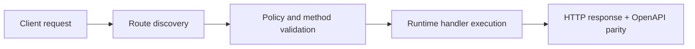

# Tools (Function-to-Function + Limited HTTP)


> Verified status as of **March 10, 2026**.
> Runtime note: FastFN auto-installs function-local dependencies from `requirements.txt` / `package.json`; host runtimes are required in `fastfn dev --native`, while `fastfn dev` depends on a running Docker daemon.
## Quick View

- Complexity: Intermediate
- Typical time: 15-25 minutes
- Use this when: you need safe tool calling with fn and http allowlists
- Outcome: tools run with explicit security controls


FastFN "tools" are a **safe, opt-in** pattern used by some example bots (Telegram, WhatsApp) to:

- call other FastFN functions (`fn` tool), and
- fetch a small set of allowlisted URLs (`http` tool),

then pass those results into an AI prompt (or return them directly).

This guide shows the **exact directive syntax**, the **allowlist knobs**, and how to test it locally.

## 1) Run the examples

Recommended (multi-route app + showcase):

```bash
bin/fastfn dev examples/functions/next-style
```

Full example catalog (includes `toolbox-bot`):

```bash
bin/fastfn dev examples/functions
```

## 2) Tool directive syntax

Some example functions parse tool directives inside user text.

### 2.1 `http` tool

Fetch a URL (GET only):

- `[[http:https://api.ipify.org?format=json]]`

### 2.2 `fn` tool

Invoke another FastFN function by name:

- `[[fn:request-inspector?key=demo|GET]]`

Format:

- `[[fn:<function-name>?<query>|<METHOD>]]`
- `?query` and `|METHOD` are optional (defaults to `GET`)

## 3) Safest way to test: `toolbox-bot`

`toolbox-bot` is a small demo function that **returns the tool plan and results as JSON**, without requiring Telegram/OpenAI.

- Route: `GET /toolbox-bot`, `POST /toolbox-bot`
- Source: `examples/functions/node/toolbox-bot/app.js`

Note: `curl` treats `[` and `]` as URL "ranges" (globbing). Examples that include `[[...]]` in the URL use `curl -g` to disable globbing.

### 3.1 Plan-only (no outbound calls)

```bash
curl -g -sS \
"http://127.0.0.1:8080/toolbox-bot?dry_run=true&text=Use%20[[http:https://api.ipify.org?format=json]]%20and%20[[fn:request-inspector?key=demo|GET]]"
```

Expected response shape:

```json
{
  "ok": true,
  "dry_run": true,
  "plan": [
    { "type": "fn", "name": "request-inspector", "query": "?key=demo", "method": "GET" },
    { "type": "http", "url": "https://api.ipify.org?format=json" }
  ],
  "note": "Set dry_run=false to execute tools."
}
```

### 3.2 Execute tools (allowlisted only)

```bash
curl -g -sS \
"http://127.0.0.1:8080/toolbox-bot?dry_run=false&text=Use%20[[http:https://api.ipify.org?format=json]]%20and%20[[fn:request-inspector?key=demo|GET]]"
```

Expected result entries:

- `ok`, `status`, `elapsed_ms`
- `body` (truncated)
- `json` (parsed when `Content-Type` is JSON)

## 4) Auto-tools (intent-based selection)

If you do **not** include directives, you can enable auto-tools:

```bash
curl -sS \
"http://127.0.0.1:8080/toolbox-bot?dry_run=true&auto_tools=true&text=what%20is%20my%20ip%20and%20weather%20in%20Buenos%20Aires%3F"
```

Auto-tools are intentionally simple (keyword-based). If the bot picks nothing, use manual directives.

## 5) Allowlists (security controls)

Tools are never "open internet access".

### 5.1 Function allowlist (`fn` tool)

- Query override: `tool_allow_fn=request-inspector,telegram-ai-digest`
- Env default (per-function): `TOOLBOX_TOOL_ALLOW_FN=...`

Only names matching `[A-Za-z0-9_-]+` are accepted.

### 5.2 HTTP host allowlist (`http` tool)

- Query override: `tool_allow_hosts=api.ipify.org,wttr.in`
- Env default (per-function): `TOOLBOX_TOOL_ALLOW_HTTP_HOSTS=...`

Only URLs whose hostname matches the allowlist are fetched.

Note: local hosts are always blocked (even if allowlisted) to prevent access to `/_fn/*`:

- `localhost`, `127.0.0.1`, `::1`, `*.local`

### 5.3 Timeout

- Query override: `tool_timeout_ms=5000`
- Env default (per-function): `TOOLBOX_TOOL_TIMEOUT_MS=5000`

## 6) Where tools are used

These examples support tools:

- `telegram-ai-reply` (Node): `TELEGRAM_*` tool knobs
- `telegram-ai-reply-py` (Python): tool query params + allowlists
- `whatsapp` (Node): `action=chat` + `WHATSAPP_*` tool knobs

## 6.1 OpenAI tool-calling (model chooses tools)

If you want a "magical" agent flow where **the model chooses tools** (instead of keyword heuristics or manual directives), use:

- `ai-tool-agent` (Node)
  - Route: `GET /ai-tool-agent`
  - Source: `examples/functions/node/ai-tool-agent/app.js`

Dry run (no OpenAI, no outbound calls):

```bash
curl -sS "http://127.0.0.1:8080/ai-tool-agent?dry_run=true&text=what%20is%20my%20ip%20and%20weather%20in%20Buenos%20Aires%3F"
```

Real run (OpenAI + tools):

```bash
curl -sS "http://127.0.0.1:8080/ai-tool-agent?dry_run=false&text=what%20is%20my%20ip%20and%20weather%20in%20Buenos%20Aires%3F"
```

The response includes a `trace.steps[]` array showing:

- each OpenAI response (including tool calls),
- each tool execution result,
- memory file path + message counts.

### Scheduler / cron

`ai-tool-agent` includes an example `schedule` block in `examples/functions/node/ai-tool-agent/fn.config.json` (disabled by default).

To enable schedules safely (admin only), see:

- [Manage Functions (Console API)](./manage-functions.md#4b-add-a-schedule-interval-cron)

See also:

- [How `telegram-ai-reply` Works](../articles/telegram-ai-reply-how-it-works.md)
- [WhatsApp Bot](../tutorial/whatsapp-bot-demo.md)

## 7) Production note

`/_fn/*` is the control-plane (config, reload, logs, health, OpenAPI toggles).

For production deployments, treat `/_fn/*` like an admin interface:

- restrict it by IP / auth / VPN,
- do not expose it to the public internet.

## Flow Diagram



## Objective

Clear scope, expected outcome, and who should use this page.

## Prerequisites

- FastFN CLI available
- Runtime dependencies by mode verified (Docker for `fastfn dev`, OpenResty+runtimes for `fastfn dev --native`)

## Validation Checklist

- Command examples execute with expected status codes
- Routes appear in OpenAPI where applicable
- References at the end are reachable

## Troubleshooting

- If runtime is down, verify host dependencies and health endpoint
- If routes are missing, re-run discovery and check folder layout

## See also

- [Function Specification](../reference/function-spec.md)
- [HTTP API Reference](../reference/http-api.md)
- [Run and Test Checklist](run-and-test.md)
