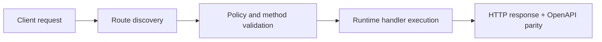

# Zero-Config Routing (Next.js Style / File-Based Dynamic Routing)


> Verified status as of **March 10, 2026**.
> Runtime note: FastFN auto-installs function-local dependencies from `requirements.txt` / `package.json`; host runtimes are required in `fastfn dev --native`, while `fastfn dev` depends on a running Docker daemon.
## Quick View

- Complexity: Intermediate
- Typical time: 15-25 minutes
- Use this when: you want filesystem routes with predictable precedence
- Outcome: route discovery and conflict behavior are deterministic


FastFN supports file-based routing with automatic runtime detection. You can ship endpoints without writing `fn.config.json` for each function.

## 1. Runtime Auto-Discovery

Runtime is inferred from file extension:

- `.js`, `.ts` -> `node`
- `.py` -> `python`
- `.php` -> `php`
- `.rs` -> `rust`
- `.go` -> `go`

## 2. File-Based Route Rules

Given a project root:

```text
my-project/
  users/
    index.js
    [id].js
  blog/
    [...slug].py
  admin/
    post.users.[id].py
```

Discovered routes:

- `users/index.js` -> `GET /users`
- `users/[id].js` -> `GET /users/:id`
- `blog/[...slug].py` -> `GET /blog/:slug*`
- `admin/post.users.[id].py` -> `POST /admin/users/:id`

!!! tip "Zero-Config Convention"
    Notice how you didn't have to register any of these routes in a central file? FastFN automatically maps `users/[id].js` to `/users/:id` using convention-based discovery. Just drop the file and the route is live.

!!! info "Nesting Depth"
    Zero-config discovery supports up to **6 levels** of directory nesting.
    For example, `api/v1/admin/users/settings/profile/index.py` maps to
    `GET /api/v1/admin/users/settings/profile`.
    Directories deeper than 6 levels are ignored and now emit a discovery warning.

Conventions:

- `index`, `handler`, and `main` map to folder root.
- `[id]` maps to a dynamic segment (`:id`).
- `[...slug]` maps to catch-all (`:slug*`).
- Optional method prefix in filename: `get.`, `post.`, `put.`, `patch.`, `delete.`.
- Exactly one method prefix is allowed per filename. `get.post.items.js` is ambiguous, so FastFN warns and ignores it.
- Ignored files: `_*.ext`, `*.test.*`, `*.spec.*`.
- Optional catch-all `[[...opt]]` maps both `/base` and `/base/:opt*`.
- Reserved prefixes are blocked (`/_fn`, `/console`).
- Invalid namespace segments outside the supported ASCII set are skipped with a warning.
- `/docs` is available for user routes.
- The zero-config scanner honors root-level `zero_config.ignore_dirs`, `zero_config_ignore_dirs`, and `FN_ZERO_CONFIG_IGNORE_DIRS`.
- The CLI warns when two same-priority file routes resolve to the same URL and removes that URL from discovery output, matching the gateway conflict model.
- When a folder contains multiple compatible single-entry handlers, FastFN selects one deterministically using runtime order `go`, `lua`, `node`, `php`, `python`, `rust` and warns about the ignored matches.

### Private helpers vs public endpoints

FastFN distinguishes three discovery shapes:

1. `pure_file_tree`: a directory without a single entrypoint; matching files become routes.
2. `single_entry_root`: a directory with `fn.config.json` `entrypoint` or a canonical file such as `handler.*`, `index.*`, `main.*`; the directory becomes one function root.
3. `mixed_subtree`: explicit file routes inside a single-entry function.

Examples:

```text
users/
  index.js
  [id].js
  _shared.js
shop/
  handler.js
  core.js
  admin/
    index.js
    get.health.js
    helpers.js
```

Results:

- `users/index.js` -> `GET /users`
- `users/[id].js` -> `GET /users/:id`
- `users/_shared.js` -> private helper, not a route
- `shop/handler.js` -> `/shop`
- `shop/core.js` -> private helper, not `/shop/core`
- `shop/admin/index.js` -> `/shop/admin`
- `shop/admin/get.health.js` -> `GET /shop/admin/health`
- `shop/admin/helpers.js` -> private helper, not a route

Rules of thumb:

- In a pure file tree, prefix private helpers with `_`.
- In a single-entry root or mixed subtree, non-explicit sibling files stay private by default.
- Private helpers never appear in `/_fn/openapi.json` or `/_fn/catalog`.
- If the scanner skips a directory because of depth, invalid namespace segments, reserved prefixes, or multiple compatible handlers, the discovery logs now tell you exactly why.

Configure ignored folders (zero-config scanner):

- Default ignored directories include: `node_modules`, `vendor`, `__pycache__`, `.fastfn`, `.deps`, `.rust-build`, `target`, `src`.

!!! note "`src/` is ignored by default"
    The `src` directory is in the default ignore list. If you use `entrypoint: "src/api.py"` in `fn.config.json`, the explicit entrypoint still works — only zero-config file-based discovery skips `src/`.

- Add more globally with env var:

```bash
FN_ZERO_CONFIG_IGNORE_DIRS="build,dist,tmp" fastfn dev .
```

- Or configure at functions root with `fn.config.json`:

```json
{
  "zero_config": {
    "ignore_dirs": ["build", "dist", "tmp"]
  }
}
```

### Folder-defined home alias (`fn.config.json`)

You can define a folder "home route" without creating `index.*`.

Example:

```text
portal/
  fn.config.json
  get.dashboard.js
```

`portal/fn.config.json`:

```json
{
  "home": {
    "route": "dashboard"
  }
}
```

Result:

- `GET /portal/dashboard` -> handled by `portal/get.dashboard.js`
- `GET /portal` -> same handler (folder home alias)

Notes:

- `home.route` can be absolute (`/portal/dashboard`) or relative (`dashboard`).
- For folder aliases, FastFN resolves `home.route` against routes discovered in that same folder.

### Root home behavior (`/`)

FastFN keeps a built-in landing page at `/` by default. You can override it:

```bash
# Internal dispatch (no 302): executes mapped handler at /showcase
FN_HOME_FUNCTION=/showcase fastfn dev .

# Redirect (302)
FN_HOME_REDIRECT=/_fn/docs fastfn dev .
```

Or from root `fn.config.json` (when that file exists in the effective `FN_FUNCTIONS_ROOT`):

```json
{
  "home": {
    "route": "/showcase"
  }
}
```

`home` object supports:

- `route` (or `function`): internal path to execute for `/`
- `redirect`: URL/path to redirect from `/` (302)

Env vars have precedence over `fn.config.json`:

1. `FN_HOME_FUNCTION`
2. `FN_HOME_REDIRECT`
3. root `fn.config.json` `home`
4. built-in landing page

### Root public assets (`assets`)

You can also mount a static directory directly from the root `fn.config.json`:

```json
{
  "assets": {
    "directory": "public",
    "not_found_handling": "single-page-application",
    "run_worker_first": false
  }
}
```

Important details:

- `assets.directory` is relative to the root functions folder and must exist.
- The assets folder is skipped by zero-config discovery, so files under `public/` or `dist/` do not accidentally become function routes.
- Only the configured assets folder is public. Sibling function directories, dotfiles, and traversal attempts are blocked.
- `run_worker_first: false` means static assets win first and FastFN falls back to handlers only when no file matches.
- `run_worker_first: true` means mapped routes win first, then static assets act as a fallback.
- SPA fallback applies to extensionless navigation-style requests. FastFN treats `Accept: text/html`, `Accept: */*`, `Sec-Fetch-Mode: navigate`, or `Sec-Fetch-Dest: document` as navigation signals.
- That means `curl` against a route-like path such as `/dashboard` can receive the SPA shell, while file-looking paths like `/app.missing.js` and API-looking paths such as `/api/unknown` still return `404`.
- Missing file-like paths such as `/app.missing.js` still return `404`.
- An empty assets folder does not mint `/` by itself. If there is no real asset, no home override, and no function route, `/` returns `404`.
- `fastfn dev` mounts non-leaf project roots as a whole, so new assets, routes, and explicit function folders can appear without restarting the stack.
- When a root-level folder is already an explicit function, `handler.*` keeps the function identity instead of becoming a fake file-route alias.
- Runnable examples: `examples/functions/assets-static-first`, `examples/functions/assets-spa-fallback`, `examples/functions/assets-worker-first`.

Manual verification tip:

```bash
curl -H 'Accept: text/html' http://127.0.0.1:8080/dashboard/team
curl -H 'Accept: */*' http://127.0.0.1:8080/dashboard/team
curl -H 'Accept: */*' http://127.0.0.1:8080/api/unknown
```

The first two requests should return your SPA shell. The third should stay `404` unless a real asset or function route exists.

## 3. Precedence (Important)

FastFN merges routes from multiple sources:

1. File-based routing (Next.js style)
2. `fn.routes.json` (explicit route map)
3. `fn.config.json` (per-function policy)

!!! warning "Route Conflict Behavior"
    - `fn.routes.json` can override file-based routes.
    - `fn.config.json` routes **do not silently override** an already-mapped URL by default.
        - Use `invoke.force-url: true` for a single function migration.
        - Or set `FN_FORCE_URL=1` (or `fastfn dev --force-url`) to force all policy routes globally.
    - If two routes collide at the same priority, FastFN treats it as a real conflict and returns `409`.

## 4. Discovery Logs

Run:

```bash
fastfn dev .
```

Look for `[Discovery]` logs to verify runtime, entry file, and generated route mapping.

`fastfn dev` now mounts the full project root in development so hot reload works for new files/folders without restarting.

Hot reload behavior:

- `fastfn dev` triggers immediate reloads on file changes via `/_fn/reload`.
- `/_fn/reload` accepts both `GET` and `POST`.
- OpenResty uses a non-blocking inotify watchdog on Linux by default.
- If watchdog is unavailable, it falls back to interval scan (`FN_HOT_RELOAD_INTERVAL`, default `2s`).
- Optional tuning env vars:
  - `FN_HOT_RELOAD_WATCHDOG=0|1`
  - `FN_HOT_RELOAD_WATCHDOG_POLL`
  - `FN_HOT_RELOAD_DEBOUNCE_MS`

!!! note "Runtime Directory Handling"
    Directories named after runtimes (`python/`, `node/`, `php/`, `lua/`, `rust/`, `go/`)
    at the root level are scanned by the runtime-specific scanner, not the zero-config scanner.
    This prevents double-registration of runtime-grouped compatibility trees.
    That layout is still supported, but it is not the default layout recommended for new projects in these docs.

## 5. Multi-Directory / Multi-App Behavior

When you run `fastfn dev <root>`, route prefixes follow folder structure. This lets you run many apps from one root without collisions.

Example root:

```text
tests/fixtures/
  nextstyle-clean/
    users/index.js
  polyglot-demo/
    fn.routes.json
```

Routes:

- `nextstyle-clean/users/index.js` -> `GET /nextstyle-clean/users`
- `polyglot-demo/fn.routes.json` route `GET /items` -> `GET /items`

## 6. HTML + CSS Endpoints

File-based routes can return HTML pages too.

Example files:

- `html/index.js` -> `GET /html`
- `showcase/index.js` -> `GET /showcase`
- `showcase/get.form.js` -> `GET /showcase/form`
- `showcase/post.form.js` -> `POST /showcase/form`
- `showcase/put.form.js` -> `PUT /showcase/form`

Each handler just needs:

- `status: 200`
- `headers: { "Content-Type": "text/html; charset=utf-8" }`
- `body` with HTML (and optional inline CSS in `<style>`)

## 7. Method-Specific File Routing

Create separate handler files per HTTP method using the method name as filename:

```text
orders/
  get.py       # GET /orders
  post.py      # POST /orders
  [id]/
    get.py     # GET /orders/:id
    put.py     # PUT /orders/:id
    delete.py  # DELETE /orders/:id
```

Each file handles exactly one HTTP method, avoiding `if method == "POST"` branching.
FastFN infers the method from the filename prefix (`get.`, `post.`, `put.`, `patch.`, `delete.`).
Use only one method prefix per filename. Names such as `get.post.items.js` are rejected as ambiguous and are not published.

Combined with `[id]` dynamic segments, this gives you a complete REST API structure
with one file per endpoint — similar to how Next.js handles API routes.

### Shared helper imports

Helpers are allowed and recommended. The key is to keep them private according to the discovery mode:

- Pure file tree: use `_shared.js`, `_shared.py`, `_shared.php`, etc.
- Single-entry / mixed subtree: use normal sibling modules such as `core.js`, `service.py`, `lib.php`, `common.rs`

Examples from the repo:

- `examples/functions/next-style/users/index.js` and `users/[id].js` both `require("./_shared")`
- `examples/functions/next-style/blog/index.py` and `blog/[...slug].py` both import `_shared.py`
- `examples/functions/node/whatsapp/handler.js` delegates to `./core.js`

Those imports are executable code dependencies, but the helper files remain private and are not published as endpoints.

## 8. Warm/Cold Runtime Signals

Gateway responses include runtime lifecycle headers:

- `X-FastFN-Function-State: cold|warm`
- `X-FastFN-Warmed: true` on first successful warm-up response
- `X-FastFN-Warming: true` with `Retry-After: 1` when the first hit is still warming

Rust first-run compile can be tuned with:

- `FN_RUST_BUILD_TIMEOUT_S` (default: `20`)

## 9. Internal Docs & Admin API Toggles

- Internal Swagger UI: `/_fn/docs`
- Internal OpenAPI JSON: `/_fn/openapi.json`
- Disable internal docs endpoints:
  - `FN_DOCS_ENABLED=0`
- Disable admin/console API endpoints (`/_fn/*` write/admin handlers):
  - `FN_ADMIN_API_ENABLED=0`

For a deeper rationale and validated outcomes, see:

- `docs/en/explanation/nextjs-style-routing-benefits.md`

## 10. Operation naming, summaries, and OpenAPI IDs

In file-based routing, operation naming is derived, not manually declared per decorator.

Practical mapping:

- Path name: derived from folder/file route (`users/[id].js` -> `/users/{id}`)
- HTTP method: derived from method prefix (`get.`, `post.`...) or allowed methods policy
- Summary: can be influenced with `invoke.summary` in `fn.config.json` or handler hint `@summary`
- `operationId`: generated automatically as `<method>_<runtime>_<name>_<version>`
- Tags: generated by gateway (`functions` for public routes)

`fn.config.json` summary example:

```json
{
  "invoke": {
    "methods": ["GET"],
    "summary": "Fetch one customer profile"
  }
}
```

Handler hint example:

```js
// @summary Fetch active subscriptions
exports.handler = async () => ({ status: 200, body: [] });
```

## 11. Swagger/OpenAPI Sanity Check

With `fastfn dev examples/functions/next-style` running:

```bash
curl -sS http://127.0.0.1:8080/_fn/openapi.json | jq '.paths | keys | length'
```

Quick expectations:

- Internal endpoints exist under `/_fn/*` (for example `/_fn/invoke`, `/_fn/catalog`).
- Public routes exist as mapped OpenAPI paths (`/users`, `/users/{id}`, `/blog`, `/blog/{slug}`, `/php/profile/{id}`, `/rust/health`, `/rust/version`).
- Private helper modules such as `/users/_shared`, `/blog/_shared`, `/php/_shared`, `/rust/_shared`, or `/whatsapp/core` must not appear.
- No `unknown/unknown` operation summaries are emitted.

## Flow Diagram



## Objective

Clear scope, expected outcome, and who should use this page.

## Prerequisites

- FastFN CLI available
- Runtime dependencies by mode verified (Docker for `fastfn dev`, OpenResty+runtimes for `fastfn dev --native`)

## Validation Checklist

- Command examples execute with expected status codes
- Routes appear in OpenAPI where applicable
- References at the end are reachable

## Troubleshooting

- If runtime is down, verify host dependencies and health endpoint
- If routes are missing, re-run discovery and check folder layout

## See also

- [Function Specification](../reference/function-spec.md)
- [HTTP API Reference](../reference/http-api.md)
- [Run and Test Checklist](run-and-test.md)
