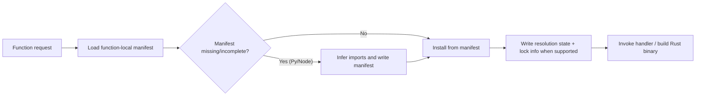

# Function Specification


> Verified status as of **March 13, 2026**.
> Runtime note: FastFN resolves dependencies and build steps per function: Python uses `requirements.txt`, Node uses `package.json`, PHP installs from `composer.json` when present, and Rust handlers are built with `cargo`. Host runtimes/tools are required in `fastfn dev --native`, while `fastfn dev` depends on a running Docker daemon.
## Quick Start

The easiest way to conform to this spec is using the CLI:

```bash
fastfn init <name> -t <runtime>
```

This generates the correct folder structure and configuration file.

## Naming and routing

- Function name (flat): `^[a-zA-Z0-9_-]+$`
- Function name (namespaced): `<segment>/<segment>/.../<name>` where each segment matches `^[a-zA-Z0-9_-]+$`
- Version: `^[a-zA-Z0-9_.-]+$`
- Public routes (default):
  - `/<name>` (flat)
  - `/<segment>/<segment>/.../<name>` (namespaced — directory structure maps to routes, Next.js-style)
  - `/<name>@<version>`

Namespaced names map directory structure directly to URL paths. Examples:

| Disk path (under runtime dir) | Function name | Route |
|-------------------------------|---------------|-------|
| `hello/app.py` | `hello` | `/hello` |
| `alice/hello/app.py` | `alice/hello` | `/alice/hello` |
| `api/v1/users/app.py` | `api/v1/users` | `/api/v1/users` |

Use cases: multi-tenant platforms (`alice/hello`, `bob/greet`), API namespacing (`api/v1/users`), organizational grouping (`team/service/handler`).

## Runtime support status

Implemented and runnable now:

- `python`
- `node`
- `php`
- `lua` (in-process)

Experimental (opt-in via `FN_RUNTIMES`):

- `rust`
- `go`

## Functions root (`FN_FUNCTIONS_ROOT`)

FastFN discovers functions by scanning a directory tree on disk. That directory is called `FN_FUNCTIONS_ROOT`.

Common setup:

1. Create a `functions/` directory in your repo.
2. Run `fastfn dev functions` (or set `"functions-dir": "functions"` in `fastfn.json`).

In portable (Docker) mode, FastFN mounts your functions directory into the container.
That internal container path is not part of the public API surface and is usually not needed.

## Runtime process wiring

Global runtime wiring lives outside `fn.config.json`.

The main controls are:

- `FN_RUNTIMES` to enable runtimes
- `runtime-daemons` or `FN_RUNTIME_DAEMONS` to choose daemon counts per external runtime
- `FN_RUNTIME_SOCKETS` to pass an explicit socket map
- `runtime-binaries` or `FN_*_BIN` to choose the host executable used for each runtime or tool

Important rules:

- `lua` runs in-process, so daemon counts for `lua` are ignored.
- `FN_RUNTIME_SOCKETS` can use either a string or an array per runtime.
- If `FN_RUNTIME_SOCKETS` is set, it wins over generated sockets from `runtime-daemons`.
- FastFN chooses one executable per binary key. If you run three Python daemons, all three use the same configured `FN_PYTHON_BIN`.

Example:

```json
{
  "runtime-daemons": {
    "node": 3,
    "python": 3
  },
  "runtime-binaries": {
    "python": "python3.12",
    "node": "node20"
  }
}
```

## Recommended layout (file routes)

Inside `FN_FUNCTIONS_ROOT`, routes come from paths and filenames (Next.js-style).

Recommended:

```text
hello/
  get.py          # GET /hello
users/
  get.js          # GET /users
  [id]/
    get.py        # GET /users/:id
    delete.py     # DELETE /users/:id
```

Filenames supported:

- Method-only: `get.py`, `post.js` (maps to the directory root).
- Method + tokens: `get.items.py`, `post.users.[id].js`.
- `index.*`, `handler.*`, `app.*`, `main.*` are treated as "directory root" files (default method: `GET`).

Reserved route prefixes are blocked: `/_fn`, `/console`.

## Advanced layout (runtime split)

For large monorepos, you can also group by runtime:

```text
node/hello/handler.js
python/risk-score/main.py
php/export-report/handler.php
lua/quick-hook/handler.lua
```

When `fn.config.json` declares a function identity (for example by setting `runtime`, `name`, or `entrypoint`), that directory is treated as a single function.

### Nested namespaces (Next.js-style)

Directory nesting under a runtime folder maps directly to URL paths:

```text
python/
  hello/app.py                    # GET /hello
  api/
    v1/
      users/app.py                # GET /api/v1/users
      orders/app.py               # GET /api/v1/orders
  alice/
    dashboard/app.py              # GET /alice/dashboard
```

Discovery recurses into directories that don't contain a handler file, treating them as namespace segments. A directory that contains a handler file (`app.py`, `handler.js`, etc.) is treated as a function.

**Depth limit**: `FN_NAMESPACE_DEPTH` controls how many levels deep the scanner recurses (default `3`, max `5`). For example, with depth 3 the path `python/a/b/c/app.py` is discovered as function `a/b/c` → route `/a/b/c`.

!!! note "Depth Limits"
    The `FN_NAMESPACE_DEPTH` setting controls runtime-grouped directories (e.g., `python/`, `node/`).
    Zero-config file-based routes use a separate, fixed depth limit of **6 levels**.

## Entry files and handler functions

The runtime resolves the handler file in the following order:

1. Explicit `entrypoint` in `fn.config.json` (e.g. `src/my_handler.py`).
2. File routes (Next.js-style): `<method>.<tokens>.<ext>` or method-only `<method>.<ext>` (for example `get.py`, `post.users.[id].js`).
3. Default entry files: `app.*`, `handler.*`, `main.*`, `index.*` (runtime-specific).

Handler function name:

- Default: `handler(event)`
- Override: `fn.config.json` -> `invoke.handler`
- Python convenience: if `handler` is missing, `main(req)` is accepted.

### Python

```python
import json

def handler(event):
    return {
        "status": 200,
        "body": json.dumps({"hello": "world"}),
    }
```

#### Optional: Python Extras (validation)

This repository includes a small optional helper at `sdk/python/fastfn/extras.py`:

- `json_response(body, status=200, headers=None)`
- `validate(Model, data)` (requires `pydantic`)

### Node

```js
exports.handler = async (event) => {
  return {
    status: 200,
    body: JSON.stringify({ hello: 'world' }),
  };
};
```

### Go

```go
package main

import "encoding/json"

func handler(event map[string]interface{}) map[string]interface{} {
    body, _ := json.Marshal(map[string]interface{}{"hello": "world"})
    return map[string]interface{}{
        "status": 200,
        "headers": map[string]interface{}{"Content-Type": "application/json"},
        "body": string(body),
    }
}
```

### Lua

```lua
local cjson = require("cjson.safe")

function handler(event)
  return {
    status = 200,
    headers = { ["Content-Type"] = "application/json" },
    body = cjson.encode({ hello = "world" }),
  }
end
```

### Simple response shorthand (quick reference)

FastFN's canonical portable response remains:

- `{ status, headers, body }`
- or binary `{ status, headers, is_base64, body_base64 }`

Runtime shorthand support:

| Runtime | Shorthand support | Notes |
|---|---|---|
| Node | yes | non-envelope values are normalized automatically |
| Python | partial | dict without envelope and tuple returns are normalized |
| PHP | yes | primitive/array/object returns are normalized |
| Lua | yes | non-envelope values are normalized as JSON `200` |
| Go | no | explicit response envelope required |
| Rust | no | explicit response envelope required |

For cross-runtime parity, prefer explicit envelope responses in docs/examples.

## Dependency management (auto-install)

FastFN resolves dependencies or build steps **per function directory** by default, with autonomous inference for Python/Node.

Resolution model:

- Python/Node/PHP use function-local dependency files (`requirements.txt`, `package.json`, `composer.json`).
- Rust handlers are built with `cargo` inside a per-function `.rust-build/` workspace.
- FastFN does **not** scan repo root dependency files automatically.
- For reusable shared installs across many functions, use packs via `shared_deps`.
- Python and Node write transparent resolution state to `<function_dir>/.fastfn-deps-state.json`.
- PHP and Rust currently install/build directly without a per-function `.fastfn-deps-state.json` file.

### Python (manifest + inference)

Supported inputs:

- `requirements.txt` (explicit manifest).
- inline `#@requirements ...` hints.
- import inference when manifest is missing or incomplete.

Behavior:

- If `requirements.txt` is missing and inference resolves imports, FastFN generates it automatically.
- If `requirements.txt` exists, FastFN appends missing inferred packages without removing your existing pins.
- After successful install, FastFN writes `requirements.lock.txt` (informational lock snapshot).

Toggles:

- `FN_AUTO_REQUIREMENTS=0` disables Python auto-install.
- `FN_AUTO_INFER_PY_DEPS=0` disables Python inference.
- `FN_AUTO_INFER_WRITE_MANIFEST=0` keeps inference in-memory only (no manifest writes).
- `FN_AUTO_INFER_STRICT=1` fails fast on unresolved imports.
- `FN_PREINSTALL_PY_DEPS_ON_START=1` preinstalls discovered handlers during runtime startup.

### Node.js (manifest + inference)

Supported inputs:

- `package.json` (explicit manifest).
- import/require inference for missing dependencies.

Behavior:

- If `package.json` is missing and imports are inferred, FastFN creates `package.json`.
- If `package.json` exists, FastFN appends inferred missing dependencies.
- If lockfile exists, FastFN prefers `npm ci`; otherwise uses `npm install`.

Toggles:

- `FN_AUTO_NODE_DEPS=0` disables Node auto-install.
- `FN_AUTO_INFER_NODE_DEPS=0` disables Node inference.
- `FN_AUTO_INFER_WRITE_MANIFEST=0` disables manifest writes from inference.
- `FN_AUTO_INFER_STRICT=1` fails fast on unresolved imports.
- `FN_PREINSTALL_NODE_DEPS_ON_START=1` preinstalls discovered handlers on startup.
- `FN_PREINSTALL_NODE_DEPS_CONCURRENCY=4` controls startup preinstall concurrency.

### PHP (manifest only in this phase)

Supported inputs:

- `composer.json` (plus optional `composer.lock`).

Behavior:

- FastFN runs `composer install` per function when `composer.json` is present.
- No import-based inference is performed for PHP in this phase.
- PHP currently does not emit `metadata.dependency_resolution` state.

Toggle:

- `FN_AUTO_PHP_DEPS=0` disables Composer auto-install.

### Rust (build step in this phase)

Behavior:

- FastFN builds Rust handlers with `cargo build --release`.
- The runtime prepares a per-function `.rust-build/` workspace and compiles the handler there.
- No import-based inference is performed for Rust in this phase.
- Native mode requires `cargo` in `PATH`.
- Rust currently does not emit `metadata.dependency_resolution` state.

### Strict errors and transparency

- Unresolved inferred imports (when strict mode is on) return actionable runtime errors.
- Install or build failures include short actionable tails from pip/npm/composer/cargo output.
- Console API `GET /_fn/function` exposes `metadata.dependency_resolution` when the runtime writes that state (today mainly Python/Node).



### Shared dependency packs (`shared_deps`)

Packs live under your functions root:

```text
<FN_FUNCTIONS_ROOT>/.fastfn/packs/python/<pack>/requirements.txt
<FN_FUNCTIONS_ROOT>/.fastfn/packs/node/<pack>/package.json
```

Then reference them from `fn.config.json`:

```json
{ "shared_deps": ["<pack>"] }
```

### Cold starts

The first request after adding or changing dependencies may be slower because the runtime installs packages before executing your handler.

## Function config (`fn.config.json`)

Main fields:

- `timeout_ms`: Maximum execution time.
- `max_concurrency`: Max simultaneous requests (semaphor).
- `max_body_bytes`: Request body limit.
- `entrypoint`: (Optional) Explicit file path to the handler script relative to function root.
- `keep_warm`: (Optional) Periodic ping settings to keep the function hot.
- `worker_pool`: (Optional) Advanced runtime worker pool settings.
- `response.include_debug_headers`: Whether to include `X-Fn-Runtime` headers.
- `invoke.routes`: (Optional) Public URLs for the function (array). Defaults to `/<name>` and `/<name>/*`.
- `invoke.allow_hosts`: (Optional) Host allowlist for those routes (array).
- `invoke.force-url`: (Optional) If `true`, this function is allowed to override an already-mapped URL.
- `invoke.adapter`: (Beta, Node/Python) compatibility mode for external handler styles (`native`, `aws-lambda`, `cloudflare-worker`).
- `home`: (Optional, directory overlay) Home mapping for folder/root:
  - `home.route` or `home.function`: internal path to execute as home.
  - `home.redirect`: URL/path to redirect as home (`302`).

Notes:
- By default, FastFN does not silently override an existing URL mapping.
- In file-routes layout, a `fn.config.json` that does not declare a function identity (`runtime`/`name`/`entrypoint`) is treated as a **policy overlay** for all file routes under that folder (and nested folders). This is the recommended way to set `timeout_ms`, `max_concurrency`, `invoke.allow_hosts`, etc.
- In file-routes layout, folder overlays can define `home.route` to alias folder root (for example `/portal`) to another discovered route in that folder (for example `/portal/dashboard`).
- Root-level `fn.config.json` can define `home.route`/`home.redirect` to override `/` without editing Nginx.
- Use `invoke.force-url: true` only when you intentionally want this function to take a route from another function (for example during a migration).
- Version-scoped configs (for example `my-fn/v2/fn.config.json`) never take over an existing URL by themselves; use `FN_FORCE_URL=1` if you need a version route to win.
- Global override: set `FN_FORCE_URL=1` (or `fastfn dev --force-url`) to treat all config/policy routes as forced.

Example with advanced fields:

```json
{
  "group": "demos",
  "timeout_ms": 1500,
  "max_concurrency": 10,
  "max_body_bytes": 1048576,
  "entrypoint": "src/api.py",
  "invoke": {
    "handler": "main",
    "adapter": "native",
    "force-url": false,
    "routes": ["/my-api", "/my-api/*"],
    "allow_hosts": ["api.example.com"]
  },
  "home": {
    "route": "/my-api"
  },
  "keep_warm": {
    "enabled": true,
    "min_warm": 1,
    "ping_every_seconds": 60,
    "idle_ttl_seconds": 300
  },
  "worker_pool": {
    "enabled": true,
    "min_warm": 0,
    "max_workers": 5,
    "idle_ttl_seconds": 600,
    "queue_timeout_ms": 2000,
    "overflow_status": 429
  },
  "response": {
    "include_debug_headers": true
  }
}
```

### Keep Warm

The `keep_warm` configuration instructs the runtime scheduler to periodically verify the function is loaded and ready.

- `enabled`: Activate the keep-warm scheduler.
- `min_warm`: Minimum number of instances (not fully implemented in all runtimes, usually 1).
- `ping_every_seconds`: Interval between heartbeats.
- `idle_ttl_seconds`: How long allowed to remain idle before scale-down.

### Worker Pool

`worker_pool` is the simplest way to control one function without changing routes.

Important model detail:

- `worker_pool` is **per function**.
- `runtime-daemons` is **per runtime** and lives in `fastfn.json` or environment variables, not in `fn.config.json`.
- OpenResty/Lua enforces `worker_pool.max_workers`, `max_queue`, and queue timeouts **before** the request enters the runtime.
- After the request is admitted, the gateway selects a healthy runtime socket. If the runtime has more than one socket, selection is `round_robin`.

Example:

```json
{
  "worker_pool": {
    "enabled": true,
    "max_workers": 3,
    "max_queue": 6,
    "queue_timeout_ms": 5000,
    "idle_ttl_seconds": 300,
    "overflow_status": 429
  }
}
```

Core fields:

- `enabled`: Turn pool-based execution on for this function.
- `max_workers`: Maximum active executions admitted for this function.
- `max_queue`: Extra queued requests allowed after all workers are busy.
- `queue_timeout_ms`: How long a queued request can wait before returning `overflow_status`.
- `idle_ttl_seconds`: How long idle workers stay around before cleanup.
- `overflow_status`: Status to return on queue overflow or timeout (`429` or `503`).
- `min_warm`: Keep some runtime workers pre-created when the runtime supports it.

Current runtime behavior:

| Runtime | Multi-daemon routing | Runtime-internal fan-out |
|---|---|---|
| Node | supported | also uses child workers inside `node-daemon.js` |
| Python | supported | request handling still depends on the Python daemon behavior |
| PHP | supported | runtime dispatch happens through the PHP launcher |
| Rust | supported | runtime dispatch happens through the compiled binary launcher |
| Lua | not applicable | runs in-process inside OpenResty |

Observed native benchmark on **March 13, 2026** (`6` concurrent requests to a `200ms` sleep handler, local host, `1` vs `3` runtime daemons):

- Node: `267.2ms` -> `232.4ms` (`13.0%` faster)
- Python: `1281.9ms` -> `447.4ms` (`65.1%` faster)
- PHP: `629.4ms` -> `862.5ms` (`37.0%` slower)
- Rust: `384.6ms` -> `417.7ms` (`8.6%` slower)

Raw artifact:

- `tests/stress/results/2026-03-13-runtime-daemon-scaling-native.json`

Use those numbers as a reminder to measure your own workload before enabling extra daemons everywhere.

### Invoke adapter (Beta)

Use `invoke.adapter` when you want to port existing handlers with minimal rewrites.

- `native` (default): FastFN contract (`handler(event)`).
- `aws-lambda`: Node/Python compatibility for Lambda-style handlers.
- `cloudflare-worker`: Node/Python compatibility for Workers-style handlers (`fetch(request, env, ctx)`).

Node + Lambda callback note:

- In `aws-lambda` mode, Node supports both async handlers and callback-based handlers (`event, context, callback`).

## Edge passthrough config (`edge`)

If you want Cloudflare-Workers-style behavior (handler returns a `proxy` directive and the gateway performs the outbound request), enable it per function in `fn.config.json`:

```json
{
  "edge": {
    "base_url": "https://api.example.com",
    "allow_hosts": ["api.example.com"],
    "allow_private": false,
    "max_response_bytes": 1048576
  }
}
```

Then your handler can return `{ "proxy": { "path": "/foo" } }`.

## Schedule (cron or interval)

You can attach a schedule to a function using either:

- `every_seconds` (simple interval)
- `cron` (cron expression)

### Interval schedule (`every_seconds`)

```json
{
  "schedule": {
    "enabled": true,
    "every_seconds": 60,
    "method": "GET",
    "query": {},
    "headers": {},
    "body": "",
    "context": {}
  }
}
```

### Cron schedule (`cron`)

Cron supports:

- 5 fields: `min hour dom mon dow`
- 6 fields: `sec min hour dom mon dow`
- macros: `@hourly`, `@daily`, `@midnight`, `@weekly`, `@monthly`, `@yearly`, `@annually`
- month/day aliases: `JAN..DEC`, `SUN..SAT`
- day-of-week accepts `0..6` and also `7` for Sunday

```json
{
  "schedule": {
    "enabled": true,
    "cron": "*/5 * * * *",
    "timezone": "UTC",
    "method": "GET",
    "query": {},
    "headers": {},
    "body": "",
    "context": {}
  }
}
```

Timezone values:

- `UTC`, `Z`
- `local` (default if omitted)
- fixed offsets like `+02:00`, `-05:00`, `+0200`, or `-0500`

Notes:

- This runs inside OpenResty (worker 0) and calls your function through the same gateway/runtime policy as normal traffic.
- To run a function every **X minutes**, set `every_seconds = X * 60` (example: every 15 minutes => `900`).
- When both day-of-month and day-of-week are restricted, cron matching follows Vixie-style `OR` semantics.
- Scheduler state is visible at `GET /_fn/schedules` (`next`, `last`, `last_status`, `last_error`).
- When retries are pending, the scheduler snapshot also exposes `retry_due` and `retry_attempt`.
- Schedules are stored in `fn.config.json` (so schedule definitions persist across restarts).
- Scheduler state is persisted to `<FN_FUNCTIONS_ROOT>/.fastfn/scheduler-state.json` by default (so `last/next/status/error` survives restarts).
- Common failure modes (`last_status` / `last_error`):
  - `405`: schedule `method` not allowed by function policy.
  - `413`: schedule `body` exceeded `max_body_bytes`.
  - `429`: function was busy (concurrency gate).
  - `503`: runtime down/unhealthy.
- Retry/backoff (optional):
  - Set `schedule.retry=true` for defaults, or provide an object:
  - `max_attempts` (default `3`), `base_delay_seconds` (default `1`), `max_delay_seconds` (default `30`), `jitter` (default `0.2`).
  - Runtime clamps: `max_attempts` `1..10`, delays `0..3600`, `jitter` `0..0.5`.
  - Retries apply to status `0`, `429`, `503`, and `>=500`. The scheduler updates `last_error` with a `retrying ...` message.
- Console UI: `GET /console/scheduler` shows schedules + keep_warm (requires `FN_UI_ENABLED=1`).
- Global toggles:
  - `FN_SCHEDULER_ENABLED=0` disables the scheduler entirely.
  - `FN_SCHEDULER_INTERVAL` controls the scheduler tick loop (default `1` second, minimum effective value `1`).
  - `FN_SCHEDULER_PERSIST_ENABLED=0` disables scheduler state persistence.
  - `FN_SCHEDULER_PERSIST_INTERVAL` controls how often scheduler state is flushed (seconds, clamped to `5..3600`).
  - `FN_SCHEDULER_STATE_PATH` overrides the state file path.

## Function env and secrets

- `fn.env.json`: values injected into `event.env`
- secret masking is defined per key in the same file with `is_secret`

Example:

```json
{
  "API_KEY": {"value": "secret-value", "is_secret": true},
  "PUBLIC_FLAG": {"value": "on", "is_secret": false}
}
```

## Execution Flow Diagram


## Contract

Defines expected request/response shape, configuration fields, and behavioral guarantees.

## End-to-End Example

Use the examples in this page as canonical templates for implementation and testing.

## Edge Cases

- Missing configuration fallbacks
- Route conflicts and precedence
- Runtime-specific nuances

## See also

- [HTTP API Reference](http-api.md)
- [Run and Test Checklist](../how-to/run-and-test.md)
- [Architecture Overview](../explanation/architecture.md)
