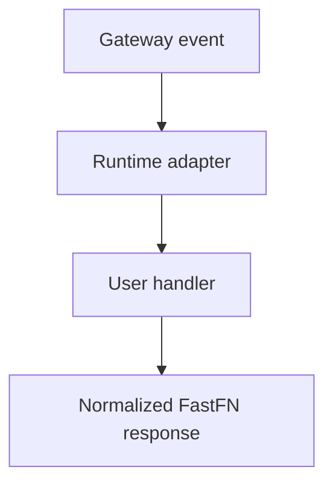

# Runtime Contract


> Verified status as of **March 10, 2026**.
> Runtime note: FastFN auto-installs function-local dependencies from `requirements.txt` / `package.json`; host runtimes are required in `fastfn dev --native`, while `fastfn dev` depends on a running Docker daemon.
This document defines exactly what OpenResty sends to handlers and what runtimes must return.

## 1) Internal transport

- Protocol: Unix socket per runtime (`python`, `node`, `php`, `rust`).
- Frame format: `4-byte big-endian length + JSON`.
- Internal request: `{ fn, version, event }`.
- Internal response: `{ status, headers, body }` or base64 binary payload. May include `stdout`/`stderr`.

## 2) What clients send and how handlers receive it

### Public request (client -> gateway)

```bash
curl -sS 'http://127.0.0.1:8080/risk-score?email=user@example.com' \
  -H 'x-user-email: user@example.com' \
  -H 'x-api-key: my-key' \
  -H 'Cookie: session_id=abc123; theme=dark' \
  -H 'Content-Type: application/json' \
  -d '{"extra":"value"}'
```

### Event mapping

- query string -> `event.query`
- request headers -> `event.headers`
- raw body string -> `event.body`
- parsed cookies -> `event.session`
- client IP/UA -> `event.client`
- gateway/policy metadata -> `event.context`
- function-level env -> `event.env`

## 3) Full internal payload (gateway -> runtime)

```json
{
  "fn": "hello",
  "version": "v2",
  "event": {
    "id": "req-1770795478241-13-311866",
    "ts": 1770795478241,
    "method": "GET",
    "path": "/hello@v2",
    "raw_path": "/hello@v2?name=NodeWay",
    "query": {"name": "NodeWay"},
    "headers": {
      "host": "127.0.0.1:8080",
      "user-agent": "curl/8.7.1",
      "accept": "*/*",
      "x-api-key": "my-key",
      "cookie": "session_id=abc123"
    },
    "body": "",
    "session": {
      "id": "abc123",
      "raw": "session_id=abc123",
      "cookies": {"session_id": "abc123"}
    },
    "client": {"ip": "127.0.0.1", "ua": "curl/8.7.1"},
    "context": {
      "request_id": "req-1770795478241-13-311866",
      "runtime": "node",
      "function_name": "hello",
      "version": "v2",
      "timeout_ms": 1500,
      "max_concurrency": 15,
      "max_body_bytes": 1048576,
      "gateway": {"worker_pid": 12345},
      "debug": {"enabled": false},
      "user": null
    },
    "env": {
      "NODE_GREETING": "v2"
    }
  }
}
```

## 4) `event` field reference

| Field | Type | Source | Notes |
|---|---|---|---|
| `id` | `string` | gateway | unique request id |
| `ts` | `number` | gateway | epoch milliseconds |
| `method` | `string` | HTTP request | `GET/POST/PUT/PATCH/DELETE` |
| `path` | `string` | gateway | normalized route without query |
| `raw_path` | `string` | gateway | original URI with query |
| `query` | `object` | query string | URL parameters |
| `headers` | `object` | request headers | includes auth/cookies when sent |
| `body` | `string` or `null` | request body | raw body, not parsed by gateway |
| `client.ip` | `string` | gateway | remote IP |
| `client.ua` | `string` or `null` | header | User-Agent |
| `context.request_id` | `string` | gateway | same as `id` |
| `context.runtime` | `string` | discovery | resolved runtime |
| `context.function_name` | `string` | routing | function name |
| `context.version` | `string` | routing | effective version |
| `context.timeout_ms` | `number` | policy | applied timeout |
| `context.max_concurrency` | `number` | policy | applied concurrency limit |
| `context.max_body_bytes` | `number` | policy | applied body limit |
| `context.gateway.worker_pid` | `number` | OpenResty | worker pid |
| `context.debug.enabled` | `boolean` | policy | debug headers policy |
| `session` | `object` or `null` | gateway | parsed cookies (see below) |
| `session.id` | `string` or `null` | gateway | auto-detected session id |
| `session.raw` | `string` | gateway | raw `Cookie` header value |
| `session.cookies` | `object` | gateway | parsed key:value cookie map |
| `context.user` | `object` or `null` | `/_fn/invoke` | custom injected context |
| `env` | `object` | `fn.env.json` | function/version env variables |

## 5) Injecting `context.user` via `/_fn/invoke`

```bash
curl -sS 'http://127.0.0.1:8080/_fn/invoke' \
  -X POST \
  -H 'Content-Type: application/json' \
  --data '{
    "name":"hello",
    "method":"GET",
    "query":{"name":"Ctx"},
    "context":{"trace_id":"abc-123","tenant":"demo"}
  }'
```

Handler receives:

- `event.context.user.trace_id`
- `event.context.user.tenant`

## 6) `event.session` — cookie parsing

The gateway automatically parses the `Cookie` header and exposes it as `event.session`. If no `Cookie` header is present, `event.session` is `null`.

### Shape

```json
{
  "id": "abc123",
  "raw": "session_id=abc123; theme=dark",
  "cookies": {
    "session_id": "abc123",
    "theme": "dark"
  }
}
```

| Field | Description |
|---|---|
| `id` | Auto-detected session identifier. Checks `session_id`, `sessionid`, and `sid` cookie names (in that order). `null` if none found. |
| `raw` | The raw `Cookie` header string as sent by the client. |
| `cookies` | Parsed key:value map of all cookies. |

### Usage examples

**Python:**

```python
def handler(event):
    session = event.get("session") or {}
    session_id = session.get("id")
    theme = (session.get("cookies") or {}).get("theme", "light")
    return {"status": 200, "body": f"session={session_id}, theme={theme}"}
```

**Node:**

```js
exports.handler = async (event) => {
  const session = event.session || {};
  const sessionId = session.id;
  const theme = (session.cookies || {}).theme || "light";
  return { status: 200, body: `session=${sessionId}, theme=${theme}` };
};
```

**Lua:**

```lua
return function(event)
  local session = event.session or {}
  local sid = session.id
  local theme = (session.cookies or {}).theme or "light"
  return { status = 200, body = "session=" .. tostring(sid) .. ", theme=" .. theme }
end
```

**Go:**

```go
package main

import "fmt"

func Handler(event map[string]interface{}) map[string]interface{} {
    session, _ := event["session"].(map[string]interface{})
    sid, _ := session["id"].(string)
    cookies, _ := session["cookies"].(map[string]interface{})
    theme, _ := cookies["theme"].(string)
    if theme == "" { theme = "light" }
    return map[string]interface{}{
        "status": 200,
        "body":   fmt.Sprintf("session=%s, theme=%s", sid, theme),
    }
}
```

## 7) Runtime response contract

### Text/JSON

```json
{
  "status": 200,
  "headers": {"Content-Type": "application/json"},
  "body": "{\"ok\":true}"
}
```

### Binary

```json
{
  "status": 200,
  "headers": {"Content-Type": "image/png"},
  "is_base64": true,
  "body_base64": "iVBORw0KGgo..."
}
```

### Simple response shorthand (runtime-dependent)

Canonical contract is always `{ status, headers, body }` (or `{ is_base64, body_base64 }` for binary).
Some runtimes also accept shorthand returns and normalize them automatically:

| Runtime | Shorthand support | What gets normalized |
|---|---|---|
| Node | yes | primitives/objects without envelope are normalized (for example object -> JSON `200`, string -> `text/plain` or `text/html`) |
| Python | partial | dict without envelope -> JSON `200`; tuple `(body, status, headers)` also supported |
| PHP | yes | primitives/arrays/objects are normalized to a valid HTTP response envelope |
| Lua | yes | values without envelope are normalized to JSON `200` |
| Go | no | must return explicit envelope object |
| Rust | no | must return explicit envelope object |

Portable recommendation:

- Use explicit envelope in shared examples and cross-runtime code.
- Use shorthand only when you intentionally target a specific runtime behavior.

### Edge passthrough (proxy)

A handler can return a `proxy` directive. This is the closest behavior to Cloudflare Workers `return fetch(request)`:

- your handler returns a declarative proxy request
- fastfn performs the outbound HTTP request inside the gateway
- fastfn returns the upstream status/headers/body back to the client
- if `proxy` is present, the upstream response wins (top-level `status/headers/body` are treated as fallback only)

Example (Node):

```js
exports.handler = async (event) => {
  return {
    status: 200,
    headers: { "Content-Type": "application/json" },
    proxy: {
      path: "/hello?name=edge",
      method: event.method || "GET",
      headers: { "x-fastfn-edge": "1" },
      body: event.body || "",
      timeout_ms: (event.context || {}).timeout_ms || 2000
    }
  };
};
```

### Proxy filter example (auth + rewrite)

This pattern is the closest to the common Workers use-case: validate the inbound request, then rewrite and passthrough.

```js
function header(event, name) {
  const h = event.headers || {};
  return h[name] || h[name.toLowerCase()] || h[name.toUpperCase()] || null;
}

exports.handler = async (event) => {
  const env = event.env || {};

  // Filter: require API key
  const expected = String(env.EDGE_FILTER_API_KEY || "");
  const provided = String(header(event, "x-api-key") || "");
  if (!expected || provided !== expected) {
    return { status: 401, headers: { "Content-Type": "application/json" }, body: "{\"error\":\"unauthorized\"}" };
  }

  // Rewrite + passthrough
  const userId = String((event.query || {}).user_id || "");
  return {
    proxy: {
      path: "/v1/users/" + encodeURIComponent(userId),
      method: "GET",
      headers: { "x-edge": "1" },
      timeout_ms: (event.context || {}).timeout_ms || 2000
    }
  };
};
```

To allow this, enable `edge` in `fn.config.json` for that function (proxy is disabled by default).

Supported `proxy` fields (minimal):

- `url`: absolute `http(s)://...` URL (or)
- `path`: path starting with `/` (requires `edge.base_url` in `fn.config.json`)
- `method`: `GET|POST|PUT|PATCH|DELETE`
- `headers`: object of headers to send upstream
- `body`: string body
- `timeout_ms`: request timeout (ms)
- `max_response_bytes`: max upstream response body size
- `is_base64` + `body_base64`: optional base64 request body

Security:

- proxying is **disabled by default** per function
- enable it via `edge` config in `fn.config.json`
- proxying to control-plane paths (`/_fn/*`, `/console/*`) is blocked

```json
{
  "edge": {
    "base_url": "https://api.example.com",
    "allow_hosts": ["api.example.com"],
    "allow_private": false,
    "max_response_bytes": 1048576
  }
}
```

## 8) Supported response types

- `application/json`
- `text/html`
- `text/csv`
- binary types such as `image/png`

`/_fn/invoke` wraps non-text responses as base64 so it can always return JSON.

## 9) stdout/stderr capture

All runtimes capture handler output (`print()`, `console.log()`, `eprintln!()`, etc.) and return it alongside the response. This is useful for debugging via Quick Test in the console.

### How it works

| Runtime | stdout capture | stderr capture |
|---|---|---|
| Python | `print()`, `sys.stdout.write()` | `sys.stderr.write()` |
| Node | `console.log()`, `console.info()`, `console.debug()` | `console.error()`, `console.warn()` |
| Lua | `print()` | — |
| PHP | `echo`, `print` (subprocess stdout) | `error_log()`, `fwrite(STDERR, ...)` (subprocess stderr) |
| Go | `fmt.Println()` (subprocess stdout) | `fmt.Fprintln(os.Stderr, ...)` (subprocess stderr) |
| Rust | `println!()` (subprocess stdout) | `eprintln!()` (subprocess stderr) |

### Response fields

The runtime adds `stdout` and `stderr` to the response JSON when output is captured:

```json
{
  "status": 200,
  "headers": {"Content-Type": "application/json"},
  "body": "{\"ok\":true}",
  "stdout": "debug: processing request\nuser_id=42",
  "stderr": "warning: deprecated field used"
}
```

Fields are omitted when empty (no output).

### Debug headers

When `context.debug.enabled` is `true`, the gateway exposes captured output as response headers:

- `X-Fn-Stdout` — captured stdout (truncated to 4096 bytes)
- `X-Fn-Stderr` — captured stderr (truncated to 4096 bytes)

### Quick Test

The `/_fn/invoke` endpoint returns `stdout` and `stderr` in the response JSON. The console Quick Test panel displays these in collapsible sections.

### Example

```python
def handler(event):
    name = (event.get("query") or {}).get("name", "world")
    print(f"handling request for {name}")   # captured in stdout
    return {"status": 200, "body": f"Hello, {name}!"}
```

Quick Test response:

```json
{
  "status": 200,
  "latency_ms": 12,
  "body": "Hello, world!",
  "stdout": "handling request for world"
}
```

## 10) Strict filesystem mode (default)

`fastfn` runs handlers with strict filesystem mode enabled by default:

- `FN_STRICT_FS=1` (default)
- `FN_STRICT_FS_ALLOW=/extra/allowed/path,/another/path` (optional)

Rules:

- a function can read/write inside its own directory
- arbitrary paths outside the function sandbox are blocked
- protected platform files are blocked from handlers:
  - `fn.config.json`
  - `fn.env.json`
- subprocess spawning from handlers is blocked in strict mode

Implementation note:

- Python and Node enforce strict filesystem blocking at runtime level; PHP and Lua enforce runtime-level path validation and bounded execution in their runtime models.
- Rust runs in an isolated runtime process with path validation and bounded execution.

Important:

- this is a runtime-level sandbox, not kernel-level isolation (cgroups/seccomp/chroot).

## Runtime Contract Diagram



## Contract

Defines expected request/response shape, configuration fields, and behavioral guarantees.

## End-to-End Example

Use the examples in this page as canonical templates for implementation and testing.

## Edge Cases

- Missing configuration fallbacks
- Route conflicts and precedence
- Runtime-specific nuances

## See also

- [Function Specification](function-spec.md)
- [HTTP API Reference](http-api.md)
- [Run and Test Checklist](../how-to/run-and-test.md)
