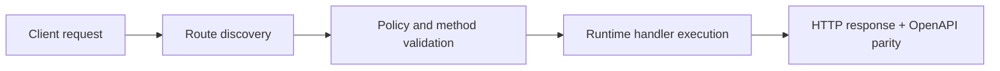

# Tutorial: Artistic QR Variants (Optional)


> Verified status as of **March 10, 2026**.
> Runtime note: FastFN auto-installs function-local dependencies from `requirements.txt` / `package.json`; host runtimes are required in `fastfn dev --native`, while `fastfn dev` depends on a running Docker daemon.
This page adds a PNG variant of the QR function with styling options.

Note: this tutorial is optional and not part of the default quickstart path.

Prerequisite: complete the basic QR tutorial first:

- [`QR in Python + Node (Dependency Isolation)`](./qr-in-python-node.md)

## 1) Create a new version folder (Python)

We will create a new version `v3` so `/qr@v3` is a distinct endpoint.

```bash
mkdir -p functions/python/qr/v3
```

## 2) Optional dependency upgrade (PIL styling)

If you want PIL styling, use:

```text
qrcode[pil]>=7.4
```

Put it in `functions/python/qr/v3/requirements.txt`:

```bash
cat > functions/python/qr/v3/requirements.txt <<'EOF'
qrcode[pil]>=7.4
EOF
```

## 3) Add the handler (PNG base64)

When returning PNG from a handler, use base64 payload (`is_base64=true`).

Create `functions/python/qr/v3/app.py`:

```python
import base64
import io
import qrcode
from qrcode.image.styledpil import StyledPilImage
from qrcode.image.styles.moduledrawers import RoundedModuleDrawer, CircleModuleDrawer, GappedSquareModuleDrawer


def handler(event):
    query = event.get("query") or {}
    text = query.get("url") or query.get("text") or "https://example.com"
    fill_color = query.get("fill", "black")
    back_color = query.get("back", "white")
    style = query.get("style", "square")

    if style == "round":
        drawer = RoundedModuleDrawer()
    elif style == "circle":
        drawer = CircleModuleDrawer()
    else:
        drawer = GappedSquareModuleDrawer()

    qr = qrcode.QRCode(
        version=1,
        error_correction=qrcode.constants.ERROR_CORRECT_H,
        box_size=10,
        border=4,
    )
    qr.add_data(text)
    qr.make(fit=True)

    img = qr.make_image(
        image_factory=StyledPilImage,
        module_drawer=drawer,
        fill_color=fill_color,
        back_color=back_color,
    )

    buf = io.BytesIO()
    img.save(buf, format="PNG")

    return {
        "status": 200,
        "headers": {"Content-Type": "image/png"},
        "is_base64": True,
        "body_base64": base64.b64encode(buf.getvalue()).decode("ascii"),
    }
```

## 4) Add function policy (optional, but recommended)

Create `functions/python/qr/v3/fn.config.json`:

```json
{
  "timeout_ms": 60000,
  "max_concurrency": 4,
  "max_body_bytes": 65536,
  "invoke": {
    "methods": ["GET"],
    "summary": "Python QR generator (PNG, styled)",
    "query": {"text": "https://example.com", "style": "round", "fill": "magenta"},
    "body": ""
  }
}
```

## 5) Examples

```text
/qr@v3?url=https://example.com&style=round&fill=magenta
/qr@v3?url=https://example.com&style=circle&fill=green&back=black
```

You can also save a PNG file:

```bash
curl -sS 'http://127.0.0.1:8080/qr@v3?text=Hello' -o /tmp/qr-v3.png
file /tmp/qr-v3.png
```

## 6) Node composition pattern

A Node function can prepare a URL and redirect to `/qr`.

```js
exports.handler = async (event) => {
  const query = event.query || {};
  const phone = query.phone;
  const text = query.text || 'Hello from FastFN';
  if (!phone) {
    return {
      status: 400,
      headers: { 'Content-Type': 'application/json' },
      body: JSON.stringify({ error: 'phone query param is required' }),
    };
  }

  const waUrl = `https://wa.me/${phone}?text=${encodeURIComponent(text)}`;
  return {
    status: 302,
    headers: { Location: `/qr@v3?url=${encodeURIComponent(waUrl)}` },
    body: '',
  };
};
```

## Flow Diagram



## Objective

Clear scope, expected outcome, and who should use this page.

## Prerequisites

- FastFN CLI available
- Runtime dependencies by mode verified (Docker for `fastfn dev`, OpenResty+runtimes for `fastfn dev --native`)

## Validation Checklist

- Command examples execute with expected status codes
- Routes appear in OpenAPI where applicable
- References at the end are reachable

## Troubleshooting

- If runtime is down, verify host dependencies and health endpoint
- If routes are missing, re-run discovery and check folder layout

## See also

- [Function Specification](../reference/function-spec.md)
- [HTTP API Reference](../reference/http-api.md)
- [Run and Test Checklist](../how-to/run-and-test.md)
