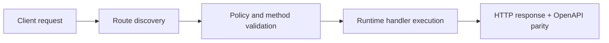

# Authentication and Secrets


> Verified status as of **March 10, 2026**.
> Runtime note: FastFN auto-installs function-local dependencies from `requirements.txt` / `package.json`; host runtimes are required in `fastfn dev --native`, while `fastfn dev` depends on a running Docker daemon.
In FastFN, security is handled **in code**. You have full access to headers, environment variables, and request context to implement any auth strategy.

---

## 1. Storing Secrets (Environment Variables)

Never hardcode API keys or database passwords in your `app.py` or `index.js`.
Instead, use a `fn.env.json` file in the function's folder.

**File:** `functions/secure-api/fn.env.json`
```json
{
  "API_SECRET": {"value": "my-super-secret-key-123", "is_secret": true},
  "DB_PASSWORD": {"value": "correct-horse-battery-staple", "is_secret": true}
}
```

The platform automatically injects these into `event['env']` (Python) or `event.env` (Node.js).

---

## 2. Implementing API Key Auth

This is the most common pattern for server-to-server communication.

**File:** `functions/secure-api/app.py`

```python
import json

def handler(event):
    headers = event.get('headers', {})
    env = event.get('env', {})
    
    # 1. Retrieve the provided key (case-insensitive usually handled by gateway, 
    # but here we access the raw map)
    # Note: OpenResty usually lowercases headers
    provided_key = headers.get('x-api-key')
    
    # 2. Compare with secret
    expected_key = env.get('API_SECRET')
    
    if not provided_key or provided_key != expected_key:
        return {
            "status": 401,
            "headers": {"Content-Type": "application/json"},
            "body": json.dumps({"error": "Unauthorized: Invalid API Key"})
        }

    return {
        "status": 200,
        "headers": {"Content-Type": "application/json"},
        "body": json.dumps({"message": "You are inside!"})
    }
```

**Test it:**

```bash
# Fail
curl -i 'http://127.0.0.1:8080/secure-api'

# Success
curl -i 'http://127.0.0.1:8080/secure-api' \
  -H 'x-api-key: my-super-secret-key-123'
```

---

## 3. Basic Authentication (Username/Password)

Handling standard `Authorization: Basic <base64>` header.

**File:** `functions/basic-auth/index.js`

```javascript
exports.handler = async (event) => {
    const headers = event.headers || {};
    const auth = headers['authorization'];
    
    if (!auth || !auth.startsWith('Basic ')) {
        return {
            status: 401,
            headers: { 'WWW-Authenticate': 'Basic realm="Secure Area"' },
            body: JSON.stringify({ error: "Missing Basic Auth" })
        };
    }

    // Decode Base64
    const base64Credentials = auth.split(' ')[1];
    const credentials = Buffer.from(base64Credentials, 'base64').toString('ascii');
    const [username, password] = credentials.split(':');

    if (username === 'admin' && password === 'hunter2') {
        return {
          status: 200,
          headers: { 'Content-Type': 'application/json' },
          body: JSON.stringify({ message: "Welcome, Admin!" })
        };
    }

    return {
      status: 403,
      headers: { 'Content-Type': 'application/json' },
      body: JSON.stringify({ error: "Forbidden" })
    };
};
```

---

## 4. Avoiding Sensitive Data Leaks

Reviewing your logs is important. By default, FastFN logs execution details.

!!! warning "Do not print secrets"
    Avoid code like `print(env)` or `console.log(event.env)`.
    If you need to debug, print only safe keys or masked values.

```python
# GOOD
print(f"Auth check: key_provided={bool(provided_key)}")

# BAD
print(f"Auth check: key={provided_key}") 
```

## Flow Diagram



## Objective

Clear scope, expected outcome, and who should use this page.

## Prerequisites

- FastFN CLI available
- Runtime dependencies by mode verified (Docker for `fastfn dev`, OpenResty+runtimes for `fastfn dev --native`)

## Validation Checklist

- Command examples execute with expected status codes
- Routes appear in OpenAPI where applicable
- References at the end are reachable

## Troubleshooting

- If runtime is down, verify host dependencies and health endpoint
- If routes are missing, re-run discovery and check folder layout

## See also

- [Function Specification](../reference/function-spec.md)
- [HTTP API Reference](../reference/http-api.md)
- [Run and Test Checklist](../how-to/run-and-test.md)
