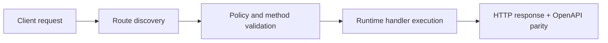

# Direct Route Params Injection


> Verified status as of **March 10, 2026**.
> Runtime note: FastFN auto-installs function-local dependencies from `requirements.txt` / `package.json`; host runtimes are required in `fastfn dev --native`, while `fastfn dev` depends on a running Docker daemon.
FastFN automatically injects route parameters as **direct function arguments**. Instead of digging into `event.params.id`, you simply declare `id` in your handler signature and it arrives ready to use.

## Before and After

**Before** (manual extraction):
```python
def handler(event):
    id = event.get("params", {}).get("id", "")
    slug = event.get("params", {}).get("slug", "")
```

**After** (direct injection):
```python
def handler(event, id, slug):
    # id and slug arrive directly!
```

## How It Works

FastFN inspects your handler's signature at call time and injects matching route params automatically.

| Runtime | Mechanism | Handler Signature |
|---------|-----------|-------------------|
| Python | `inspect.signature` → kwargs injection | `def handler(event, id):` |
| Node.js | Second arg when `handler.length > 1` | `async (event, { id }) =>` |
| PHP | `ReflectionFunction` → second arg | `function handler($event, $params)` |
| Lua | Always passed as second arg | `function handler(event, params)` |
| Go | Params merged into event map | `event["id"].(string)` |
| Rust | Params merged into event value | `event["id"].as_str()` |

!!! tip "100% Backward Compatible"
    Existing `handler(event)` signatures continue to work unchanged. Params are only injected when the handler declares extra parameters.

---

## Param Types

### `[id]` — Single Dynamic Param

File: `products/[id]/get.py` → Route: `GET /products/:id`

=== "Python"
    ```python
    def handler(event, id):
        return {"status": 200, "body": {"id": int(id), "name": "Widget"}}
    ```

=== "Node.js"
    ```javascript
    exports.handler = async (event, { id }) => ({
      status: 200,
      headers: { "Content-Type": "application/json" },
      body: JSON.stringify({ id: Number(id), name: "Widget" }),
    });
    ```

=== "PHP"
    ```php
    <?php
    function handler($event, $params) {
        $id = $params["id"] ?? "";
        return [
            "status" => 200,
            "headers" => ["Content-Type" => "application/json"],
            "body" => json_encode(["id" => (int)$id, "name" => "Widget"]),
        ];
    }
    ```

=== "Lua"
    ```lua
    local cjson = require("cjson")

    local function handler(event, params)
        local id = params.id or ""
        return {
            status = 200,
            headers = { ["Content-Type"] = "application/json" },
            body = cjson.encode({ id = tonumber(id), name = "Widget" }),
        }
    end

    return handler
    ```

=== "Go"
    ```go
    package main

    import ("encoding/json"; "strconv")

    func handler(event map[string]interface{}) interface{} {
        idStr, _ := event["id"].(string)  // merged from params
        id, _ := strconv.Atoi(idStr)
        body, _ := json.Marshal(map[string]interface{}{"id": id, "name": "Widget"})
        return map[string]interface{}{
            "status": 200, "headers": map[string]string{"Content-Type": "application/json"},
            "body": string(body),
        }
    }
    ```

=== "Rust"
    ```rust
    use serde_json::{json, Value};

    pub fn handler(event: Value) -> Value {
        let id: i64 = event["id"].as_str().unwrap_or("0").parse().unwrap_or(0);
        json!({
            "status": 200,
            "headers": { "Content-Type": "application/json" },
            "body": serde_json::to_string(&json!({"id": id, "name": "Widget"})).unwrap()
        })
    }
    ```

### `[slug]` — Named Param

File: `posts/[slug]/get.py` → Route: `GET /posts/:slug`

=== "Python"
    ```python
    def handler(event, slug):
        return {"status": 200, "body": {"slug": slug, "title": f"Post: {slug}"}}
    ```

=== "Node.js"
    ```javascript
    exports.handler = async (event, { slug }) => ({
      status: 200,
      headers: { "Content-Type": "application/json" },
      body: JSON.stringify({ slug, title: `Post: ${slug}` }),
    });
    ```

=== "PHP"
    ```php
    <?php
    function handler($event, $params) {
        $slug = $params["slug"] ?? "";
        return [
            "status" => 200,
            "body" => json_encode(["slug" => $slug, "title" => "Post: $slug"]),
        ];
    }
    ```

=== "Lua"
    ```lua
    local cjson = require("cjson")

    local function handler(event, params)
        local slug = params.slug or ""
        return {
            status = 200,
            body = cjson.encode({ slug = slug, title = "Post: " .. slug }),
        }
    end

    return handler
    ```

### `[category]/[slug]` — Multiple Params

File: `posts/[category]/[slug]/get.py` → Route: `GET /posts/:category/:slug`

=== "Python"
    ```python
    def handler(event, category, slug):
        return {
            "status": 200,
            "body": {"category": category, "slug": slug, "url": f"/posts/{category}/{slug}"},
        }
    ```

=== "Node.js"
    ```javascript
    exports.handler = async (event, { category, slug }) => ({
      status: 200,
      headers: { "Content-Type": "application/json" },
      body: JSON.stringify({ category, slug, url: `/posts/${category}/${slug}` }),
    });
    ```

=== "PHP"
    ```php
    <?php
    function handler($event, $params) {
        $cat = $params["category"] ?? "";
        $slug = $params["slug"] ?? "";
        return [
            "status" => 200,
            "body" => json_encode(["category" => $cat, "slug" => $slug]),
        ];
    }
    ```

=== "Lua"
    ```lua
    local cjson = require("cjson")

    local function handler(event, params)
        return {
            status = 200,
            body = cjson.encode({
                category = params.category or "",
                slug = params.slug or "",
            }),
        }
    end

    return handler
    ```

### `[...path]` — Catch-All Wildcard

File: `files/[...path]/get.py` → Route: `GET /files/*`

The entire remaining path after `/files/` is captured as a single string.

=== "Python"
    ```python
    def handler(event, path):
        # /files/docs/2024/report.pdf -> path = "docs/2024/report.pdf"
        segments = path.split("/") if path else []
        return {
            "status": 200,
            "body": {"path": path, "segments": segments, "depth": len(segments)},
        }
    ```

=== "Node.js"
    ```javascript
    exports.handler = async (event, { path }) => {
      const segments = path ? path.split("/") : [];
      return {
        status: 200,
        headers: { "Content-Type": "application/json" },
        body: JSON.stringify({ path, segments, depth: segments.length }),
      };
    };
    ```

=== "PHP"
    ```php
    <?php
    function handler($event, $params) {
        $path = $params["path"] ?? "";
        $segments = $path !== "" ? explode("/", $path) : [];
        return [
            "status" => 200,
            "body" => json_encode(["path" => $path, "segments" => $segments]),
        ];
    }
    ```

=== "Lua"
    ```lua
    local cjson = require("cjson")

    local function handler(event, params)
        local path = params.path or ""
        local segments = {}
        if path ~= "" then
            for seg in path:gmatch("[^/]+") do
                segments[#segments + 1] = seg
            end
        end
        return {
            status = 200,
            body = cjson.encode({ path = path, segments = segments, depth = #segments }),
        }
    end

    return handler
    ```

---

## Complete CRUD Example

Here's a full REST API using method-specific files with param injection:

```text
products/
  get.py          GET    /products        — list all
  post.py         POST   /products        — create
  [id]/
    get.py        GET    /products/:id    — read one
    put.py        PUT    /products/:id    — update
    delete.py     DELETE /products/:id    — delete
```

Each handler is clean and focused:

```python
# products/get.py — list all
def handler(event):
    return {"status": 200, "body": [{"id": 1, "name": "Widget"}]}

# products/post.py — create
def handler(event):
    import json
    body = json.loads(event.get("body", "{}"))
    return {"status": 201, "body": {"id": 1, "name": body.get("name")}}

# products/[id]/get.py — read one
def handler(event, id):
    return {"status": 200, "body": {"id": int(id), "name": "Widget"}}

# products/[id]/put.py — update
def handler(event, id):
    import json
    body = json.loads(event.get("body", "{}"))
    return {"status": 200, "body": {"id": int(id), "name": body.get("name")}}

# products/[id]/delete.py — delete
def handler(event, id):
    return {"status": 200, "body": {"id": int(id), "deleted": True}}
```

## Test with curl

```bash
fastfn dev examples/functions/rest-api-methods

# List
curl http://127.0.0.1:8080/products

# Create
curl -X POST http://127.0.0.1:8080/products \
  -H "Content-Type: application/json" -d '{"name":"Widget"}'

# Read (id=42 injected directly)
curl http://127.0.0.1:8080/products/42

# Update
curl -X PUT http://127.0.0.1:8080/products/42 \
  -H "Content-Type: application/json" -d '{"name":"Updated"}'

# Delete
curl -X DELETE http://127.0.0.1:8080/products/42

# Slug param
curl http://127.0.0.1:8080/posts/hello-world

# Multi-param
curl http://127.0.0.1:8080/posts/tech/hello-world

# Wildcard catch-all
curl http://127.0.0.1:8080/files/docs/2024/report.pdf
```

## Summary

| Pattern | File Example | Python | Node.js |
|---------|-------------|--------|---------|
| `[id]` | `[id]/get.py` | `def handler(event, id):` | `async (event, { id }) =>` |
| `[slug]` | `[slug]/get.py` | `def handler(event, slug):` | `async (event, { slug }) =>` |
| Multi | `[cat]/[slug]/get.py` | `def handler(event, category, slug):` | `async (event, { category, slug }) =>` |
| Catch-all | `[...path]/get.py` | `def handler(event, path):` | `async (event, { path }) =>` |

See the full working examples in `examples/functions/rest-api-methods/`.

## Flow Diagram



## Objective

Clear scope, expected outcome, and who should use this page.

## Prerequisites

- FastFN CLI available
- Runtime dependencies by mode verified (Docker for `fastfn dev`, OpenResty+runtimes for `fastfn dev --native`)

## Validation Checklist

- Command examples execute with expected status codes
- Routes appear in OpenAPI where applicable
- References at the end are reachable

## Troubleshooting

- If runtime is down, verify host dependencies and health endpoint
- If routes are missing, re-run discovery and check folder layout

## See also

- [Function Specification](../reference/function-spec.md)
- [HTTP API Reference](../reference/http-api.md)
- [Run and Test Checklist](../how-to/run-and-test.md)
