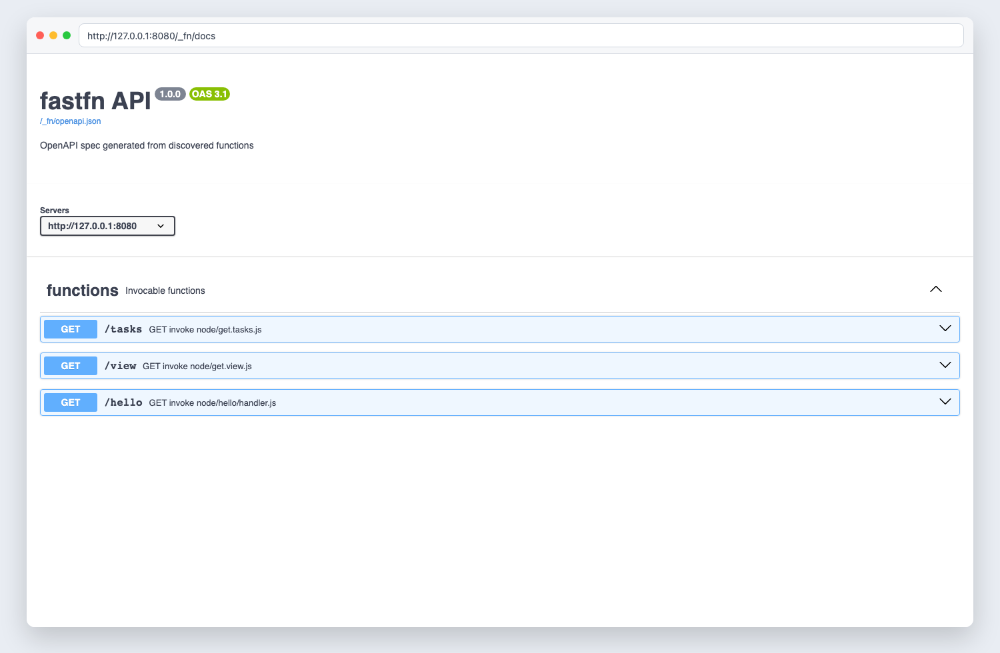
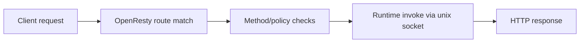

# Quick Start

> Verified status as of **March 13, 2026**.
> Runtime note: FastFN auto-installs function-local dependencies from `requirements.txt` / `package.json`; host runtimes are required in `fastfn dev --native`, while `fastfn dev` depends on a running Docker daemon.

## Quick View

- Complexity: Beginner
- Typical time: 10-15 minutes
- Scope: create one function, run locally, call it, and confirm OpenAPI visibility
- Expected outcome: a working `GET /hello` endpoint and docs at `/docs`

## Prerequisites

- FastFN CLI installed and available in `PATH`
- One execution mode ready:
  - Portable mode: Docker daemon running
  - Native mode: `openresty` and runtime binaries (`node`, `python`, etc.) available

## 1. Create your first function

```bash
fastfn init hello --template node
```

This generates `node/hello/handler.js`.

## 2. Start the local server

```bash
fastfn dev .
```

## 3. Make the first request

```bash
curl -sS 'http://127.0.0.1:8080/hello?name=World'
```

Expected response:

```json
{
  "status": 200,
  "body": "Hello World"
}
```

## 4. Verify generated API docs

- Swagger UI: [http://127.0.0.1:8080/docs](http://127.0.0.1:8080/docs)
- OpenAPI JSON: [http://127.0.0.1:8080/openapi.json](http://127.0.0.1:8080/openapi.json)

```bash
curl -sS 'http://127.0.0.1:8080/openapi.json' | jq '.paths | has("/hello")'
```

Expected output:

```text
true
```



## How requests flow



## Validation checklist

- `GET /hello` returns HTTP `200`
- `/openapi.json` contains `/hello`
- `/docs` loads and shows the route

## Troubleshooting

- Runtime down or `503`: check `/_fn/health` and missing host dependencies
- Route missing: confirm folder layout and rerun discovery (`/_fn/reload`)
- `/docs` empty: verify `openapi-include-internal`/docs toggles were not disabled unexpectedly

## Next links

- [Part 1: Setup and first route](./from-zero/1-setup-and-first-route.md)
- [Routing and parameters](./routing.md)
- [HTTP API reference](../reference/http-api.md)
