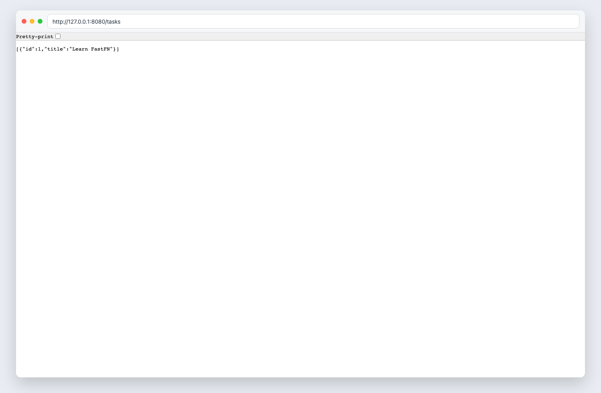

# Part 1: Setup and Your First Route

> Verified status as of **March 13, 2026**.
> Runtime note: FastFN auto-installs function-local dependencies from `requirements.txt` / `package.json`; host runtimes are required in `fastfn dev --native`, while `fastfn dev` depends on a running Docker daemon.

## Quick View

- Complexity: Beginner
- Typical time: 15-20 minutes
- Outcome: clean-room project with one `GET /tasks` endpoint and OpenAPI entry

## 1. Clean-room setup

```bash
mkdir -p task-manager-api
cd task-manager-api
fastfn init tasks --template node
```

Resulting layout:

```text
task-manager-api/
  node/
    tasks/
      handler.js
```

## 2. Implement the first route

Edit `node/tasks/handler.js`:

```js
exports.handler = async () => ({
  status: 200,
  body: [
    { id: 1, title: "Learn FastFN", completed: false },
    { id: 2, title: "Ship first endpoint", completed: false }
  ]
});
```

## 3. Run locally

```bash
fastfn dev .
```

## 4. Validate first request

```bash
curl -sS 'http://127.0.0.1:8080/tasks'
```

Expected body:

```json
[
  { "id": 1, "title": "Learn FastFN", "completed": false },
  { "id": 2, "title": "Ship first endpoint", "completed": false }
]
```

## 5. Validate OpenAPI visibility

```bash
curl -sS 'http://127.0.0.1:8080/openapi.json' | jq '.paths | has("/tasks")'
```

Expected output:

```text
true
```



## Troubleshooting

- `curl` returns `503`: inspect `/_fn/health` and missing runtime dependencies
- route not found: confirm the function path is `node/tasks/handler.js`
- path missing in OpenAPI: trigger reload with `curl -X POST http://127.0.0.1:8080/_fn/reload`

## Next step

[Go to Part 2: Routing and Data](./2-routing-and-data.md)

## Related links

- [Request validation and schemas](../request-validation-and-schemas.md)
- [HTTP API reference](../../reference/http-api.md)
- [Run and test](../../how-to/run-and-test.md)
