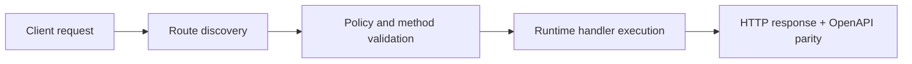

# Part 2: Routing and Data


> Verified status as of **March 10, 2026**.
> Runtime note: FastFN auto-installs function-local dependencies from `requirements.txt` / `package.json`; host runtimes are required in `fastfn dev --native`, while `fastfn dev` depends on a running Docker daemon.
In Part 1, we created a static list of tasks at `/tasks`. Now, let's make our API dynamic. We want to fetch a specific task by its ID (e.g., `/tasks/1`) and add new tasks using a `POST` request.

## 1. Dynamic Routing (Fetching a single task)

FastFN uses brackets `[]` in file names to create dynamic path parameters. 

Inside your `tasks` folder, create a new file named `[id].js` (or `.py`, `.php`).

```text
task-manager-api/
└── tasks/
    ├── handler.js     # -> GET /tasks
    └── [id].js        # -> GET /tasks/:id
```

Add the following code to `tasks/[id].js`:

=== "Python"
    ```python
    def handler(event, id):
        # 'id' is injected directly from the URL path
        return {
            "status": 200,
            "body": {"message": f"Fetching details for task {id}"}
        }
    ```

=== "Node.js"
    ```javascript
    exports.handler = async (event, { id }) => {
        // 'id' is destructured from the route params object
        return {
            status: 200,
            body: { message: `Fetching details for task ${id}` }
        };
    };
    ```

=== "PHP"
    ```php
    <?php
    return function($event, $params) {
        // $params contains the route parameters
        $taskId = $params['id'] ?? null;

        return [
            "status" => 200,
            "body" => ["message" => "Fetching details for task $taskId"]
        ];
    };
    ```

!!! tip "Direct Parameter Injection"
    FastFN inspects your handler's signature and injects matching route parameters
    directly. In Python, `def handler(event, id)` receives the `:id` value as the
    second argument. In Node.js, you can destructure: `async (event, { id }) =>`.
    Parameters are also always available in `event.params` if you prefer.

Test it by opening `http://127.0.0.1:8080/tasks/42` in your browser. You should see `{"message": "Fetching details for task 42"}`.

## 2. Reading the Request Body (Adding a task)

By default, FastFN routes handle `GET` requests. To handle a `POST` request to `/tasks`, we can inspect the HTTP method inside our main `tasks/handler.js` file.

Update your `tasks/handler.js` to handle both `GET` and `POST`:

=== "Python"
    ```python
    def handler(event):
        if event.get("method") == "POST":
            # Read the parsed JSON body
            new_task = event.get("body")
            return {
                "status": 201,
                "body": {"message": "Task created!", "task": new_task}
            }

        # Default GET behavior
        return {
            "status": 200,
            "body": [{"id": 1, "title": "Learn FastFN"}]
        }
    ```

=== "Node.js"
    ```javascript
    exports.handler = async (event) => {
        if (event.method === "POST") {
            // Read the parsed JSON body
            const newTask = event.body;
            return {
                status: 201,
                body: { message: "Task created!", task: newTask }
            };
        }

        // Default GET behavior
        return {
            status: 200,
            body: [{ id: 1, title: "Learn FastFN" }]
        };
    };
    ```

=== "PHP"
    ```php
    <?php
    return function($event) {
        if (($event['method'] ?? 'GET') === 'POST') {
            $newTask = $event['body'] ?? [];
            return [
                "status" => 201,
                "body" => ["message" => "Task created!", "task" => $newTask]
            ];
        }

        return [
            "status" => 200,
            "body" => [["id" => 1, "title" => "Learn FastFN"]]
        ];
    };
    ```

!!! tip "Alternative: Method-Specific Files"
    Instead of handling both GET and POST in one file, you could create separate files:
    `tasks/get.js` for GET and `tasks/post.js` for POST.
    FastFN infers the HTTP method from the filename prefix.
    See [Routing](../routing.md) for details.

Test your new `POST` endpoint using `curl` or the Swagger UI (`http://127.0.0.1:8080/docs`):

```bash
curl -X POST http://127.0.0.1:8080/tasks \
     -H "Content-Type: application/json" \
     -d '{"title": "Write documentation"}'
```

## Next Steps

Our API is taking shape! But what if we want to connect to a real database using a secret token? In the next part, we'll learn how to securely manage environment variables and configure our function's behavior.

[Go to Part 3: Configuration and Secrets :arrow_right:](./3-config-and-secrets.md)

## Flow Diagram



## Objective

Clear scope, expected outcome, and who should use this page.

## Prerequisites

- FastFN CLI available
- Runtime dependencies by mode verified (Docker for `fastfn dev`, OpenResty+runtimes for `fastfn dev --native`)

## Validation Checklist

- Command examples execute with expected status codes
- Routes appear in OpenAPI where applicable
- References at the end are reachable

## Troubleshooting

- If runtime is down, verify host dependencies and health endpoint
- If routes are missing, re-run discovery and check folder layout

## See also

- [Function Specification](../../reference/function-spec.md)
- [HTTP API Reference](../../reference/http-api.md)
- [Run and Test Checklist](../../how-to/run-and-test.md)
