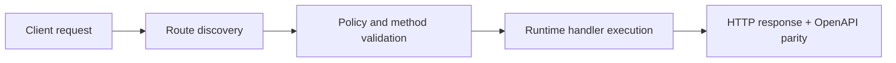

# Part 3: Configuration and Secrets


> Verified status as of **March 10, 2026**.
> Runtime note: FastFN auto-installs function-local dependencies from `requirements.txt` / `package.json`; host runtimes are required in `fastfn dev --native`, while `fastfn dev` depends on a running Docker daemon.
Real-world APIs need to connect to databases, third-party services, and manage strict routing rules. FastFN makes this easy with two special files: `fn.env.json` (for secrets) and `fn.config.json` (for behavior).

## 1. Environment Variables (`fn.env.json`)

Let's pretend our Task Manager API needs a secret token to save tasks to a database. 

Inside your `tasks` folder, create a file named `fn.env.json`:

```json
{
  "DB_TOKEN": "super-secret-token-123"
}
```

!!! warning "Security Tip"
    Never commit `fn.env.json` to version control! Add it to your `.gitignore`.

Now, let's read this token inside our `tasks/handler.js`:

=== "Python"
    ```python hl_lines="3"
    def handler(event):
        # Access environment variables via event["env"]
        token = event.get("env", {}).get("DB_TOKEN")
        
        return {
            "status": 200,
            "body": {"message": f"Connected to DB with token: {token}"}
        }
    ```

=== "Node.js"
    ```javascript hl_lines="3"
    exports.handler = async (event) => {
        // Access environment variables via event.env
        const token = event.env.DB_TOKEN;

        return {
            status: 200,
            body: { message: `Connected to DB with token: ${token}` }
        };
    };
    ```

=== "PHP"
    ```php hl_lines="3"
    <?php
    return function($event) {
        $token = $event['env']['DB_TOKEN'] ?? 'missing';
        
        return [
            "status" => 200,
            "body" => ["message" => "Connected to DB with token: $token"]
        ];
    };
    ```

## 2. Function Configuration (`fn.config.json`)

Sometimes you want to enforce strict rules on your endpoint without writing code. For example, what if we want to restrict our `/tasks` endpoint to *only* accept `GET` and `POST` requests, and reject `DELETE` or `PUT` automatically?

Inside your `tasks` folder, create a file named `fn.config.json`:

```json
{
  "invoke": {
    "methods": ["GET", "POST"]
  },
  "timeout_ms": 5000
}
```

!!! tip "Zero-Code Validation"
    With this config, if someone sends a `DELETE /tasks` request, FastFN's OpenResty gateway will instantly return a `405 Method Not Allowed` error. Your runtime code won't even be executed, saving you CPU cycles!

We also added a `timeout_ms` of 5 seconds. If your database query takes longer than that, FastFN will safely terminate the request.

## Next Steps

You now know how to securely configure your functions. In the final part of this course, we'll look at how to return things other than JSON, like HTML pages or custom headers.

[Go to Part 4: Advanced Responses :arrow_right:](./4-advanced-responses.md)

## Flow Diagram



## Objective

Clear scope, expected outcome, and who should use this page.

## Prerequisites

- FastFN CLI available
- Runtime dependencies by mode verified (Docker for `fastfn dev`, OpenResty+runtimes for `fastfn dev --native`)

## Validation Checklist

- Command examples execute with expected status codes
- Routes appear in OpenAPI where applicable
- References at the end are reachable

## Troubleshooting

- If runtime is down, verify host dependencies and health endpoint
- If routes are missing, re-run discovery and check folder layout

## See also

- [Function Specification](../../reference/function-spec.md)
- [HTTP API Reference](../../reference/http-api.md)
- [Run and Test Checklist](../../how-to/run-and-test.md)
