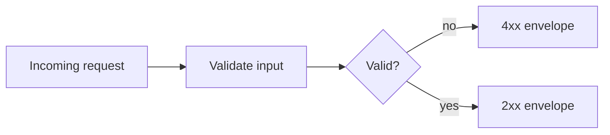

# Part 4: Advanced Responses

> Verified status as of **March 13, 2026**.
> Runtime note: FastFN auto-installs function-local dependencies from `requirements.txt` / `package.json`; host runtimes are required in `fastfn dev --native`, while `fastfn dev` depends on a running Docker daemon.

## Quick View

- Complexity: Intermediate
- Typical time: 30-40 minutes
- Outcome: consistent response contracts with explicit multi-status behavior

## 1. Response shape guarantees

Use an explicit envelope in every branch:

```js
exports.handler = async () => ({
  status: 200,
  headers: { "Content-Type": "application/json; charset=utf-8" },
  body: { items: [], total: 0 }
});
```

Recommended stable shape for JSON APIs:

```json
{
  "data": {},
  "error": null,
  "meta": {}
}
```

## 2. Alternate response models by state

`node/tasks/[id]/get.js`:

```js
exports.handler = async (_event, { id }) => {
  if (id === "404") {
    return { status: 404, body: { error: { code: "TASK_NOT_FOUND", message: "task not found" } } };
  }
  return { status: 200, body: { data: { id, title: "Write docs" }, error: null } };
};
```

Validate:

```bash
curl -sS 'http://127.0.0.1:8080/tasks/1'
curl -sS 'http://127.0.0.1:8080/tasks/404'
```

## 3. Status code strategy

| Status | When to use | Body contract |
|---|---|---|
| `200` | read/update success | `data` present, `error: null` |
| `201` | resource created | `data` with created id |
| `202` | accepted async work | `job_id` + polling URL |
| `400` | malformed request | error with client-fix message |
| `404` | missing route/resource | error code + message |
| `409` | conflict | deterministic conflict details |
| `422` | semantic validation fail | field-level validation message |

## 4. Additional status codes in one endpoint

`node/tasks/post.js`:

```js
exports.handler = async (event) => {
  const body = JSON.parse(event.body || "{}");
  if (!body.title) return { status: 422, body: { error: "title required" } };
  if (body.async === true) return { status: 202, body: { job_id: "job-123", status_url: "/_fn/jobs/job-123" } };
  return { status: 201, body: { id: 99, title: body.title } };
};
```

Validate:

```bash
curl -sS -X POST 'http://127.0.0.1:8080/tasks' -H 'Content-Type: application/json' -d '{}'
curl -sS -X POST 'http://127.0.0.1:8080/tasks' -H 'Content-Type: application/json' -d '{"title":"Docs","async":true}'
curl -sS -X POST 'http://127.0.0.1:8080/tasks' -H 'Content-Type: application/json' -d '{"title":"Docs"}'
```

Expected statuses:

- `422` validation error
- `202` accepted
- `201` created

## 5. Error handling envelope and operational hints

Use a stable error object to keep client handling simple:

```json
{
  "error": {
    "code": "VALIDATION_ERROR",
    "message": "title required",
    "hint": "send title as non-empty string"
  }
}
```

Operational hints:

- include `trace_id` in `meta` when available
- do not leak raw stack traces
- keep `code` stable across versions


## Flow diagram



## Related links

- [Request validation and schemas](../request-validation-and-schemas.md)
- [HTTP API reference](../../reference/http-api.md)
- [Deploy to production](../../how-to/deploy-to-production.md)
