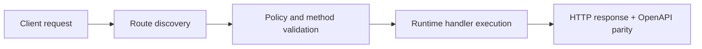

# From Zero Course: Build a Task Manager API

> Verified status as of **March 10, 2026**.
> Runtime note: FastFN auto-installs function-local dependencies from `requirements.txt` / `package.json`; host runtimes are required in `fastfn dev --native`, while `fastfn dev` depends on a running Docker daemon.
Welcome to the FastFN "From Zero" course! If this is your first time building a function, start here. This tutorial assumes **zero prior knowledge** of FastFN.

## What are we building?

Over the next 4 parts, we will build a complete **Task Manager API** from scratch. You will learn how to:
1. Create your first endpoint and return data.
2. Handle dynamic routes (like `/tasks/1`) and read request bodies.
3. Manage environment variables and function configuration.
4. Return rich responses like HTML or custom headers.

## Prerequisites

You only need the FastFN CLI installed. 
- **Portable mode (recommended):** Docker Desktop running.
- **Native mode:** `fastfn dev --native` (requires OpenResty + runtimes installed on the host).

Everything in this tutorial works identically in both modes.

## Learning Path

1. [Part 1: Setup and Your First Route](./1-setup-and-first-route.md)
2. [Part 2: Routing and Data](./2-routing-and-data.md)
3. [Part 3: Configuration and Secrets](./3-config-and-secrets.md)
4. [Part 4: Advanced Responses](./4-advanced-responses.md)

Let's get started!

## Flow Diagram

## Objective

Clear scope, expected outcome, and who should use this page.

## Validation Checklist

- Command examples execute with expected status codes
- Routes appear in OpenAPI where applicable
- References at the end are reachable

## Troubleshooting

- If runtime is down, verify host dependencies and health endpoint
- If routes are missing, re-run discovery and check folder layout

## See also

- [Function Specification](../../reference/function-spec.md)
- [HTTP API Reference](../../reference/http-api.md)
- [Run and Test Checklist](../../how-to/run-and-test.md)
