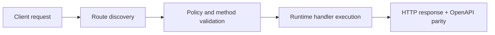

# Routing


> Verified status as of **March 10, 2026**.
> Runtime note: FastFN auto-installs function-local dependencies from `requirements.txt` / `package.json`; host runtimes are required in `fastfn dev --native`, while `fastfn dev` depends on a running Docker daemon.
FastFN uses **file-system routing**, similar to Next.js.

The file structure of your project determines the public URL paths.

### Visualizing File-Based Routing

Instead of maintaining a massive `routes.py` file, FastFN uses your folder structure to define your API.

```text
functions/
├── users/
│   ├── index.py       # -> GET /users
│   └── [id].py        # -> GET /users/:id
│   └── _shared.py     # private helper
└── settings.js        # -> GET /settings
```

## Basic Routing

| File Path | URL Path |
| :--- | :--- |
| `users/index.py` | `/users` |
| `settings/profile.js` | `/settings/profile` |

## Dynamic Segments

You can use brackets `[]` to create dynamic path parameters.

| File Path | URL Path | Example Match |
| :--- | :--- | :--- |
| `users/[id].py` | `/users/:id` | `/users/42` |
| `posts/[category]/[slug].py` | `/posts/:category/:slug` | `/posts/tech/fastfn-intro` |

### Accessing Parameters (Direct Injection)

FastFN automatically injects route params as **direct function arguments**. Just declare the param name in your handler signature:

=== "Python"
    ```python hl_lines="1"
    def handler(event, id):
        # For /users/42, id will be "42"
        return {"status": 200, "body": id}
    ```

=== "Node.js"
    ```javascript hl_lines="1"
    exports.handler = async (event, { id }) => {
        // For /users/42, id will be "42"
        return { status: 200, body: id };
    };
    ```

=== "PHP"
    ```php hl_lines="2"
    <?php
    function handler($event, $params) {
        // For /users/42, $params["id"] will be "42"
        return ["status" => 200, "body" => $params["id"]];
    }
    ```

=== "Go"
    ```go hl_lines="4"
    package main

    func handler(event map[string]interface{}) interface{} {
        // For /users/42, id is merged into event
        idStr, _ := event["id"].(string)
        return map[string]interface{}{"status": 200, "body": idStr}
    }
    ```

=== "Rust"
    ```rust hl_lines="4"
    use serde_json::{json, Value};

    pub fn handler(event: Value) -> Value {
        // For /users/42, id is merged into event
        let user_id = event["id"].as_str().unwrap_or("");
        json!({"status": 200, "body": user_id})
    }
    ```

=== "Lua"
    ```lua hl_lines="1"
    local function handler(event, params)
        -- For /users/42, params.id will be "42"
        return { status = 200, body = params.id }
    end

    return handler
    ```

!!! info "How injection works per runtime"
    | Runtime | Mechanism | Signature |
    |---------|-----------|-----------|
    | Python | `inspect.signature` kwargs | `def handler(event, id):` |
    | Node.js | Second arg when `handler.length > 1` | `async (event, { id }) =>` |
    | PHP | `ReflectionFunction` second arg | `function handler($event, $params)` |
    | Lua | Always passed as second arg | `function handler(event, params)` |
    | Go | Params merged into event map | `event["id"].(string)` |
    | Rust | Params merged into event value | `event["id"].as_str()` |

!!! tip "Backward compatible"
    Existing `handler(event)` signatures work unchanged. Params are only injected when the handler declares them.

### Multiple Parameters

For nested segments like `posts/[category]/[slug]/get.py`:

=== "Python"
    ```python
    def handler(event, category, slug):
        return {"status": 200, "body": f"{category}/{slug}"}
    ```

=== "Node.js"
    ```javascript
    exports.handler = async (event, { category, slug }) => ({
      status: 200, body: `${category}/${slug}`,
    });
    ```

### Catch-All Wildcards

For `files/[...path]/get.py`, the entire remaining path is captured:

=== "Python"
    ```python
    def handler(event, path):
        # /files/docs/2024/report.pdf -> path = "docs/2024/report.pdf"
        segments = path.split("/") if path else []
        return {"status": 200, "body": {"path": path, "depth": len(segments)}}
    ```

=== "Node.js"
    ```javascript
    exports.handler = async (event, { path }) => {
      const segments = path ? path.split("/") : [];
      return { status: 200, body: JSON.stringify({ path, depth: segments.length }) };
    };
    ```

## Route Precedence

If you have overlapping routes, FastFN follows strict precedence:

1.  **Static Routes**: `users/settings.py` (Specific)
2.  **Dynamic Routes**: `users/[id].py` (General)
3.  **Catch-all Routes**: `users/[...slug].py` (Most General)

!!! tip "Most Specific Wins"
    FastFN applies a deterministic "most specific wins" ordering, so a catch-all route cannot steal a more specific match.

## Private helpers and mixed folders

You can import local modules without publishing them as endpoints.

- In a pure file tree, prefix private helpers with `_`:
  - `users/_shared.py`
  - `users/_shared.js`
- In a single-entry folder, sibling modules stay private by default:
  - `whatsapp/handler.js` is the public function
  - `whatsapp/core.js` is private implementation code
- Subdirectories under a single-entry folder can still expose explicit routes:
  - `whatsapp/admin/index.js` -> `/whatsapp/admin`
  - `whatsapp/admin/get.health.js` -> `GET /whatsapp/admin/health`
  - `whatsapp/admin/helpers.js` stays private

This gives you a Lambda-style entrypoint directory without losing Next.js-style nested routes.

## HTTP Methods

By default, a route is `GET` unless you opt into another method.

To restrict methods or handle them differently:

### Option 1: Logic inside handler

=== "Python"
    ```python
    def handler(event):
        method = event.get("method")
        if method == "POST":
            return create_item(event)
        elif method == "GET":
            return get_item(event)
        return {"status": 405, "body": "Method not allowed"}
    ```

=== "Node.js"
    ```javascript
    exports.handler = async (event) => {
      if (event.method === "POST") return createItem(event);
      if (event.method === "GET") return getItem(event);
      return { status: 405, body: "Method not allowed" };
    };
    ```

=== "PHP"
    ```php
    <?php
    function handler($event) {
        if ($event["method"] === "POST") return create_item($event);
        if ($event["method"] === "GET") return get_item($event);
        return ["status" => 405, "body" => "Method not allowed"];
    }
    ```

=== "Go"
    ```go
    package main

    func handler(event map[string]interface{}) interface{} {
        method, _ := event["method"].(string)
        switch method {
        case "POST":
            return createItem(event)
        case "GET":
            return getItem(event)
        }
        return map[string]interface{}{"status": 405, "body": "Method not allowed"}
    }
    ```

=== "Rust"
    ```rust
    use serde_json::{json, Value};

    pub fn handler(event: Value) -> Value {
        match event["method"].as_str().unwrap_or("") {
            "POST" => create_item(&event),
            "GET"  => get_item(&event),
            _      => json!({"status": 405, "body": "Method not allowed"}),
        }
    }
    ```

=== "Lua"
    ```lua
    local function handler(event)
        if event.method == "POST" then return create_item(event) end
        if event.method == "GET"  then return get_item(event)    end
        return { status = 405, body = "Method not allowed" }
    end

    return handler
    ```

### Option 2: `fn.config.json`

Add a config file next to your handler:

`users/[id]/fn.config.json`:
```json
{
  "invoke": {
    "methods": ["GET"]
  }
}
```

Now `POST /users/42` will automatically return `405 Method Not Allowed`.

### Option 3: Method-Specific Files

Instead of branching on `event.method` inside one handler, create separate files:

```text
users/
  get.py       # handles GET /users
  post.py      # handles POST /users
  [id]/
    get.py     # handles GET /users/:id
    put.py     # handles PUT /users/:id
    delete.py  # handles DELETE /users/:id
```

Each file only handles one method. FastFN infers the method from the filename prefix.
See [Zero-Config Routing](../how-to/zero-config-routing.md) for the full details.

[Next: Operational Recipes :arrow_right:](../how-to/operational-recipes.md)

## Flow Diagram



## Objective

Clear scope, expected outcome, and who should use this page.

## Prerequisites

- FastFN CLI available
- Runtime dependencies by mode verified (Docker for `fastfn dev`, OpenResty+runtimes for `fastfn dev --native`)

## Validation Checklist

- Command examples execute with expected status codes
- Routes appear in OpenAPI where applicable
- References at the end are reachable

## Troubleshooting

- If runtime is down, verify host dependencies and health endpoint
- If routes are missing, re-run discovery and check folder layout

## See also

- [Function Specification](../reference/function-spec.md)
- [HTTP API Reference](../reference/http-api.md)
- [Run and Test Checklist](../how-to/run-and-test.md)
