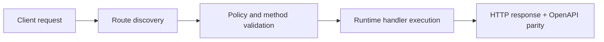

# Versioning and Rollout


> Verified status as of **March 10, 2026**.
> Runtime note: FastFN auto-installs function-local dependencies from `requirements.txt` / `package.json`; host runtimes are required in `fastfn dev --native`, while `fastfn dev` depends on a running Docker daemon.
FastFN supports side-by-side versions (for example `v2`) so you can ship changes without breaking existing clients.

## 1) Folder structure (runtime split)

Versioning is represented by a version subfolder under the function directory:

```text
functions/
  node/
    hello/
      app.js        # default version
      v2/
        app.js      # version v2
```

## 2) Example code

Default version (`functions/hello/app.js`):

```js
exports.handler = async (event) => {
  const name = (event.query || {}).name || "World";
  return { message: `Hello from V1, ${name}` };
};
```

Version `v2` (`functions/hello/v2/app.js`):

```js
exports.handler = async (event) => {
  const name = (event.query || {}).name || "World";
  return { status: "success", data: { greeting: `Hello from V2, ${name}` } };
};
```

## 3) Calling default vs version

Default (if `app.js` exists at the root of the function folder):

```bash
curl -sS 'http://127.0.0.1:8080/hello?name=World'
```

Versioned:

```bash
curl -sS 'http://127.0.0.1:8080/hello@v2?name=World'
```

## 4) Rollout pattern

1. Deploy the `v2/` folder.
2. Test with `GET /hello@v2`.
3. Migrate clients gradually.
4. Remove the old default version when traffic reaches zero.

[Next: Authentication and Secrets](./auth-and-secrets.md){ .md-button .md-button--primary }

## Flow Diagram



## Objective

Clear scope, expected outcome, and who should use this page.

## Prerequisites

- FastFN CLI available
- Runtime dependencies by mode verified (Docker for `fastfn dev`, OpenResty+runtimes for `fastfn dev --native`)

## Validation Checklist

- Command examples execute with expected status codes
- Routes appear in OpenAPI where applicable
- References at the end are reachable

## Troubleshooting

- If runtime is down, verify host dependencies and health endpoint
- If routes are missing, re-run discovery and check folder layout

## See also

- [Function Specification](../reference/function-spec.md)
- [HTTP API Reference](../reference/http-api.md)
- [Run and Test Checklist](../how-to/run-and-test.md)
