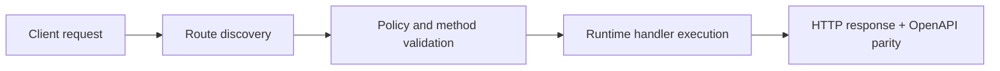

# WhatsApp Bot Demo (Real Session)


> Verified status as of **March 10, 2026**.
> Runtime note: FastFN auto-installs function-local dependencies from `requirements.txt` / `package.json`; host runtimes are required in `fastfn dev --native`, while `fastfn dev` depends on a running Docker daemon.
This tutorial runs a real WhatsApp Web session from a function.

## 1. Start platform

```bash
docker compose up -d --build
```

## 2. Run the first demo (QR)

```bash
curl -sS 'http://127.0.0.1:8080/qr?text=HelloQR' -o /tmp/qr.svg
```

## 3. Open WhatsApp demo intro

```bash
curl -sS 'http://127.0.0.1:8080/whatsapp' | jq .
```

## 4. Get login QR and scan it (auto-start)

```bash
curl -sS 'http://127.0.0.1:8080/whatsapp?action=qr' --output /tmp/wa-qr.png
```

Open `/tmp/wa-qr.png` and scan from WhatsApp:
- `Settings`
- `Linked devices`
- `Link a device`

## 5. Check session status

```bash
curl -sS 'http://127.0.0.1:8080/whatsapp?action=status' | jq .
```

Look for:
- `"connected": true`
- `"me": "<jid>"`

## 6. Send a message

```bash
curl -sS -X POST 'http://127.0.0.1:8080/whatsapp?action=send' \
  -H 'Content-Type: application/json' \
  --data '{"to":"15551234567","text":"hello from FastFN"}' | jq .
```

## 7. Read inbox/outbox

```bash
curl -sS 'http://127.0.0.1:8080/whatsapp?action=inbox' | jq .
curl -sS 'http://127.0.0.1:8080/whatsapp?action=outbox' | jq .
```

## 8. AI reply (optional)

Set API key in function env file:

`<FN_FUNCTIONS_ROOT>/whatsapp/fn.env.json`

```json
{
  "OPENAI_API_KEY": {"value":"sk-...","is_secret":true},
  "OPENAI_MODEL": {"value":"gpt-4o-mini","is_secret":false}
}
```

Then:

```bash
curl -sS -X POST 'http://127.0.0.1:8080/whatsapp?action=chat' \
  -H 'Content-Type: application/json' \
  --data '{"to":"15551234567","text":"Write a short friendly reply in Spanish"}' | jq .
```


## 9. Reset session

```bash
curl -sS -X DELETE 'http://127.0.0.1:8080/whatsapp?action=reset-session' | jq .
```

## Flow Diagram



## Objective

Clear scope, expected outcome, and who should use this page.

## Prerequisites

- FastFN CLI available
- Runtime dependencies by mode verified (Docker for `fastfn dev`, OpenResty+runtimes for `fastfn dev --native`)

## Validation Checklist

- Command examples execute with expected status codes
- Routes appear in OpenAPI where applicable
- References at the end are reachable

## Troubleshooting

- If runtime is down, verify host dependencies and health endpoint
- If routes are missing, re-run discovery and check folder layout

## See also

- [Function Specification](../reference/function-spec.md)
- [HTTP API Reference](../reference/http-api.md)
- [Run and Test Checklist](../how-to/run-and-test.md)
