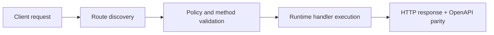

# Your First Function (Node, Python, PHP, Rust)


> Verified status as of **March 10, 2026**.
> Runtime note: FastFN auto-installs function-local dependencies from `requirements.txt` / `package.json`; host runtimes are required in `fastfn dev --native`, while `fastfn dev` depends on a running Docker daemon.
In this tutorial, you will create a serverless function from scratch using the FastFN workflow that the rest of these docs recommend: a path-neutral `functions/<name>/...` project layout.

We will build a simple API that returns a JSON profile based on query parameters.

??? tip "Prerequisites"
    - [FastFN CLI installed](../how-to/run-and-test.md)
    - Docker running (for `fastfn dev`)
    - OpenResty + host runtimes installed (for `fastfn dev --native`)

## 1. Create a Project

Open your terminal and create a folder for your function app:

```bash
mkdir my-functions
cd my-functions
mkdir -p functions/my-profile
```

## 2. Initialize a Function

You can write the handler directly inside `functions/my-profile/`. If you want starter code, `fastfn init` is still useful, but note that the current scaffold is runtime-grouped (`./node/my-profile/`, `./python/my-profile/`, etc.), while the docs recommend path-neutral app layouts for new projects.

Example starter commands:

### Node.js

```bash
fastfn init my-profile --template node
```

### Python

```bash
fastfn init my-profile --template python
```

### PHP

```bash
fastfn init my-profile --template php
```

### Rust

```bash
fastfn init my-profile --template rust
```

For the rest of this tutorial, assume your function lives at `functions/my-profile/` with a handler file such as `handler.js`, `handler.py`, `handler.php`, or `handler.rs`.

## 3. The Function Contract

Open the generated handler file. FastFN normalizes the request into a single `event` object across all languages.

The `event` object contains:
- `method` (GET, POST, etc.)
- `path`
- `query` (URL parameters)
- `headers`
- `body` (raw request body string)
- `context` (Request ID, user info, debug flags)

If the client sends JSON, parse `event.body` explicitly inside the handler.

### Edit the Code

Let's modify the handler to read query parameters and return a dynamic JSON response.

### Node.js (`handler.js`)

```javascript
/**
 * @typedef {Object} Profile
 * @property {string} name
 * @property {string} role
 * @property {string} request_id
 */

/**
 * @param {import('@fastfn/runtime').Request} event
 */
module.exports.handler = async (event) => {
  // 1. Extract inputs
  const query = event.query || {};
  const context = event.context || {};

  // 2. Build response data
  const profile = {
    name: query.name || "Anonymous",
    role: query.role || "Viewer",
    request_id: context.request_id
  };

  // 3. Return response object
  return {
    status: 200,
    headers: { "Content-Type": "application/json" },
    body: JSON.stringify(profile)
  };
};
```

### Python (`handler.py`)

```python
from typing import Any, Dict

def handler(event: Dict[str, Any]) -> Dict[str, Any]:
    # 1. Extract inputs
    query = event.get("query", {})
    context = event.get("context", {})

    # 2. Build response data
    profile = {
        "name": query.get("name", "Anonymous"),
        "role": query.get("role", "Viewer"),
        "request_id": context.get("request_id")
    }

    # 3. Return response object
    return {
        "status": 200,
        "headers": {"Content-Type": "application/json"},
        "body": profile  # Python convenience shorthand, normalized to JSON
    }
```

### PHP (`handler.php`)

```php
<?php

function handler(array $event): array {
    // 1. Extract inputs
    $query = $event['query'] ?? [];
    $context = $event['context'] ?? [];

    // 2. Build response data
    $profile = [
        'name' => $query['name'] ?? 'Anonymous',
        'role' => $query['role'] ?? 'Viewer',
        'request_id' => $context['request_id'] ?? null
    ];

    // 3. Return response object
    return [
        'status' => 200,
        'headers' => ['Content-Type' => 'application/json'],
        'body' => json_encode($profile)
    ];
}
```

### Rust (`handler.rs`)

```rust
use serde_json::{json, Value};

pub fn handler(event: Value) -> Value {
    // 1. Extract inputs (safely with defaults)
    let query = event.get("query").unwrap_or(&json!({}));
    let context = event.get("context").unwrap_or(&json!({}));

    let name = query.get("name").and_then(|v| v.as_str()).unwrap_or("Anonymous");
    let role = query.get("role").and_then(|v| v.as_str()).unwrap_or("Viewer");
    let req_id = context.get("request_id").and_then(|v| v.as_str()).unwrap_or("");

    // 2. Return response object
    json!({
        "status": 200,
        "headers": { "Content-Type": "application/json" },
        "body": json!({
            "name": name,
            "role": role,
            "request_id": req_id
        }).to_string()
    })
}
```

## 4. Run Locally

Start the development server with hot-reload enabled:

```bash
fastfn dev .
```

You should see output indicating the server is running at `http://localhost:8080`.

## 5. Test It

Open your browser or use `curl`:

```bash
# Default values
curl "http://localhost:8080/my-profile/"

# With query params
curl "http://localhost:8080/my-profile/?name=Alice&role=Admin"
```

You should receive a JSON response:

```json
{
  "name": "Alice",
  "role": "Admin",
  "request_id": "req-..."
}
```

## Next Steps

- Learn about [Dependency Management](build-complete-api.md)
- Explore [Authentication & Secrets](auth-and-secrets.md)

## Flow Diagram



## Objective

Clear scope, expected outcome, and who should use this page.

## Prerequisites

- FastFN CLI available
- Runtime dependencies by mode verified (Docker for `fastfn dev`, OpenResty+runtimes for `fastfn dev --native`)

## Validation Checklist

- Command examples execute with expected status codes
- Routes appear in OpenAPI where applicable
- References at the end are reachable

## Troubleshooting

- If runtime is down, verify host dependencies and health endpoint
- If routes are missing, re-run discovery and check folder layout

## See also

- [Function Specification](../reference/function-spec.md)
- [HTTP API Reference](../reference/http-api.md)
- [Run and Test Checklist](../how-to/run-and-test.md)
