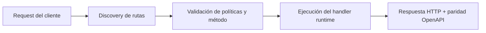

# FastFN Doctor para Dominios y CI


> Estado verificado al **10 de marzo de 2026**.
> Nota de runtime: FastFN auto-instala dependencias locales por función desde `requirements.txt` / `package.json`; en `fastfn dev --native` necesitas runtimes instalados en host, mientras que `fastfn dev` depende de Docker daemon activo.
`fastfn doctor` centraliza validaciones de entorno local y readiness de dominios.

## Por que importa

Los problemas de dominio suelen aparecer tarde:
- DNS apunta al target equivocado
- TLS expirado o por expirar
- HTTP no redirige a HTTPS
- ruta de ACME bloqueada

`fastfn doctor domains` permite detectarlos antes de deploy.

## Inicio rapido

```bash
fastfn doctor
fastfn doctor --json
```

Chequeo de dominios:

```bash
fastfn doctor domains --domain api.midominio.com
fastfn doctor domains --domain api.midominio.com --expected-target lb.midominio.net
```

Salida para CI:

```bash
fastfn doctor domains --domain api.midominio.com --json
```

## Configurar dominios en `fastfn.json`

```json
{
  "domains": [
    "api.midominio.com",
    {
      "domain": "www.midominio.com",
      "expected-target": "lb.midominio.net",
      "enforce-https": true
    }
  ]
}
```

Luego:

```bash
fastfn doctor domains
```

## Contrato de checks (OK/WARN/FAIL)

- `domain.format`: validacion de sintaxis del host.
- `dns.resolve`: resolucion A/AAAA/CNAME.
- `dns.target`: match contra target esperado (si esta configurado).
- `tls.handshake`: validez del certificado para el host.
- `tls.expiry`: ventana de expiracion (warning cuando esta cerca).
- `https.reachability`: respuesta HTTPS basica.
- `http.redirect`: politica HTTP -> HTTPS.
- `acme.challenge`: reachability de `/.well-known/acme-challenge/...`.

## Auto-fix seguro

`fastfn doctor --fix` solo aplica cambios locales seguros.

Fix actual:
- crear `fastfn.json` minimo cuando falta.

## Diagrama de Flujo



## Problema

Qué dolor operativo o de DX resuelve este tema.

## Modelo Mental

Cómo razonar esta feature en entornos similares a producción.

## Decisiones de Diseño

- Por qué existe este comportamiento
- Qué tradeoffs se aceptan
- Cuándo conviene una alternativa

## Ver también

- [Especificación de Funciones](../referencia/especificacion-funciones.md)
- [Referencia API HTTP](../referencia/api-http.md)
- [Checklist Ejecutar y Probar](../como-hacer/ejecutar-y-probar.md)
