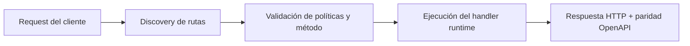

# Construir una API REST con Enrutamiento de Metodos por Archivos


> Estado verificado al **10 de marzo de 2026**.
> Nota de runtime: FastFN auto-instala dependencias locales por función desde `requirements.txt` / `package.json`; en `fastfn dev --native` necesitas runtimes instalados en host, mientras que `fastfn dev` depende de Docker daemon activo.
La mayoria de plataformas serverless te dan un handler por endpoint. Si ese endpoint
necesita responder a GET, POST, PUT y DELETE, terminas con una cadena creciente de
`if/else` o un `switch` que se vuelve dificil de leer, testear y mantener.

FastFN toma un enfoque diferente: **un archivo por metodo HTTP**. El nombre del archivo
declara el metodo, el directorio declara la ruta, y los corchetes declaran parametros
dinamicos. Sin tabla de rutas. Sin archivo de configuracion. Solo archivos.

Este articulo recorre la construccion de una API CRUD completa para un recurso
`products` usando enrutamiento de metodos por archivos, y luego extiende el patron a
una API versionada multinivel.

---

## El Problema

Considera un handler serverless tipico que soporta multiples metodos HTTP:

```python
def handler(event):
    method = event.get("method", "GET")

    if method == "GET":
        return list_products()
    elif method == "POST":
        return create_product(event)
    elif method == "PUT":
        return update_product(event)
    elif method == "DELETE":
        return delete_product(event)
    else:
        return {"status": 405, "body": {"error": "Method not allowed"}}
```

Funciona, pero tiene costos reales:

- **La legibilidad se degrada** a medida que crece el handler. Un endpoint con cinco
  metodos y validacion facilmente llega a 200+ lineas en un solo archivo.
- **El testing se ensucia.** Necesitas mockear el campo method y testear cada rama
  dentro del mismo modulo de test.
- **El code review se complica.** Un diff que toca la rama DELETE tambien muestra la
  rama GET sin cambios, agregando ruido visual.
- **Los permisos se mezclan.** Si POST requiere auth pero GET no, esa logica vive en
  el mismo handler, mezclada con logica de negocio.

En frameworks como Express o FastAPI esto se resuelve con decoradores o handlers
separados por ruta. Pero en function-as-a-service, tipicamente tienes un solo punto de
entrada por funcion desplegada. FastFN cierra esa brecha.

---

## La Solucion: Un Archivo Por Metodo

El zero-config routing de FastFN usa tres convenciones para mapear archivos a endpoints
HTTP:

1. **Nombre de archivo = metodo.** Un archivo llamado `get.py` maneja peticiones GET.
   `post.py` maneja POST. Prefijos soportados: `get`, `post`, `put`, `patch`, `delete`.
2. **Directorio = ruta.** La estructura de carpetas refleja la ruta URL.
   `products/` se convierte en `/products`.
3. **Corchetes = segmentos dinamicos.** Una carpeta llamada `[id]` captura un
   parametro de ruta. `products/[id]/get.py` maneja `GET /products/:id`.

Sin tabla de rutas. Sin decoradores. Sin config. El filesystem **es** el router.

---

## Paso 1: Planifica Tu API

Antes de escribir codigo, define los endpoints. Un CRUD estandar de productos se ve
asi:

| Metodo   | Ruta             | Accion               | Archivo                       |
|----------|------------------|----------------------|-------------------------------|
| `GET`    | `/products`      | Listar productos     | `products/get.py`             |
| `POST`   | `/products`      | Crear un producto    | `products/post.py`            |
| `GET`    | `/products/:id`  | Obtener un producto  | `products/[id]/get.py`        |
| `PUT`    | `/products/:id`  | Actualizar producto  | `products/[id]/put.py`        |
| `DELETE` | `/products/:id`  | Eliminar producto    | `products/[id]/delete.py`     |

Cinco endpoints, cinco archivos. Cada archivo hace exactamente una cosa.

---

## Paso 2: Crea la Estructura de Directorios

```text
rest-api-methods/
  products/
    get.py
    post.py
    [id]/
      get.py
      put.py
      delete.py
```

Ese es el proyecto completo. Sin `fn.config.json`, sin `fn.routes.json`, sin
boilerplate de framework.

---

## Paso 3: Escribe los Handlers

### `products/get.py` -- Listar todos los productos

```python
def handler(event):
    """GET /products -- listar todos los productos"""
    return {
        "status": 200,
        "body": {
            "products": [
                {"id": 1, "name": "Widget", "price": 9.99},
                {"id": 2, "name": "Gadget", "price": 24.99},
            ],
            "total": 2,
        },
    }
```

El handler recibe un dict `event` y retorna un dict de respuesta con `status` y
`body`. Ese es el contrato completo.

### `products/post.py` -- Crear un producto

```python
import json

def handler(event):
    """POST /products -- crear un producto"""
    body = event.get("body", "")
    try:
        data = json.loads(body) if isinstance(body, str) else (body or {})
    except Exception:
        return {"status": 400, "body": {"error": "Invalid JSON"}}

    name = data.get("name", "").strip()
    price = data.get("price", 0)

    if not name:
        return {"status": 400, "body": {"error": "name is required"}}

    return {
        "status": 201,
        "body": {"id": 42, "name": name, "price": price, "created": True},
    }
```

La validacion es local a este archivo. El handler de GET no necesita saber nada de ella.

### `products/[id]/get.py` -- Obtener un producto

```python
def handler(event, id):
    """GET /products/:id -- obtener un producto"""
    return {
        "status": 200,
        "body": {"id": int(id), "name": "Widget", "price": 9.99},
    }
```

El nombre de carpeta `[id]` se inyecta directamente como parametro `id` en la firma
del handler. Sin parseo manual de la ruta URL.

### `products/[id]/put.py` -- Actualizar un producto

```python
import json

def handler(event, id):
    """PUT /products/:id -- actualizar un producto"""
    body = event.get("body", "")
    try:
        data = json.loads(body) if isinstance(body, str) else (body or {})
    except Exception:
        return {"status": 400, "body": {"error": "Invalid JSON"}}

    return {
        "status": 200,
        "body": {"id": int(id), **data, "updated": True},
    }
```

### `products/[id]/delete.py` -- Eliminar un producto

```python
def handler(event, id):
    """DELETE /products/:id -- eliminar un producto"""
    return {
        "status": 200,
        "body": {"id": int(id), "deleted": True},
    }
```

Cada archivo tiene 5-15 lineas. Cada uno es testeable de forma independiente.

---

## La Misma API, Todos los Runtimes

Los ejemplos anteriores usan Python, pero exactamente la misma estructura de archivos
funciona con **todos los runtimes de FastFN**. Solo cambia la extension. Aqui esta
`products/[id]/get` en los seis lenguajes soportados:

### Node.js — `products/[id]/get.js`

```javascript
exports.handler = async (event, { id }) => {
  return {
    status: 200,
    headers: { "Content-Type": "application/json" },
    body: JSON.stringify({ id: Number(id), name: "Widget", price: 9.99 }),
  };
};
```

### PHP — `products/[id]/get.php`

```php
<?php
function handler($event, $params) {
    $id = $params["id"] ?? "";
    return [
        "status" => 200,
        "headers" => ["Content-Type" => "application/json"],
        "body" => json_encode(["id" => (int)$id, "name" => "Widget", "price" => 9.99]),
    ];
}
```

### Go — `products/[id]/get.go`

```go
package main

import (
    "encoding/json"
    "strconv"
)

func handler(event map[string]interface{}) interface{} {
    // Go recibe params combinados en event
    params, _ := event["params"].(map[string]interface{})
    idStr, _ := params["id"].(string)
    id, _ := strconv.Atoi(idStr)

    body, _ := json.Marshal(map[string]interface{}{
        "id": id, "name": "Widget", "price": 9.99,
    })
    return map[string]interface{}{
        "status":  200,
        "headers": map[string]string{"Content-Type": "application/json"},
        "body":    string(body),
    }
}
```

### Rust — `products/[id]/get.rs`

```rust
use serde_json::{json, Value};

pub fn handler(event: Value) -> Value {
    // Rust recibe params combinados en event
    let id: i64 = event["params"]["id"].as_str()
        .unwrap_or("0").parse().unwrap_or(0);

    json!({
        "status": 200,
        "headers": { "Content-Type": "application/json" },
        "body": serde_json::to_string(&json!({
            "id": id, "name": "Widget", "price": 9.99
        })).unwrap()
    })
}
```

### Lua — `products/[id]/get.lua`

```lua
local cjson = require("cjson")

local function handler(event, params)
    local id = params.id or ""
    return {
        status = 200,
        headers = { ["Content-Type"] = "application/json" },
        body = cjson.encode({
            id = tonumber(id),
            name = "Widget",
            price = 9.99,
        }),
    }
end

return handler
```

### POST con validacion — todos los runtimes

Crear un producto requiere parsear el body y validar campos. Aqui esta el handler POST
en cada lenguaje:

=== "Node.js"
    ```javascript
    exports.handler = async (event) => {
      let data;
      try {
        data = typeof event.body === "string" ? JSON.parse(event.body) : event.body || {};
      } catch {
        return { status: 400, body: JSON.stringify({ error: "Invalid JSON" }) };
      }

      const name = (data.name || "").trim();
      if (!name) {
        return { status: 400, body: JSON.stringify({ error: "name is required" }) };
      }

      return {
        status: 201,
        headers: { "Content-Type": "application/json" },
        body: JSON.stringify({ id: 42, name, price: data.price || 0, created: true }),
      };
    };
    ```

=== "PHP"
    ```php
    <?php
    function handler($event) {
        $body = $event["body"] ?? "";
        $data = is_string($body) ? json_decode($body, true) : ($body ?: []);

        $name = trim($data["name"] ?? "");
        if ($name === "") {
            return ["status" => 400, "body" => json_encode(["error" => "name is required"])];
        }

        return [
            "status" => 201,
            "headers" => ["Content-Type" => "application/json"],
            "body" => json_encode(["id" => 42, "name" => $name, "price" => $data["price"] ?? 0, "created" => true]),
        ];
    }
    ```

=== "Go"
    ```go
    package main

    import "encoding/json"

    func handler(event map[string]interface{}) interface{} {
        bodyRaw, _ := event["body"].(string)
        var data map[string]interface{}
        if err := json.Unmarshal([]byte(bodyRaw), &data); err != nil {
            errBody, _ := json.Marshal(map[string]string{"error": "Invalid JSON"})
            return map[string]interface{}{"status": 400, "body": string(errBody)}
        }

        name, _ := data["name"].(string)
        if name == "" {
            errBody, _ := json.Marshal(map[string]string{"error": "name is required"})
            return map[string]interface{}{"status": 400, "body": string(errBody)}
        }

        price, _ := data["price"].(float64)
        body, _ := json.Marshal(map[string]interface{}{
            "id": 42, "name": name, "price": price, "created": true,
        })
        return map[string]interface{}{
            "status": 201, "headers": map[string]string{"Content-Type": "application/json"},
            "body": string(body),
        }
    }
    ```

=== "Rust"
    ```rust
    use serde_json::{json, Value};

    pub fn handler(event: Value) -> Value {
        let body_str = event["body"].as_str().unwrap_or("{}");
        let data: Value = match serde_json::from_str(body_str) {
            Ok(v) => v,
            Err(_) => return json!({"status": 400, "body": r#"{"error":"Invalid JSON"}"#}),
        };

        let name = data["name"].as_str().unwrap_or("").trim().to_string();
        if name.is_empty() {
            return json!({"status": 400, "body": r#"{"error":"name is required"}"#});
        }

        let price = data["price"].as_f64().unwrap_or(0.0);
        json!({
            "status": 201,
            "headers": { "Content-Type": "application/json" },
            "body": serde_json::to_string(&json!({
                "id": 42, "name": name, "price": price, "created": true
            })).unwrap()
        })
    }
    ```

=== "Lua"
    ```lua
    local cjson = require("cjson")

    local function handler(event)
        local ok, data = pcall(cjson.decode, event.body or "")
        if not ok then
            return { status = 400, body = cjson.encode({ error = "Invalid JSON" }) }
        end

        local name = (data.name or ""):match("^%s*(.-)%s*$")
        if name == "" then
            return { status = 400, body = cjson.encode({ error = "name is required" }) }
        end

        return {
            status = 201,
            headers = { ["Content-Type"] = "application/json" },
            body = cjson.encode({ id = 42, name = name, price = data.price or 0, created = true }),
        }
    end

    return handler
    ```

### Referencia rapida: firma del handler por runtime

| Runtime    | Extension | Punto de entrada                                       | Acceso a params (inyeccion directa)    |
|------------|-----------|--------------------------------------------------------|----------------------------------------|
| **Python** | `.py`     | `def handler(event, id):`                              | `id` (inyectado como kwarg)            |
| **Node.js**| `.js`     | `exports.handler = async (event, { id }) => {}`        | `id` (desestructurado del 2do arg)     |
| **PHP**    | `.php`    | `function handler($event, $params) {}`                 | `$params["id"]`                        |
| **Go**     | `.go`     | `func handler(event map[string]interface{}) interface{}`   | `event["params"].(map[string]interface{})["id"]` |
| **Rust**   | `.rs`     | `pub fn handler(event: Value) -> Value {}`             | `event["params"]["id"].as_str()`       |
| **Lua**    | `.lua`    | `local function handler(event, params) ... return handler` | `params.id`                        |

---

## Paso 4: Ejecuta y Prueba

Inicia el servidor de desarrollo:

```bash
fastfn dev examples/functions/rest-api-methods
```

FastFN descubre los archivos, infiere las rutas y empieza a servir. Veras una salida
similar a:

```text
[routes] GET    /products         -> products/get.py (python)
[routes] POST   /products         -> products/post.py (python)
[routes] GET    /products/:id     -> products/[id]/get.py (python)
[routes] PUT    /products/:id     -> products/[id]/put.py (python)
[routes] DELETE /products/:id     -> products/[id]/delete.py (python)
```

Ahora prueba con curl:

```bash
# Listar productos
curl http://127.0.0.1:8080/products
# {"products":[{"id":1,"name":"Widget","price":9.99},{"id":2,"name":"Gadget","price":24.99}],"total":2}

# Crear un producto
curl -X POST http://127.0.0.1:8080/products \
  -H "Content-Type: application/json" \
  -d '{"name":"Widget","price":9.99}'
# {"id":42,"name":"Widget","price":9.99,"created":true}

# Obtener un producto
curl http://127.0.0.1:8080/products/42
# {"id":42,"name":"Widget","price":9.99}

# Actualizar un producto
curl -X PUT http://127.0.0.1:8080/products/42 \
  -H "Content-Type: application/json" \
  -d '{"name":"Updated Widget","price":12.99}'
# {"id":42,"name":"Updated Widget","price":12.99,"updated":true}

# Eliminar un producto
curl -X DELETE http://127.0.0.1:8080/products/42
# {"id":42,"deleted":true}
```

Cada curl golpea un archivo distinto. Cada archivo retorna su propia respuesta. Sin
despacho de metodos necesario.

---

## Paso 5: Revisa el OpenAPI Auto-Generado

FastFN genera una spec OpenAPI 3.0 a partir de las rutas descubiertas. Consultala en:

```bash
curl http://127.0.0.1:8080/_fn/openapi.json | python3 -m json.tool
```

La salida incluye el metodo HTTP correcto para cada ruta:

```json
{
  "openapi": "3.0.0",
  "info": { "title": "FastFN API", "version": "1.0.0" },
  "paths": {
    "/products": {
      "get": {
        "operationId": "get_products",
        "summary": "products/get.py",
        "responses": { "200": { "description": "OK" } }
      },
      "post": {
        "operationId": "post_products",
        "summary": "products/post.py",
        "responses": { "200": { "description": "OK" } }
      }
    },
    "/products/{id}": {
      "get": {
        "operationId": "get_products_id",
        "summary": "products/[id]/get.py",
        "parameters": [
          { "name": "id", "in": "path", "required": true, "schema": { "type": "string" } }
        ],
        "responses": { "200": { "description": "OK" } }
      },
      "put": {
        "operationId": "put_products_id",
        "summary": "products/[id]/put.py",
        "responses": { "200": { "description": "OK" } }
      },
      "delete": {
        "operationId": "delete_products_id",
        "summary": "products/[id]/delete.py",
        "responses": { "200": { "description": "OK" } }
      }
    }
  }
}
```

Esta spec se genera completamente desde el filesystem. Puedes apuntar Swagger UI,
Redoc, o cualquier herramienta compatible con OpenAPI a `/_fn/openapi.json` y obtener
una referencia en vivo y precisa de tu API.

---

## Nesting Profundo: Versionado de APIs

El file-based routing soporta hasta **6 niveles** de anidamiento de directorios. Esto
es util para APIs versionadas donde el prefijo de version es parte de la ruta URL.

Considera esta estructura:

```text
versioned-api/
  api/
    v1/
      users/
        index.js        GET /api/v1/users
        [id].js         GET /api/v1/users/:id
      health/
        index.py        GET /api/v1/health
    v2/
      users/
        index.js        GET /api/v2/users
        [id].js         GET /api/v2/users/:id
```

Aqui `api/v1/users/index.js` mapea a `GET /api/v1/users` y
`api/v2/users/[id].js` mapea a `GET /api/v2/users/:id`. Cada version es un
subarbol de directorios independiente.

### Handler v1 (respuesta minima)

```javascript
exports.handler = function(event) {
  return {
    status: 200,
    headers: { "Content-Type": "application/json" },
    body: JSON.stringify({
      version: "v1",
      users: [
        { id: 1, name: "Alice" },
        { id: 2, name: "Bob" },
      ],
    }),
  };
};
```

### Handler v2 (respuesta extendida con paginacion)

```javascript
exports.handler = function(event) {
  return {
    status: 200,
    headers: { "Content-Type": "application/json" },
    body: JSON.stringify({
      version: "v2",
      data: {
        users: [
          { id: 1, name: "Alice", email: "alice@example.com" },
          { id: 2, name: "Bob", email: "bob@example.com" },
        ],
        total: 2,
        page: 1,
      },
    }),
  };
};
```

Ambas versiones coexisten en el mismo proyecto. Tambien puedes mezclar runtimes: el
health check esta en Python mientras los endpoints de usuarios estan en Node. FastFN
infiere el runtime desde la extension del archivo.

### Por que funciona bien

- **Migracion incremental.** Despliega endpoints v2 uno a la vez mientras v1 sigue
  activo.
- **Deploy independiente.** Cambiar `api/v2/users/index.js` no toca ningun archivo de
  v1.
- **Limites claros.** Cada directorio de version es autocontenido. Sin tablas de rutas
  compartidas que actualizar.

---

## Como Se Ve en el Dashboard de FastFN Cloud

Si usas el dashboard de FastFN Cloud, navega a tu proyecto y abre la pestana
**Config**. La seccion **Detected Routes** muestra cada ruta descubierta con:

- El metodo HTTP mostrado como un badge de color (verde para GET, azul para POST,
  naranja para PUT, rojo para DELETE).
- La ruta URL.
- El archivo fuente que maneja la ruta.
- El runtime inferido (Python, Node, etc.).

Esto te da una vista general visual e instantanea de toda la superficie de tu API.
Cuando agregas un nuevo archivo de metodo y refrescas, el dashboard lo detecta
automaticamente en el siguiente ciclo de escaneo.

---

## Handler Unico vs Archivos por Metodo: Cuando Usar Cual

Ambos patrones son validos en FastFN. La eleccion depende de la complejidad del
endpoint.

| Aspecto            | Handler Unico (`index.py`)            | Archivos por Metodo (`get.py`, `post.py`, ...) |
|--------------------|----------------------------------------|------------------------------------------------|
| **Ideal para**     | Funciones simples, webhooks, endpoints de un solo metodo | APIs REST, recursos CRUD, endpoints multi-metodo |
| **Organizacion**   | Todos los metodos en un archivo       | Un archivo por metodo                          |
| **Legibilidad**    | Limpio para 1-2 metodos; se ensucia con 4+ | Cada archivo es enfocado y corto               |
| **Testing**        | Hay que testear todas las ramas juntas | Testea cada archivo independientemente          |
| **Code review**    | Cambios a un metodo muestran todos en el diff | Solo aparece el archivo del metodo cambiado    |
| **Permisos**       | Logica de auth mezclada con todos los metodos | Se puede aplicar middleware distinto por metodo |
| **Salida OpenAPI** | Una operacion por ruta                | Operaciones separadas por metodo por ruta      |

**Regla general:** si tu endpoint maneja mas de dos metodos HTTP, separa en archivos
por metodo. Si solo maneja GET (o un solo POST de webhook), un archivo unico es mas
simple.

### Enfoque mixto

Puedes mezclar ambos estilos en el mismo proyecto. Algunas rutas usan `index.py`
(handler unico), mientras otras usan `get.py` / `post.py` (archivos por metodo).
FastFN resuelve ambas convenciones con el mismo motor de enrutamiento.

---

## Patrones Comunes

### Utilidades compartidas

Si multiples handlers de metodo necesitan la misma logica (conexion a base de datos,
verificacion de auth), crea un modulo compartido:

```text
products/
  _helpers.py        (ignorado por el router -- empieza con _)
  get.py
  post.py
  [id]/
    get.py
    put.py
    delete.py
```

Los archivos que empiezan con `_` son ignorados por el escaner de rutas. Importalos
normalmente:

```python
# products/post.py
from products._helpers import validate_product, get_db

def handler(event):
    ...
```

### Estaticos y dinamicos en el mismo nivel

Puedes combinar segmentos estaticos y dinamicos:

```text
users/
  index.js           GET /users
  me.js              GET /users/me
  [id].js            GET /users/:id
```

FastFN da mayor precedencia a las rutas estaticas que a las dinamicas, asi que
`/users/me` siempre matchea `me.js` en lugar de `[id].js`.

---

## Resumen

- **Un archivo por metodo** elimina el boilerplate de despacho de metodos y mantiene
  cada handler enfocado, testeable y facil de revisar.
- **Los directorios definen rutas**, los corchetes definen parametros. Sin config
  necesaria.
- **OpenAPI se auto-genera** desde el filesystem, con metodos correctos por ruta.
- **Nesting profundo** (hasta 6 niveles) soporta APIs versionadas y jerarquias URL
  complejas.
- **Mezcla y combina**: usa handlers unicos para endpoints simples, archivos por
  metodo para CRUD, y modulos `_helpers` compartidos para logica comun.

Los ejemplos funcionales completos estan disponibles en:

- `examples/functions/rest-api-methods/` -- API CRUD de productos
- `examples/functions/versioned-api/` -- API versionada con nesting profundo

Clona el repo, ejecuta `fastfn dev` y empieza a construir.

## Diagrama de Flujo



## Problema

Qué dolor operativo o de DX resuelve este tema.

## Modelo Mental

Cómo razonar esta feature en entornos similares a producción.

## Decisiones de Diseño

- Por qué existe este comportamiento
- Qué tradeoffs se aceptan
- Cuándo conviene una alternativa

## Ver también

- [Especificación de Funciones](../referencia/especificacion-funciones.md)
- [Referencia API HTTP](../referencia/api-http.md)
- [Checklist Ejecutar y Probar](../como-hacer/ejecutar-y-probar.md)
