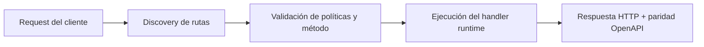

# Geolocalizacion IP con MaxMind e ipapi


> Estado verificado al **10 de marzo de 2026**.
> Nota de runtime: FastFN auto-instala dependencias locales por función desde `requirements.txt` / `package.json`; en `fastfn dev --native` necesitas runtimes instalados en host, mientras que `fastfn dev` depende de Docker daemon activo.
Este articulo muestra una implementacion practica de `ip -> country` con dos ejemplos de FastFN:

- `/ip-intel/maxmind`: lookup local usando MMDB tipo MaxMind (`GeoLite2-Country.mmdb`).
- `/ip-intel/remote`: lookup remoto con un servicio HTTP estilo ipapi.

## Ejecutar ejemplos

```bash
bin/fastfn dev examples/functions
```

## 1) Lookup local con MaxMind

Prueba deterministica (sin archivo MMDB):

```bash
curl -s "http://127.0.0.1:8080/ip-intel/maxmind?ip=8.8.8.8&mock=1"
```

Lookup real con MMDB:

```bash
# Instala dependencia Python una vez en la carpeta de la funcion:
#   echo "maxminddb>=2.6.2" > examples/functions/ip-intel/requirements.txt
# Luego reinicia fastfn dev para que el runtime la instale.
MAXMIND_DB_PATH=/ruta/absoluta/GeoLite2-Country.mmdb \
curl -s "http://127.0.0.1:8080/ip-intel/maxmind?ip=8.8.8.8"
```

Forma de respuesta:

```json
{
  "ok": true,
  "provider": "maxmind",
  "ip": "8.8.8.8",
  "country_code": "US",
  "country_name": "United States"
}
```

## 2) Lookup remoto estilo ipapi

Modo deterministico para pruebas:

```bash
curl -s "http://127.0.0.1:8080/ip-intel/remote?ip=8.8.8.8&mock=1"
```

Lookup real remoto:

```bash
IPAPI_BASE_URL=https://ipapi.co \
curl -s "http://127.0.0.1:8080/ip-intel/remote?ip=8.8.8.8"
```

El handler espera endpoints con patron `/{ip}/json/` y normaliza campos comunes:
`country_code`, `country_name`, `city`, `region`.

## Pruebas incluidas

Unitarias:

```bash
python3 tests/unit/test-python-handlers.py
node tests/unit/test-node-handler.js
```

Integracion (incluye ambas rutas de geolocalizacion):

```bash
bash tests/integration/test-api.sh
```

## Diagrama de Flujo



## Problema

Qué dolor operativo o de DX resuelve este tema.

## Modelo Mental

Cómo razonar esta feature en entornos similares a producción.

## Decisiones de Diseño

- Por qué existe este comportamiento
- Qué tradeoffs se aceptan
- Cuándo conviene una alternativa

## Ver también

- [Especificación de Funciones](../referencia/especificacion-funciones.md)
- [Referencia API HTTP](../referencia/api-http.md)
- [Checklist Ejecutar y Probar](../como-hacer/ejecutar-y-probar.md)
