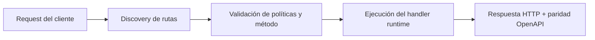

# Serverless Local sin Archivo de Rutas: Hot Reload, Rutas Custom y OpenAPI Vivo


> Estado verificado al **10 de marzo de 2026**.
> Nota de runtime: FastFN auto-instala dependencias locales por función desde `requirements.txt` / `package.json`; en `fastfn dev --native` necesitas runtimes instalados en host, mientras que `fastfn dev` depende de Docker daemon activo.
## Por qué importa
Muchos setups serverless locales fallan por dos motivos:
- dependen de un archivo central de rutas difícil de mantener,
- o la documentación no coincide con el runtime.

`fastfn` evita ambos problemas con descubrimiento por filesystem y OpenAPI generado desde cada `fn.config.json`.

## Mapa rápido de documentación
- Arranque y pruebas: [Ejecutar y probar](../como-hacer/ejecutar-y-probar.md)
- Gestión desde consola/API: [Gestionar funciones](../como-hacer/gestionar-funciones.md)
- Formato y opciones de función: [Especificación de funciones](../referencia/especificacion-funciones.md)
- Endpoints disponibles: [API HTTP](../referencia/api-http.md)
- Contrato de payload runtime: [Contrato runtime](../referencia/contrato-runtime.md)
- Motivo del flujo de invocación: [Flujo de invocación](../explicacion/flujo-invocacion.md)

## Idea base
Definís funciones por archivos en:
- `functions/<runtime>/<name>/`

Con versionado opcional:
- `functions/<runtime>/<name>/<version>/`

No necesitás `routes.json` global.

El gateway descubre automáticamente y aplica políticas por `fn.config.json`.

## Paso 1: Crear función mínima
Crear `functions/my-profile/app.py`:

```python
import json

def handler(event):
    query = (event or {}).get("query") or {}
    name = query.get("name", "world")
    return {
        "status": 200,
        "headers": {"Content-Type": "application/json"},
        "body": json.dumps({"hello": name})
    }
```

Crear `functions/my-profile/fn.config.json`:

```json
{
  "timeout_ms": 1200,
  "max_concurrency": 10,
  "invoke": {
    "methods": ["GET"],
    "summary": "Demo simple de perfil",
    "query": {"name": "World"}
  }
}
```

## Paso 2: Recargar catálogo

```bash
curl -sS -X POST http://127.0.0.1:8080/_fn/reload
```

Así evitás reinicios en cada cambio.

## Paso 3: Invocar función

```bash
curl -sS 'http://127.0.0.1:8080/my-profile?name=Misael'
```

## Paso 4: Verificar OpenAPI vivo

```bash
curl -sS http://127.0.0.1:8080/openapi.json
```

Confirmá:
- existe `/my-profile`,
- métodos iguales a `invoke.methods`.

Si cambiás a `POST` y recargás, OpenAPI se actualiza.

## Paso 5: Agregar endpoint custom real
Editar `fn.config.json`:

```json
{
  "invoke": {
    "methods": ["GET"],
    "routes": ["/api/profile", "/public/whoami"],
    "summary": "Perfil vía rutas custom"
  }
}
```

Recargar y probar:

```bash
curl -sS 'http://127.0.0.1:8080/api/profile?name=Misael'
curl -sS 'http://127.0.0.1:8080/public/whoami?name=Misael'
```

## Paso 6: Versionado sin confusión
Crear v2:
- `functions/my-profile/v2/app.py`
- `functions/my-profile/v2/fn.config.json`

Probar:

```bash
curl -sS 'http://127.0.0.1:8080/my-profile'
curl -sS 'http://127.0.0.1:8080/my-profile@v2'
```

## Paso 7: Handler custom estilo Lambda
Si no quieres usar el nombre `handler`, configura `invoke.handler`.

`fn.config.json`:

```json
{
  "invoke": {
    "handler": "main",
    "methods": ["POST"]
  }
}
```

Luego define/exporta `main` en el archivo runtime.

## Errores comunes y fixes

| Problema | Causa | Solución |
|---|---|---|
| función no encontrada | estructura de carpetas incorrecta | respetar `runtime/name[/version]` |
| OpenAPI no cambia | catálogo sin recargar | ejecutar `POST /_fn/reload` |
| método incorrecto | cambió `invoke.methods` pero test viejo | validar método en curl y OpenAPI |
| conflicto de rutas | misma ruta custom en 2 funciones | renombrar; conflicto devuelve `409` |
| función ambigua | mismo nombre en varios runtimes | usar runtime explícito o evitar duplicados |

## Por qué este modelo es práctico
- política junto al código,
- sin archivo central gigante,
- documentación y ejecución alineadas,
- loop local rápido para desarrollar.

## Documentación relacionada
- [Especificación de funciones](../referencia/especificacion-funciones.md)
- [API HTTP](../referencia/api-http.md)
- [Gestionar funciones](../como-hacer/gestionar-funciones.md)
- [Consola y administración](../como-hacer/consola-admin.md)
- [Arquitectura](../explicacion/arquitectura.md)

## Diagrama de Flujo



## Problema

Qué dolor operativo o de DX resuelve este tema.

## Modelo Mental

Cómo razonar esta feature en entornos similares a producción.

## Decisiones de Diseño

- Por qué existe este comportamiento
- Qué tradeoffs se aceptan
- Cuándo conviene una alternativa

## Ver también

- [Especificación de Funciones](../referencia/especificacion-funciones.md)
- [Referencia API HTTP](../referencia/api-http.md)
- [Checklist Ejecutar y Probar](../como-hacer/ejecutar-y-probar.md)
