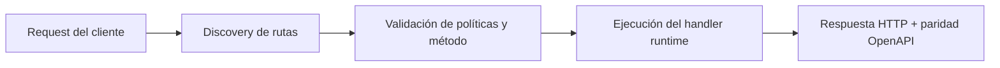

# Telegram Loop Mode (Auto-contenido)


> Estado verificado al **10 de marzo de 2026**.
> Nota de runtime: FastFN auto-instala dependencias locales por función desde `requirements.txt` / `package.json`; en `fastfn dev --native` necesitas runtimes instalados en host, mientras que `fastfn dev` depende de Docker daemon activo.
Este articulo explica como `telegram-ai-reply` puede ejecutar un loop E2E completo **dentro de un solo endpoint**. La misma URL puede:

- enviarte un prompt,
- esperar tu respuesta via `getUpdates`,
- llamar a OpenAI,
- y responderte por Telegram.

## Por que existe

Queremos mostrar que fastfn puede manejar un flujo multi-paso sin workers externos ni scripts. Todo pasa dentro de:

`/telegram-ai-reply`

## Un solo comando (modo loop)

```bash
curl -sS -X POST \
"http://127.0.0.1:8080/telegram-ai-reply?mode=loop&dry_run=false&chat_id=TU_CHAT_ID&prompt=fastfn%20loop%20demo&wait_secs=120&max_replies=5&force_clear_webhook=true"
```

Que hace:

1. fastfn envia el prompt a tu chat.
2. Hace polling de `getUpdates` hasta que respondas.
3. Llama OpenAI y te responde.

Si respondes dentro de `wait_secs`, recibis una respuesta con IA.

## Comportamiento por defecto

Si ejecutás loop sin `chat_id`, entra en modo **poller multi-chat** (ideal para scheduler): lee updates entrantes y responde por chat.

Para forzar un reply unico:

```bash
curl -sS -X POST \
"http://127.0.0.1:8080/telegram-ai-reply?mode=reply&dry_run=false&chat_id=TU_CHAT_ID&text=Hola"
```

## Parametros

- `chat_id` (opcional): si está presente, el loop se limita a ese chat. Si falta, escucha todos los chats entrantes.
- `prompt`: texto inicial enviado antes de esperar tu respuesta.
- `wait_secs`: tiempo maximo de espera (default 120).
- `max_replies`: cantidad de respuestas antes de salir (default 5).
- `poll_ms`: intervalo de polling (default 2000).
- `force_clear_webhook`: si `true`, limpia el webhook para evitar 409.
- `dry_run`: si `true`, no hace llamadas externas.
- `memory`: `true|false` (default `true`). Cuando esta activo, usa memoria por chat.
- `memory_max_turns`: cuantos turnos guardar (default 8).
- `memory_ttl_secs`: expira memoria en segundos (default 3600).

## Errores comunes

`409 Conflict`:

Ya tenes un webhook o otro poller activo. Usa:

`force_clear_webhook=true`

o apaga el otro proceso.

## Nota de seguridad

El endpoint usa:

- `TELEGRAM_BOT_TOKEN`
- `OPENAI_API_KEY`

Se pueden cargar via `fn.env.json` de `telegram-ai-reply` o por variables de entorno del contenedor.

La memoria se guarda localmente en `<FN_FUNCTIONS_ROOT>/node/telegram-ai-reply/.memory.json`.
El estado de offset del loop se guarda en `<FN_FUNCTIONS_ROOT>/node/telegram-ai-reply/.loop_state.json`.

## Diagrama de Flujo



## Problema

Qué dolor operativo o de DX resuelve este tema.

## Modelo Mental

Cómo razonar esta feature en entornos similares a producción.

## Decisiones de Diseño

- Por qué existe este comportamiento
- Qué tradeoffs se aceptan
- Cuándo conviene una alternativa

## Ver también

- [Especificación de Funciones](../referencia/especificacion-funciones.md)
- [Referencia API HTTP](../referencia/api-http.md)
- [Checklist Ejecutar y Probar](../como-hacer/ejecutar-y-probar.md)
