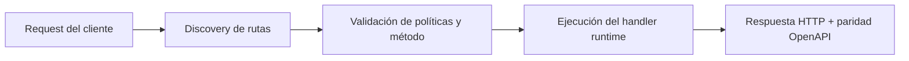

# Workers Compatibility (Beta): portar Cloudflare Workers y Lambda a FastFN


> Estado verificado al **10 de marzo de 2026**.
> Nota de runtime: FastFN auto-instala dependencias locales por función desde `requirements.txt` / `package.json`; en `fastfn dev --native` necesitas runtimes instalados en host, mientras que `fastfn dev` depende de Docker daemon activo.
Esta feature beta busca reducir al minimo el overhead para reutilizar handlers existentes en FastFN sin reescribir toda la logica de negocio.

## Objetivo

Portar codigo existente con cambios chicos, especialmente:

- Cloudflare Workers (`fetch(request, env, ctx)`).
- AWS Lambda Node/Python (`handler(event, context)`), incluyendo callback en Node (`handler(event, context, callback)`).

## Estado actual (beta)

Implementado en runtimes:

- Node
- Python

Activacion por funcion en `fn.config.json`:

```json
{
  "invoke": {
    "adapter": "cloudflare-worker"
  }
}
```

Valores soportados:

- `native` (default): contrato FastFN (`handler(event)`).
- `aws-lambda`: firma Lambda.
- `cloudflare-worker`: firma Workers.

## Mapeo 1:1 real

### 1) Cloudflare Worker (ejemplo real)

Referencia usada (repo real):

- [advissor/nodejs-cloudflare-workers/src/index.js](https://github.com/advissor/nodejs-cloudflare-workers/blob/main/src/index.js)

Ese ejemplo usa:

- `export default { async fetch(request, env) { ... } }`
- CORS preflight
- versionado por path (`/api/v1/...`)
- respuestas `Response` JSON

En FastFN (beta), el mapeo de logica es 1:1. La adaptacion minima practica en Node hoy es cambiar el export a CommonJS:

```js
module.exports = {
  async fetch(request, env, ctx) {
    // misma logica que en Worker
    return new Response('ok');
  },
};
```

`fn.config.json`:

```json
{
  "invoke": {
    "adapter": "cloudflare-worker"
  }
}
```

### 2) AWS Lambda Node (doc oficial)

Referencia oficial:

- [AWS Lambda Node.js handler](https://docs.aws.amazon.com/lambda/latest/dg/nodejs-handler.html)

El adapter `aws-lambda` soporta:

- async handler: `handler(event, context)`
- callback handler: `handler(event, context, callback)`

Nota de AWS oficial:

- AWS recomienda async/await y documenta que callback-based handlers quedan soportados solo hasta Node.js 22.

`fn.config.json`:

```json
{
  "invoke": {
    "adapter": "aws-lambda"
  }
}
```

## Ejemplo rapido (callback Lambda en Node)

```js
exports.handler = (event, context, callback) => {
  callback(null, {
    statusCode: 200,
    headers: { 'Content-Type': 'application/json' },
    body: JSON.stringify({ ok: true, requestId: context.awsRequestId }),
  });
};
```

## Consideraciones de beta

- `cloudflare-worker` replica firma y objetos base, pero no replica la infraestructura de isolates/distributed execution de Cloudflare.
- En Node, para Workers-style, la forma mas estable hoy es `module.exports.fetch = ...`.
- En Lambda callback mode, FastFN resuelve por primer resultado valido (callback o Promise), con proteccion de doble-resolucion.
- En Python, no existe callback estilo Node Lambda; se usa `handler(event, context)`.

## Plan completo (roadmap)

### Fase 0 (completada)

1. Adapter por funcion en `invoke.adapter`.
2. Compatibilidad Node/Python para `aws-lambda`.
3. Compatibilidad Node/Python para `cloudflare-worker`.
4. Soporte Node Lambda callback (`event, context, callback`).
5. Tests unitarios dedicados de adapters.

### Fase 1 (siguiente)

1. Soporte ESM directo para Worker-style en Node (`export default { fetch }`) sin cambiar export.
2. Matriz de fixtures 1:1 por proveedor (Cloudflare/AWS) en `tests/fixtures/compat/`.
3. Pruebas de contrato por adapter (headers, query, status, body binario, errores).

### Fase 2 (hardening)

1. Cobertura de `ctx.waitUntil` con trazabilidad y politicas de cancelacion.
2. Documento de limites de paridad (que se emula y que no).
3. Pruebas de regresion en pipeline CI para adapters.

### Fase 3 (graduacion beta -> stable)

1. Criterios de salida: cobertura, estabilidad y feedback de migraciones reales.
2. Guias de migracion por proveedor (Cloudflare, Lambda Node, Lambda Python).
3. Versionado de compatibilidad (`adapter` + `adapter_version` si aplica).

## Referencias

- [Cloudflare: How Workers works](https://developers.cloudflare.com/workers/reference/how-workers-works/)
- [Cloudflare Worker example repo](https://github.com/advissor/nodejs-cloudflare-workers/blob/main/src/index.js)
- [AWS Lambda Node.js handlers](https://docs.aws.amazon.com/lambda/latest/dg/nodejs-handler.html)

## Diagrama de Flujo



## Problema

Qué dolor operativo o de DX resuelve este tema.

## Modelo Mental

Cómo razonar esta feature en entornos similares a producción.

## Decisiones de Diseño

- Por qué existe este comportamiento
- Qué tradeoffs se aceptan
- Cuándo conviene una alternativa

## Ver también

- [Especificación de Funciones](../referencia/especificacion-funciones.md)
- [Referencia API HTTP](../referencia/api-http.md)
- [Checklist Ejecutar y Probar](../como-hacer/ejecutar-y-probar.md)
