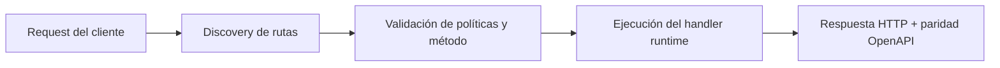

# Antes de salir a producción: checklist de seguridad


> Estado verificado al **10 de marzo de 2026**.
> Nota de runtime: FastFN auto-instala dependencias locales por función desde `requirements.txt` / `package.json`; en `fastfn dev --native` necesitas runtimes instalados en host, mientras que `fastfn dev` depende de Docker daemon activo.
## Ficha rapida

- Complejidad: Intermedia
- Tiempo tipico: 15-25 minutos
- Usala cuando: vas a salir a produccion y quieres un baseline seguro
- Resultado: queda claro que esta protegido por default y que debes configurar


Esta página es una sección práctica para operar FastFN con confianza antes de usarlo en producción.

## Qué viene protegido por default

FastFN ya incluye estos controles por defecto:

- sandbox estricto de filesystem por función (`FN_STRICT_FS=1`)
- rutas internas/admin separadas de rutas públicas
- guardrails de edge proxy para paths de control-plane (`/_fn/*`, `/console/*`)
- límites por función de método y tamaño de body
- controles por función de timeout y concurrencia
- masking de secretos cuando están marcados como secretos

## Qué debes configurar sí o sí en producción

Baseline recomendado:

1. Correr FastFN detrás de reverse proxy (Nginx/Caddy/ALB).
2. Restringir `/_fn/*` y `/console/*` a red/IPs confiables.
3. Usar token admin fuerte y apagar writes si no los necesitas.
4. Guardar secretos en env/secret manager, no en código.
5. Definir allowlists de host (`invoke.allow_hosts`, edge allowlists).
6. Fijar `FN_HOST_PORT` explícito y evitar conflicto de puertos.
7. Monitorear health y logs (`/_fn/health`, logs runtime).

## Verificación rápida de confianza (copy/paste)

```bash
# Health endpoint
curl -sS http://127.0.0.1:8080/_fn/health | jq .

# Verificar exposición de superficie interna según policy/red
curl -i -sS http://127.0.0.1:8080/_fn/catalog | sed -n '1,20p'

# Confirmar modo estricto de filesystem en runtime env
env | rg '^FN_STRICT_FS='
```

## Límites de seguridad (importante)

FastFN reduce riesgo por default, pero no es aislamiento multi-tenant total out-of-the-box.  
Para aislamiento fuerte, agrega controles a nivel host (contenedores, seccomp/cgroups, segmentación de red, workers separados).

## Siguiente lectura recomendada

- [Modelo de Seguridad](../explicacion/modelo-seguridad.md)
- [Consola y Administración](./consola-admin.md)
- [Desplegar a Producción](./desplegar-a-produccion.md)

## Diagrama de Flujo



## Objetivo

Alcance claro, resultado esperado y público al que aplica esta guía.

## Prerrequisitos

- CLI de FastFN disponible
- Dependencias por modo verificadas (Docker para `fastfn dev`, OpenResty+runtimes para `fastfn dev --native`)

## Checklist de Validación

- Los comandos de ejemplo devuelven estados esperados
- Las rutas aparecen en OpenAPI cuando aplica
- Las referencias del final son navegables

## Solución de Problemas

- Si un runtime cae, valida dependencias de host y endpoint de health
- Si faltan rutas, vuelve a ejecutar discovery y revisa layout de carpetas

## Ver también

- [Especificación de Funciones](../referencia/especificacion-funciones.md)
- [Referencia API HTTP](../referencia/api-http.md)
- [Checklist Ejecutar y Probar](ejecutar-y-probar.md)

## Postura para HTTP Basic

Postura de soporte: `adjacent-stack`.

Rationale:

- HTTP Basic puede servir en entornos controlados, pero no es recomendable como auth principal expuesta a internet.
- Usarlo solo con TLS, restriccion de red y rotacion de credenciales.

Alternativas preferidas:

- bearer token/JWT para APIs
- API key + scopes para trafico servicio-a-servicio
