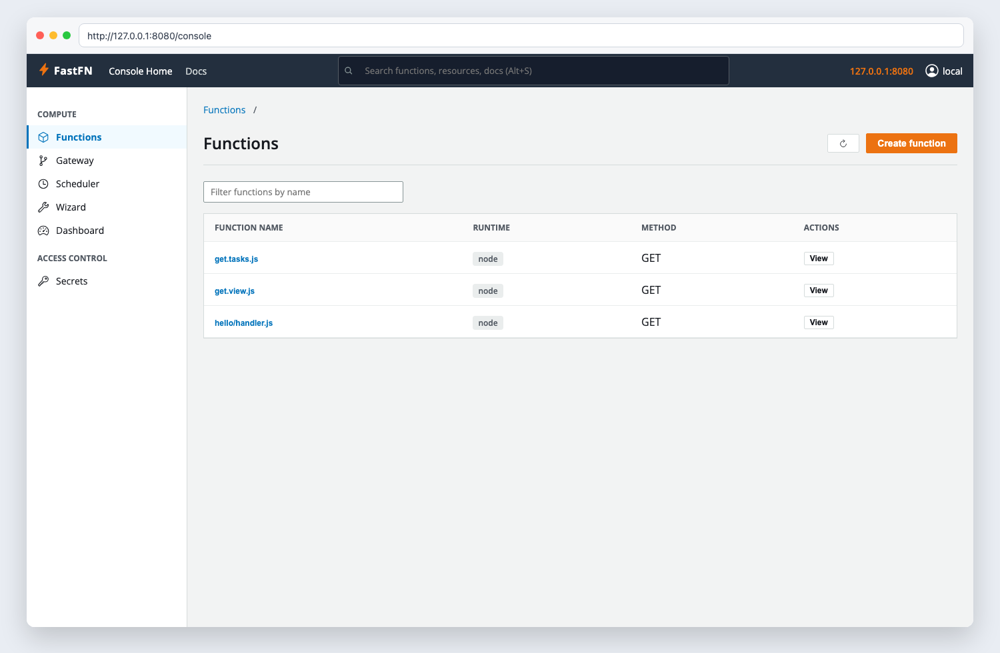

# Consola y administración


> Estado verificado al **10 de marzo de 2026**.
> Nota de runtime: FastFN resuelve dependencias y build por función según el runtime: Python usa `requirements.txt`, Node usa `package.json`, PHP instala desde `composer.json` cuando existe, y Rust compila handlers con `cargo`. En `fastfn dev --native` necesitas runtimes y herramientas del host; `fastfn dev` depende de un daemon de Docker activo.
## Ficha rapida

- Complejidad: Intermedia
- Tiempo tipico: 10-15 minutos
- Úsala cuando: necesitas endurecer /console y /_fn
- Resultado: la superficie admin queda expuesta solo como corresponde


Esta guia esta enfocada **solo** en la superficie administrativa:

- `/console`
- `/_fn/*`

Para auth de negocio de funciones (API key, sesion, JWT), usa:

- `docs/es/tutorial/auth-y-secretos.md`

## Alcance

Esta pagina cubre:

- habilitar/deshabilitar UI/API de consola
- proteccion de escritura
- modo local-only
- token admin para operaciones remotas
- deep links de consola por URL
- dashboard Gateway para rutas mapeadas

## Flags

- `FN_UI_ENABLED` (default `0`)
- `FN_CONSOLE_API_ENABLED` (default `1`)
- `FN_CONSOLE_WRITE_ENABLED` (default `0`)
- `FN_CONSOLE_LOCAL_ONLY` (default `1`)
- `FN_ADMIN_TOKEN` (opcional)
- `FN_CONSOLE_LOGIN_ENABLED` (default `0`, solo UI)
- `FN_CONSOLE_LOGIN_API` (default `0`, si se habilita: protege API de consola tambien)
- `FN_CONSOLE_LOGIN_USERNAME` / `FN_CONSOLE_LOGIN_PASSWORD`
- `FN_CONSOLE_SESSION_SECRET` (o reutiliza `FN_ADMIN_TOKEN`)

## Baseline recomendado

- mantener `FN_UI_ENABLED=0` salvo necesidad
- mantener `FN_CONSOLE_LOCAL_ONLY=1`
- mantener `FN_CONSOLE_WRITE_ENABLED=0` por defecto
- definir `FN_ADMIN_TOKEN` para admin remota controlada

## Login opcional (UI de consola)

Si quieres una pantalla de login para `/console`:

```bash
export FN_CONSOLE_LOGIN_ENABLED=1
export FN_CONSOLE_LOGIN_USERNAME='admin'
export FN_CONSOLE_LOGIN_PASSWORD='dev-password'
export FN_CONSOLE_SESSION_SECRET='change-me-too'
```

Si también quieres que la API de consola (`/_fn/*`) requiera cookie de login:

```bash
export FN_CONSOLE_LOGIN_API=1
```

## Ver estado actual de UI/API

```bash
curl -sS 'http://127.0.0.1:8080/_fn/ui-state'
```

## Usar token admin

```bash
curl -sS 'http://127.0.0.1:8080/_fn/ui-state' \
  -H 'x-fn-admin-token: my-secret-token'
```

## Cambiar estado en caliente

```bash
curl -sS 'http://127.0.0.1:8080/_fn/ui-state' \
  -X PUT \
  -H 'Content-Type: application/json' \
  --data '{"ui_enabled":true,"api_enabled":true,"write_enabled":false,"local_only":true}'
```

Comportamiento de `/_fn/ui-state`:

- `GET` es solo lectura.
- `PUT|POST|PATCH|DELETE` son escritura y requieren permiso de escritura.

## Errores administrativos tipicos

- `403 console ui local-only`
- `403 console api local-only`
- `403 console write disabled`
- `404 console ui disabled`

## Deep links de consola (URLs reales)

La consola soporta deep links que sobreviven refresh:



- `/console`
- `/console/explorer`
- `/console/explorer/<runtime>/<funcion>`
- `/console/explorer/<runtime>/<funcion>@<version>`
- `/console/gateway`
- `/console/configuration`
- `/console/crud`
- `/console/wizard`

Ejemplo:

- `/console/explorer/node/hello@v2`

Acceso rapido al dashboard Gateway:

- `/console/gateway`

La pestaña Gateway muestra:

- ruta publica mapeada
- funcion destino (`runtime/funcion@version`)
- metodos permitidos
- conflictos de rutas detectados en discovery

## Tour rapido de la UI

La consola esta organizada en tabs:

- **Explorer**: detalle de funcion + form de invocacion (`/_fn/invoke`).
- **Wizard**: paso a paso para crear funciones (ideal para principiantes).
- **Gateway**: dashboard de endpoints mapeados (URL publica -> funcion).
- **Configuration**: paneles agrupados para:
  - limites/metodos/rutas
  - config edge proxy (`edge.*`) para respuestas `{ "proxy": { ... } }`
  - schedule (cron por intervalo)
  - editor de env (secretos ocultos)
  - editor de codigo
- **CRUD**: crear/borrar funciones + toggles de acceso a consola.

Notas de schedule:

- El schedule se configura por funcion en `fn.config.json` bajo `schedule`.
- `GET /_fn/schedules` muestra estado (`next`, `last`, ultimo status/error).

## Checklist de hardening

- mantener consola/API en red privada o VPN
- no exponer `/_fn/*` a internet publica
- exigir token admin para operaciones de escritura
- habilitar escritura solo en ventanas de mantenimiento

## Objetivo

Alcance claro, resultado esperado y público al que aplica esta guía.

## Prerrequisitos

- CLI de FastFN disponible
- Dependencias por modo verificadas (Docker para `fastfn dev`, OpenResty+runtimes para `fastfn dev --native`)

## Checklist de Validación

- Los comandos de ejemplo devuelven estados esperados
- Las rutas aparecen en OpenAPI cuando aplica
- Las referencias del final son navegables

## Solución de Problemas

- Si un runtime cae, valida dependencias de host y endpoint de health
- Si faltan rutas, vuelve a ejecutar discovery y revisa layout de carpetas

## Ver también

- [Especificación de Funciones](../referencia/especificacion-funciones.md)
- [Referencia API HTTP](../referencia/api-http.md)
- [Checklist Ejecutar y Probar](ejecutar-y-probar.md)
