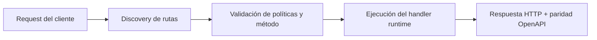

# Contribuir


> Estado verificado al **10 de marzo de 2026**.
> Nota de runtime: FastFN auto-instala dependencias locales por función desde `requirements.txt` / `package.json`; en `fastfn dev --native` necesitas runtimes instalados en host, mientras que `fastfn dev` depende de Docker daemon activo.
## Ficha rapida

- Complejidad: Basica
- Tiempo tipico: 5-10 minutos
- Usala cuando: vas a preparar un cambio o PR
- Resultado: sigues el flujo esperado del repo y sus checks


1. Crea una rama de trabajo.
2. Haz cambios pequenos y enfocados.
3. Actualiza docs cuando cambie API o comportamiento.
4. Ejecuta todo antes del PR:

```bash
sh ./scripts/ci/test-pipeline.sh
mkdocs build --strict
```

Checklist:

- tests unitarios OK
- tests integracion OK
- README y docs actualizados
- sin secretos hardcodeados
- politicas de metodos (`invoke.methods`) reflejadas en gateway y OpenAPI

## Diagrama de Flujo



## Objetivo

Alcance claro, resultado esperado y público al que aplica esta guía.

## Prerrequisitos

- CLI de FastFN disponible
- Dependencias por modo verificadas (Docker para `fastfn dev`, OpenResty+runtimes para `fastfn dev --native`)

## Checklist de Validación

- Los comandos de ejemplo devuelven estados esperados
- Las rutas aparecen en OpenAPI cuando aplica
- Las referencias del final son navegables

## Solución de Problemas

- Si un runtime cae, valida dependencias de host y endpoint de health
- Si faltan rutas, vuelve a ejecutar discovery y revisa layout de carpetas

## Ver también

- [Especificación de Funciones](../referencia/especificacion-funciones.md)
- [Referencia API HTTP](../referencia/api-http.md)
- [Checklist Ejecutar y Probar](ejecutar-y-probar.md)

## Flujo de contribucion y checklist de review

1. crear rama enfocada
2. implementar cambio minimo coherente
3. correr tests relevantes y build docs strict
4. abrir PR con evidencia de validacion
5. resolver comentarios y mantener CI en verde

Checklist de review:

- cambios de contrato incluyen tests
- paridad EN/ES en docs publicas cuando aplica
- no filtrar runbooks internos en docs publicas

## Politica de release notes

- todo cambio visible para usuario debe quedar en release notes/changelog
- cada entrada incluye fecha, alcance e impacto de upgrade
- cambios solo de docs tambien requieren nota breve si cambian expectativas de uso
