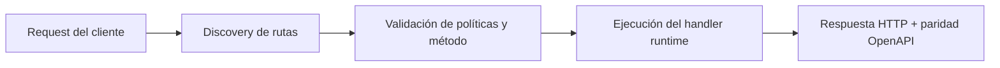

# Desplegar a Producción


> Estado verificado al **10 de marzo de 2026**.
> Nota de runtime: FastFN auto-instala dependencias locales por función desde `requirements.txt` / `package.json`; en `fastfn dev --native` necesitas runtimes instalados en host, mientras que `fastfn dev` depende de Docker daemon activo.
## Ficha rapida

- Complejidad: Intermedia
- Tiempo tipico: 20-30 minutos
- Usala cuando: pasas de dev local a ejecucion de produccion
- Resultado: modo run y hardening de edge quedan configurados


FastFN está pensado para correr en producción usando el mismo motor que en desarrollo, pero con hot reload deshabilitado y defaults más seguros.

## Estado actual

- Modo producción native (`fastfn run --native`): disponible
- Modo producción docker-first: disponible para flujos específicos, mientras este documento mantiene `--native` como camino principal.

## Modos de Producción

### 1. Self-Hosted (VM / Bare Metal)

La forma más simple es correr el binario en modo `run`. Esto deshabilita hot reload y los file watchers.

**Comando:**

```bash
fastfn run --native /path/a/tus/funciones
```

**Requisitos:**

- Binario de FastFN en el host.
- OpenResty disponible en `PATH` (requerido por `--native`).
- Runtimes instalados en el host para los lenguajes que uses (Python/Node/PHP).

Si falta OpenResty pero Docker esta instalado, `run --native` igual falla (esperado).  
Para desarrollo puedes usar `fastfn dev` (modo Docker) mientras instalas OpenResty para flujos native de produccion.

### 2. Contenedor Docker

FastFN soporta modo producción usando `--native`. Existen flujos docker-first para casos puntuales, pero no son el camino default de este documento.

## Health Checks

FastFN expone un endpoint de health check para load balancers:

- `GET /_fn/health`
- Devuelve `200 OK`

## Variables de Entorno

En producción, pasa secretos por variables de entorno, no por `fn.env.json`.

```bash
docker run -e DB_PASSWORD=secret ...
```

FastFN mergea `fn.env.json` con las variables de entorno del proceso, priorizando la variable de entorno.

## Reverse Proxy Con Nginx Existente

Supongamos que ya tienes un sitio en Nginx y quieres forwardear solo paths de API a FastFN.

FastFN escucha en un puerto interno (por ejemplo `127.0.0.1:8080`) y Nginx proxya requests hacia ese upstream.

### Ejemplo mínimo

Esto mantiene tu sitio actual y forwardea `/api/` a FastFN:

```nginx
upstream fastfn_upstream {
  server 127.0.0.1:8080;
  keepalive 32;
}

server {
  listen 443 ssl;
  server_name example.com;

  # Tu sitio actual:
  root /var/www/site;
  index index.html;

  # Forward de API a FastFN:
  location ^~ /api/ {
    proxy_pass http://fastfn_upstream;
    proxy_set_header Host $host;
    proxy_set_header X-Forwarded-Host $host;
    proxy_set_header X-Forwarded-Proto $scheme;
    proxy_set_header X-Forwarded-For $proxy_add_x_forwarded_for;
  }
}
```

### Bloquear endpoints admin

No expongas `/_fn/*` ni `/console/*` públicamente salvo que los restrinjas.

Una opción simple es allowlist por IP:

```nginx
location ^~ /_fn/ {
  allow 127.0.0.1;
  deny all;
  proxy_pass http://fastfn_upstream;
}

location ^~ /console/ {
  allow 127.0.0.1;
  deny all;
  proxy_pass http://fastfn_upstream;
}
```

### Base URL de OpenAPI detrás de Nginx

FastFN detecta el server URL público desde `X-Forwarded-Proto` y `X-Forwarded-Host`.

Si no puedes (o no quieres) forwardear esos headers, setea:

- `FN_PUBLIC_BASE_URL=https://example.com`

## Diagrama de Flujo



## Objetivo

Alcance claro, resultado esperado y público al que aplica esta guía.

## Prerrequisitos

- CLI de FastFN disponible
- Dependencias por modo verificadas (Docker para `fastfn dev`, OpenResty+runtimes para `fastfn dev --native`)

## Checklist de Validación

- Los comandos de ejemplo devuelven estados esperados
- Las rutas aparecen en OpenAPI cuando aplica
- Las referencias del final son navegables

## Solución de Problemas

- Si un runtime cae, valida dependencias de host y endpoint de health
- Si faltan rutas, vuelve a ejecutar discovery y revisa layout de carpetas

## Ver también

- [Especificación de Funciones](../referencia/especificacion-funciones.md)
- [Referencia API HTTP](../referencia/api-http.md)
- [Checklist Ejecutar y Probar](ejecutar-y-probar.md)

## Matriz de modos runtime y preflight de produccion

| Modo | Requisito | Uso recomendado |
|---|---|---|
| Docker mode (`fastfn dev`) | Docker daemon | paridad local y onboarding |
| Native mode (`fastfn dev --native`) | OpenResty + runtimes host | debug/ops avanzado |

Preflight antes de desplegar:

1. check de dependencias pasa (`fastfn doctor`)
2. health endpoint responde up
3. OpenAPI y rutas criticas validadas
4. defaults de seguridad revisados (exposicion `/_fn/*`, admin token)
