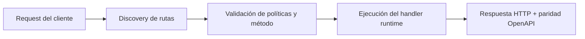

# Ejecutar y probar


> Estado verificado al **10 de marzo de 2026**.
> Nota de runtime: FastFN resuelve dependencias y build por función según el runtime: Python usa `requirements.txt`, Node usa `package.json`, PHP instala desde `composer.json` cuando existe, y Rust compila handlers con `cargo`. En `fastfn dev --native` necesitas runtimes y herramientas del host; `fastfn dev` depende de un daemon de Docker activo.
## Vista rápida

- Complejidad: Intermedia
- Tiempo tipico: 20-40 minutos
- Úsala cuando: necesitas validar la plataforma completa en local o CI
- Resultado: salud, ruteo, OpenAPI y tests quedan verificados


Esta guia define un flujo de validacion real para usar FastFN como plataforma FaaS en serio.

Esta ordenada por etapas para que puedas usarla igual en local y en CI.

## Alcance de validacion

Este flujo valida:

- arranque de runtimes y salud
- discovery de rutas y manejo de requests
- paridad OpenAPI con rutas descubiertas
- comportamiento ante conflictos de rutas
- suites de regresion (unit + integracion)

Contexto tecnico:

- [Arquitectura](../explicacion/arquitectura.md)
- [Flujo de invocacion](../explicacion/flujo-invocacion.md)
- [Especificacion de funciones](../referencia/especificacion-funciones.md)
- [Playbook FastAPI/Next.js](./playbook-fastapi-nextjs.md)

## Requisitos

Base:

- `./bin/fastfn` disponible
- `curl`, `jq`

Segun modo:

- modo Docker (`fastfn dev`): Docker CLI + daemon activo
- modo Native (`fastfn dev --native`): OpenResty en PATH y runtimes que vayas a usar

## Etapa 1: build y arranque

Build:

```bash
make build-cli
```

Arranque en Docker:

```bash
./bin/fastfn dev examples/functions/next-style
```

Arranque en Native:

```bash
./bin/fastfn dev --native examples/functions/next-style
```

Criterio de aceptacion:

- proceso inicia sin errores fatales
- `/_fn/health` llega a HTTP `200`

## Etapa 2: salud y endpoints base

Salud:

```bash
curl -sS 'http://127.0.0.1:8080/_fn/health' | jq
```

Smoke de rutas publicas:

```bash
curl -i 'http://127.0.0.1:8080/hello?name=Mundo'
curl -i 'http://127.0.0.1:8080/html?name=Designer'
```

Criterio de aceptacion:

- health reporta runtimes habilitados en `up=true`
- endpoints responden HTTP `200`

## Etapa 3: paridad OpenAPI y mapa de rutas

Rutas OpenAPI:

```bash
curl -sS 'http://127.0.0.1:8080/_fn/openapi.json' | jq '.paths | keys'
```

Catalogo y conflictos:

```bash
curl -sS 'http://127.0.0.1:8080/_fn/catalog' | jq '{mapped_routes, mapped_route_conflicts}'
```

Criterio de aceptacion:

- las rutas publicas esperadas existen en OpenAPI
- `mapped_route_conflicts` vacio en operacion normal

Referencias:

- [API HTTP](../referencia/api-http.md)
- [Especificacion de funciones](../referencia/especificacion-funciones.md)

## Etapa 4: validar politica de conflictos

FastFN no debe sobrescribir rutas mapeadas en silencio por default.

Validar:

1. crear dos funciones que reclamen la misma ruta
2. revisar catalogo y conflicto detectado
3. confirmar comportamiento determinista de error

Politica:

- `invoke.force-url` por funcion
- `FN_FORCE_URL` global

Detalles:

- [Config fastfn.json](../referencia/config-fastfn.md)
- [Especificacion de funciones](../referencia/especificacion-funciones.md)
- [Zero-config routing](./zero-config-routing.md)
- [Plomería runtime/plataforma](./plomeria-runtime-plataforma.md)

## Etapa 5: suites de regresion

Pipeline completo:

```bash
bash scripts/ci/test-pipeline.sh
```

Suites focalizadas:

```bash
bash tests/integration/test-openapi-system.sh
bash tests/integration/test-openapi-native.sh
bash tests/integration/test-api.sh
bash tests/integration/test-home-routing.sh
bash tests/integration/test-auto-install-inference.sh
bash tests/integration/test-platform-equivalents.sh
```

Criterio de aceptacion:

- sin `skip` en checks obligatorios de CI
- paridad OpenAPI OK en docker y native (si aplica)

## Etapa 6: checklist de seguimiento antes de merge/release

- [ ] `/_fn/health` responde 200 y runtimes en up
- [ ] rutas publicas representativas responden status/body esperado
- [ ] `/_fn/openapi.json` contiene rutas publicas mapeadas
- [ ] `mapped_route_conflicts` vacio (o conflicto documentado)
- [ ] `test-openapi-system.sh` en verde
- [ ] `test-openapi-native.sh` en verde (o justificado fuera de entorno native)
- [ ] `test-home-routing.sh` en verde (override de `/` + home por carpeta vía `fn.config.json`)
- [ ] `test-auto-install-inference.sh` en verde (inferencia strict + metadata visible)
- [ ] `test-platform-equivalents.sh` en verde (ejemplos avanzados de auth/webhook/jobs/orders)
- [ ] docs y links internos actualizados con el cambio

Siguiente paso para hardening:

- [Desplegar a produccion](./desplegar-a-produccion.md)
- [Checklist de seguridad](./checklist-seguridad-produccion.md)
- [Patrones de acceso a datos](./patrones-de-acceso-a-datos.md)
- [Estructura app grande](./estructura-app-grande.md)

## Diagrama de Flujo



## Objetivo

Alcance claro, resultado esperado y público al que aplica esta guía.

## Prerrequisitos

- CLI de FastFN disponible
- Dependencias por modo verificadas (Docker para `fastfn dev`, OpenResty+runtimes para `fastfn dev --native`)

## Checklist de Validación

- Los comandos de ejemplo devuelven estados esperados
- Las rutas aparecen en OpenAPI cuando aplica
- Las referencias del final son navegables

## Solución de Problemas

- Si un runtime cae, valida dependencias de host y endpoint de health
- Si faltan rutas, vuelve a ejecutar discovery y revisa layout de carpetas

## Ver también

- [Especificación de Funciones](../referencia/especificacion-funciones.md)
- [Referencia API HTTP](../referencia/api-http.md)
- [Arquitectura](../explicacion/arquitectura.md)

## Recetas rapidas de unit e integracion

```bash
cd cli && go test ./...
sh ./scripts/ci/test-pipeline.sh
```

Usa unit para logica de funcion e integracion para paridad routing/runtime.

## Seams y estrategia de mocking

Preferir seams en:

- clientes HTTP externos
- adaptadores de base de datos
- proveedor de reloj/tiempo
- limites de proceso/seniales en modo native

## Checklist de debug

1. confirmar salida de discovery
2. confirmar estado en `/_fn/health`
3. probar endpoint con curl verbose (`-i -v`)
4. inspeccionar logs runtime por lenguaje
5. aislar funcion minima reproducible

### Leer salida de debug del handler

Para una funcion como:

```python
def handler(event):
    print(event)
    return {"status": 200, "body": "Hello"}
```

usa estas reglas:

- terminal de `fastfn dev`: `stdout`/`stderr` completos, con prefijo por funcion
- `X-Fn-Stdout` / `X-Fn-Stderr`: utiles desde clientes externos, pero truncados
- `/_fn/invoke`: `stdout` / `stderr` completos en JSON para flujos de consola/admin

Ejemplo de linea en logs:

```text
[python] [fn:hello@default stdout] {'query': {'id': '42'}}
```

Si haces debugging desde otra app, usa headers para una verificacion rapida y los logs runtime para la salida completa.

## Siguiente paso

Continúa con [Desplegar a producción](./desplegar-a-produccion.md) cuando este checklist esté en verde de forma consistente en local y CI.

## Enlaces relacionados

- [Desplegar a producción](./desplegar-a-produccion.md)
- [Checklist de seguridad](./checklist-seguridad-produccion.md)
- [Zero-config routing](./zero-config-routing.md)
- [Plomería runtime/plataforma](./plomeria-runtime-plataforma.md)
- [Referencia API HTTP](../referencia/api-http.md)
- [Especificación de funciones](../referencia/especificacion-funciones.md)
- [Arquitectura](../explicacion/arquitectura.md)
- [Obtener ayuda](./obtener-ayuda.md)
