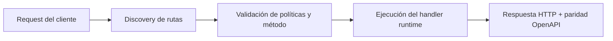

# Gestionar funciones (API de consola)


> Estado verificado al **10 de marzo de 2026**.
> Nota de runtime: FastFN auto-instala dependencias locales por función desde `requirements.txt` / `package.json`; en `fastfn dev --native` necesitas runtimes instalados en host, mientras que `fastfn dev` depende de Docker daemon activo.
## Ficha rapida

- Complejidad: Intermedia
- Tiempo tipico: 15-25 minutos
- Usala cuando: necesitas CRUD y cambios de config por Console API
- Resultado: puedes crear, actualizar, invocar y eliminar funciones con control


Flujo CRUD practico usando endpoints `/_fn/*`.

## Importante: rutas de funciones configurables

Los archivos de funciones viven bajo `FN_FUNCTIONS_ROOT` (no hardcodeado).

En la practica, es el directorio que le pasas a `fastfn dev`.

Setup recomendado:

1. Poner tu codigo en `functions/`.
2. Correr `fastfn dev functions` (o setear `"functions-dir": "functions"` en `fastfn.json`).

Si quieres fijarlo explícitamente:

```bash
export FN_FUNCTIONS_ROOT="$PWD/functions"
```

## Requisitos

- plataforma en `http://127.0.0.1:8080`
- API habilitada (`FN_CONSOLE_API_ENABLED=1`)
- escritura habilitada (`FN_CONSOLE_WRITE_ENABLED=1`) o token admin

## 1) Revisar catalogo

```bash
curl -sS 'http://127.0.0.1:8080/_fn/catalog'
```

Usalo para confirmar runtimes y ver el `functions_root` activo.

## 2) Crear funcion

```bash
curl -sS 'http://127.0.0.1:8080/_fn/function?runtime=python&name=demo-new' \
  -X POST \
  -H 'Content-Type: application/json' \
  --data '{"methods":["GET"],"summary":"Funcion demo"}'
```

## 3) Ver detalle

```bash
curl -sS 'http://127.0.0.1:8080/_fn/function?runtime=python&name=demo-new&include_code=1'
```

## 3a) Ver estado de resolucion de dependencias

```bash
curl -sS 'http://127.0.0.1:8080/_fn/function?runtime=python&name=demo-new' \
| python3 - <<'PY'
import json, sys
obj = json.load(sys.stdin)
print(json.dumps((obj.get("metadata") or {}).get("dependency_resolution"), indent=2))
PY
```

Campos clave:

- `mode`: `manifest` o `inferred`
- `manifest_generated`: si FastFN creo el manifiesto automaticamente
- `inferred_imports` / `resolved_packages` / `unresolved_imports`
- `last_install_status` y `last_error`
- `lockfile_path` (cuando existe)

## 4) Actualizar politica (metodos/limites)

```bash
curl -sS 'http://127.0.0.1:8080/_fn/function-config?runtime=python&name=demo-new' \
  -X PUT \
  -H 'Content-Type: application/json' \
  --data '{"timeout_ms":1200,"max_concurrency":5,"max_body_bytes":262144,"invoke":{"methods":["GET","POST"]}}'
```

## 4a) Reutilizar packs de dependencias compartidas (opcional)

Si varias funciones necesitan las mismas dependencias, puedes crear un pack compartido en:

```text
<FN_FUNCTIONS_ROOT>/.fastfn/packs/<runtime>/<pack>/
```

Luego lo asocias a una funcion con `shared_deps`:

```bash
curl -sS 'http://127.0.0.1:8080/_fn/function-config?runtime=python&name=demo-new' \
  -X PUT \
  -H 'Content-Type: application/json' \
  --data '{"shared_deps":["common_http"]}'
```

## 4b) Agregar schedule (cron por intervalo)

```bash
curl -sS 'http://127.0.0.1:8080/_fn/function-config?runtime=python&name=demo-new' \
  -X PUT \
  -H 'Content-Type: application/json' \
  --data '{"schedule":{"enabled":true,"every_seconds":60,"method":"GET","query":{"action":"inc"},"headers":{},"body":"","context":{}}}'
```

Ver estado del scheduler:

```bash
curl -sS 'http://127.0.0.1:8080/_fn/schedules'
```

## 5) Actualizar env

```bash
curl -sS 'http://127.0.0.1:8080/_fn/function-env?runtime=python&name=demo-new' \
  -X PUT \
  -H 'Content-Type: application/json' \
  --data '{"GREETING_PREFIX":"hola"}'
```

## 6) Actualizar codigo

```bash
curl -sS 'http://127.0.0.1:8080/_fn/function-code?runtime=python&name=demo-new' \
  -X PUT \
  -H 'Content-Type: application/json' \
  --data '{"code":"import json\n\ndef handler(event):\n    q = event.get(\"query\") or {}\n    return {\"status\":200,\"headers\":{\"Content-Type\":\"application/json\"},\"body\":json.dumps({\"ok\":True,\"query\":q})}\n"}'
```

## 7) Invocar por helper interno

```bash
curl -sS 'http://127.0.0.1:8080/_fn/invoke' \
  -X POST \
  -H 'Content-Type: application/json' \
  --data '{"runtime":"python","name":"demo-new","method":"GET","query":{"name":"Ops"}}'
```

Esto enruta por la misma capa de routing/política que el tráfico público, así que aplica los mismos métodos y límites.

## 7b) Encolar job asincrono (ejecuta luego)

```bash
curl -sS 'http://127.0.0.1:8080/_fn/jobs' \
  -X POST \
  -H 'Content-Type: application/json' \
  --data '{"name":"demo-new","method":"GET","query":{"name":"Async"}}'
```

Luego consultar:

```bash
curl -sS 'http://127.0.0.1:8080/_fn/jobs/<id>'
curl -sS 'http://127.0.0.1:8080/_fn/jobs/<id>/result'
```

## 8) Eliminar funcion

```bash
curl -sS 'http://127.0.0.1:8080/_fn/function?runtime=python&name=demo-new' -X DELETE
```

## Errores comunes

- `404`: funcion/version inexistente
- `405`: metodo no permitido por politica
- `409`: ambiguedad por nombre en varios runtimes (o conflicto de rutas mapeadas)
- `403`: escritura bloqueada/local-only

## Diagrama de Flujo



## Objetivo

Alcance claro, resultado esperado y público al que aplica esta guía.

## Prerrequisitos

- CLI de FastFN disponible
- Dependencias por modo verificadas (Docker para `fastfn dev`, OpenResty+runtimes para `fastfn dev --native`)

## Checklist de Validación

- Los comandos de ejemplo devuelven estados esperados
- Las rutas aparecen en OpenAPI cuando aplica
- Las referencias del final son navegables

## Solución de Problemas

- Si un runtime cae, valida dependencias de host y endpoint de health
- Si faltan rutas, vuelve a ejecutar discovery y revisa layout de carpetas
- Si falla la inferencia, revisa `metadata.dependency_resolution` y `<function_dir>/.fastfn-deps-state.json`
- En errores strict, agrega pins explícitos en `requirements.txt` / `package.json` o ajusta `FN_AUTO_INFER_STRICT`

## Ver también

- [Especificación de Funciones](../referencia/especificacion-funciones.md)
- [Referencia API HTTP](../referencia/api-http.md)
- [Checklist Ejecutar y Probar](ejecutar-y-probar.md)
- [Catálogo de Funciones de Ejemplo](../referencia/funciones-ejemplo.md)
- [Python Packaging User Guide](https://packaging.python.org/)
- [Documentación de package.json (npm)](https://docs.npmjs.com/cli/v10/configuring-npm/package-json)
