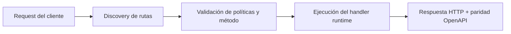

# Herramientas (Función-a-Función + HTTP Limitado)


> Estado verificado al **10 de marzo de 2026**.
> Nota de runtime: FastFN auto-instala dependencias locales por función desde `requirements.txt` / `package.json`; en `fastfn dev --native` necesitas runtimes instalados en host, mientras que `fastfn dev` depende de Docker daemon activo.
## Ficha rapida

- Complejidad: Intermedia
- Tiempo tipico: 15-25 minutos
- Usala cuando: quieres usar tool calling seguro con allowlists
- Resultado: las tools quedan operativas con controles explicitos


En FastFN, las "tools" (herramientas) son un patrón **seguro y opt-in** que usan algunos ejemplos (Telegram, WhatsApp) para:

- llamar a otras funciones de FastFN (`fn` tool), y
- hacer fetch a un conjunto chico de URLs allowlisted (`http` tool),

y luego pasar esos resultados a un prompt de IA (o devolverlos directo).

Esta guía muestra la **sintaxis exacta**, los **controles de seguridad (allowlists)** y cómo probarlo local.

## 1) Ejecutar los ejemplos

Recomendado (app multi-ruta + showcase):

```bash
bin/fastfn dev examples/functions/next-style
```

Catálogo completo (incluye `toolbox-bot`):

```bash
bin/fastfn dev examples/functions
```

## 2) Sintaxis de directivas de tools

Algunas funciones de ejemplo parsean directivas dentro del texto del usuario.

### 2.1 Tool `http`

Hace fetch a una URL (solo GET):

- `[[http:https://api.ipify.org?format=json]]`

### 2.2 Tool `fn`

Invoca otra función de FastFN por nombre:

- `[[fn:request-inspector?key=demo|GET]]`

Formato:

- `[[fn:<nombre-funcion>?<query>|<METODO>]]`
- `?query` y `|METODO` son opcionales (default `GET`)

## 3) La forma más segura de probar: `toolbox-bot`

`toolbox-bot` es una función demo que **devuelve el plan y los resultados como JSON**, sin necesitar Telegram/OpenAI.

- Ruta: `GET /toolbox-bot`, `POST /toolbox-bot`
- Código: `examples/functions/node/toolbox-bot/handler.js`

Nota: `curl` interpreta `[` y `]` como "ranges" (globbing) en URLs. En ejemplos que incluyen `[[...]]` en la URL, usa `curl -g` para desactivar globbing.

### 3.1 Ejecutar con directivas

```bash
curl -g -sS \
"http://127.0.0.1:8080/toolbox-bot?text=Usa%20[[http:https://api.ipify.org?format=json]]%20y%20[[fn:hello|GET]]"
```

Forma esperada:

```json
{
  "ok": true,
  "text": "Usa [[http:...]] y [[fn:hello|GET]]",
  "results": [
    { "ok": true, "type": "http", "status": 200, "body": "..." },
    { "ok": true, "type": "fn", "name": "hello", "status": 200, "body": "..." }
  ]
}
```

## 5) Allowlists (controles de seguridad)

Tools no es "internet libre".

### 5.1 Allowlist de funciones (`fn`)

- Override por query: `tool_allow_fn=request-inspector,telegram-ai-digest`
- Default por env (por función): `TOOLBOX_TOOL_ALLOW_FN=...`

Solo se aceptan nombres que matchean `[A-Za-z0-9_-]+`.

### 5.2 Allowlist de hosts (`http`)

- Override por query: `tool_allow_hosts=api.ipify.org,wttr.in`
- Default por env (por función): `TOOLBOX_TOOL_ALLOW_HTTP_HOSTS=...`

Solo se hace fetch si el hostname está allowlisted.

Nota: hosts locales siempre se bloquean (aunque estén allowlisted) para evitar acceso a `/_fn/*`:

- `localhost`, `127.0.0.1`, `::1`, `*.local`

### 5.3 Timeout

- Override por query: `tool_timeout_ms=5000`
- Default por env: `TOOLBOX_TOOL_TIMEOUT_MS=5000`

## 6) Dónde se usan tools

El ejemplo `toolbox-bot` demuestra directivas de tools. Para tool calling por modelo, ver `ai-tool-agent` abajo.

## 6.1 OpenAI tool-calling (el modelo elige tools)

Si quieres un flujo "mágico" donde **la IA elige tools** (en vez de heurísticas por keywords o directivas manuales), usa:

- `ai-tool-agent` (Node)
  - Ruta: `GET /ai-tool-agent`
  - Código: `examples/functions/node/ai-tool-agent/handler.js`

Dry run (sin OpenAI, sin llamadas externas):

```bash
curl -sS "http://127.0.0.1:8080/ai-tool-agent?dry_run=true&text=cual%20es%20mi%20ip%20y%20como%20esta%20el%20clima%20en%20Buenos%20Aires%3F"
```

Ejecución real (OpenAI + tools):

```bash
curl -sS "http://127.0.0.1:8080/ai-tool-agent?dry_run=false&text=cual%20es%20mi%20ip%20y%20como%20esta%20el%20clima%20en%20Buenos%20Aires%3F"
```

La respuesta incluye `trace.steps[]` con:

- cada respuesta de OpenAI (incluye tool calls),
- cada resultado de ejecución de tool,
- path del archivo de memoria + contadores.

### Scheduler / cron

`ai-tool-agent` trae un bloque `schedule` de ejemplo en `examples/functions/node/ai-tool-agent/fn.config.json` (desactivado por defecto).

Para activar schedules de forma segura (admin), ver:

- [Gestionar funciones (Console API)](./gestionar-funciones.md)

Ver también:

- [Cómo funciona `telegram-ai-reply`](../articulos/telegram-ai-reply-como-funciona.md)
- [Demo WhatsApp Bot](../tutorial/demo-bot-whatsapp.md)

## 7) Nota para producción

`/_fn/*` es el control-plane (config, reload, logs, health, toggles de OpenAPI).

En producción, tratá `/_fn/*` como interfaz admin:

- restringir por IP / auth / VPN,
- no exponerlo al público.

## Diagrama de Flujo



## Objetivo

Alcance claro, resultado esperado y público al que aplica esta guía.

## Prerrequisitos

- CLI de FastFN disponible
- Dependencias por modo verificadas (Docker para `fastfn dev`, OpenResty+runtimes para `fastfn dev --native`)

## Checklist de Validación

- Los comandos de ejemplo devuelven estados esperados
- Las rutas aparecen en OpenAPI cuando aplica
- Las referencias del final son navegables

## Solución de Problemas

- Si un runtime cae, valida dependencias de host y endpoint de health
- Si faltan rutas, vuelve a ejecutar discovery y revisa layout de carpetas

## Ver también

- [Especificación de Funciones](../referencia/especificacion-funciones.md)
- [Referencia API HTTP](../referencia/api-http.md)
- [Checklist Ejecutar y Probar](ejecutar-y-probar.md)
