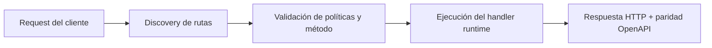

# Instalar y Publicar (Homebrew)


> Estado verificado al **10 de marzo de 2026**.
> Nota de runtime: FastFN auto-instala dependencias locales por función desde `requirements.txt` / `package.json`; en `fastfn dev --native` necesitas runtimes instalados en host, mientras que `fastfn dev` depende de Docker daemon activo.
## Ficha rapida

- Complejidad: Basica
- Tiempo tipico: 5-10 minutos
- Usala cuando: necesitas instalar o actualizar FastFN por Homebrew
- Resultado: queda claro el camino de instalacion y prerequisitos


Esta pagina cubre:

- Uso del canal Homebrew y caminos de instalación alternativos.
- Como publicar un release y actualizar el tap de Homebrew (mantenedores).

> Estado verificado al **10 de marzo de 2026**: si el tap/formula no está disponible en tu entorno, usa la instalación desde source (abajo).

## Instalar (usuarios, cuando el tap este disponible)

```bash
brew tap misaelzapata/homebrew-fastfn
brew install fastfn
fastfn --version
```

## Requisitos de runtime (segun modo)

`brew install fastfn` instala el CLI. Los requisitos de ejecucion dependen del modo:

- `native` (`fastfn dev --native`, `fastfn run --native`): requiere `openresty`.
- `docker` (`fastfn dev` por default): requiere Docker CLI + daemon activo.

Comportamiento cuando faltan dependencias:

- Docker instalado, OpenResty ausente:
  - `fastfn dev --native` y `fastfn run --native` fallan con error explicito de OpenResty.
  - `fastfn dev` (sin `--native`) funciona si el daemon de Docker esta activo.
- OpenResty instalado, Docker ausente:
  - el modo native funciona.
  - el modo docker falla hasta instalar/iniciar Docker.

Esto sigue el estandar de UX de dependencias usado por CLIs similares:

- prerequisito explicito por modo de ejecucion (docs de Cloudflare Wrangler)
- requisito claro de Docker para stack local (docs de Supabase)
- error accionable cuando el runtime de contenedores falta/esta caido (docs de AWS SAM / LocalStack)

Bootstrap recomendado (macOS + Homebrew):

```bash
brew tap misaelzapata/homebrew-fastfn
brew install fastfn openresty
brew install --cask docker
fastfn doctor
```

Actualizar:

```bash
brew upgrade fastfn
```

Desinstalar:

```bash
brew uninstall fastfn
```

## Instalar desde el codigo fuente (contributors)

Requisitos: Go y Docker.

```bash
git clone https://github.com/misaelzapata/fastfn
cd fastfn
bash cli/build.sh
./bin/fastfn --help
```

## Publicar un release (mantenedores)

FastFN usa GoReleaser y GitHub Actions:

- CI corre en pushes a `main`.
- Releases corren cuando pusheas tags que matchean `v*` (por ejemplo `v0.1.0`).

### 1) Configurar secrets (una vez)

Si quieres que GoReleaser actualice Homebrew automaticamente, agrega:

- `HOMEBREW_TAP_GITHUB_TOKEN`: un token de GitHub con permiso de push a `misaelzapata/homebrew-fastfn`.

Si el secret no existe, el release igual publica los assets en GitHub, pero **omite** actualizar Homebrew.

### 2) Crear tag y pushear

Desde la raiz del repo:

```bash
git tag -a v0.1.0 -m "v0.1.0"
git push origin v0.1.0
```

### 3) Verificar

Cuando termina el workflow:

- En GitHub Releases aparece la nueva version y los binarios.
- En `misaelzapata/homebrew-fastfn` se actualiza `Formula/fastfn.rb`.

## Diagrama de Flujo



## Objetivo

Alcance claro, resultado esperado y público al que aplica esta guía.

## Prerrequisitos

- CLI de FastFN disponible
- Dependencias por modo verificadas (Docker para `fastfn dev`, OpenResty+runtimes para `fastfn dev --native`)

## Checklist de Validación

- Los comandos de ejemplo devuelven estados esperados
- Las rutas aparecen en OpenAPI cuando aplica
- Las referencias del final son navegables

## Solución de Problemas

- Si un runtime cae, valida dependencias de host y endpoint de health
- Si faltan rutas, vuelve a ejecutar discovery y revisa layout de carpetas

## Ver también

- [Especificación de Funciones](../referencia/especificacion-funciones.md)
- [Referencia API HTTP](../referencia/api-http.md)
- [Checklist Ejecutar y Probar](ejecutar-y-probar.md)
